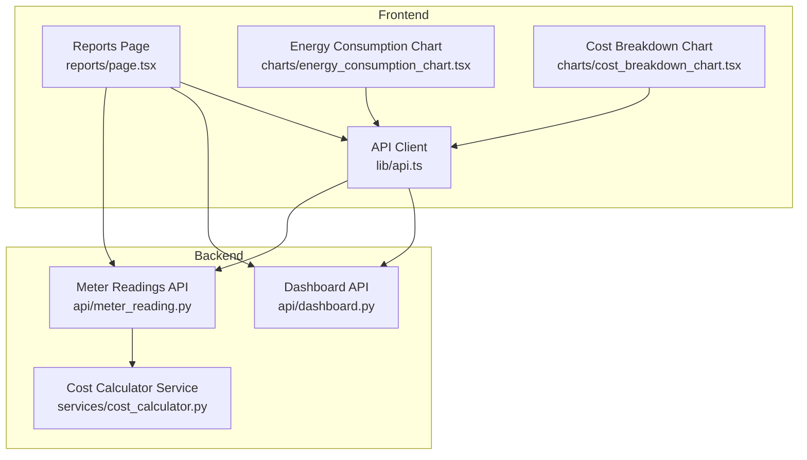
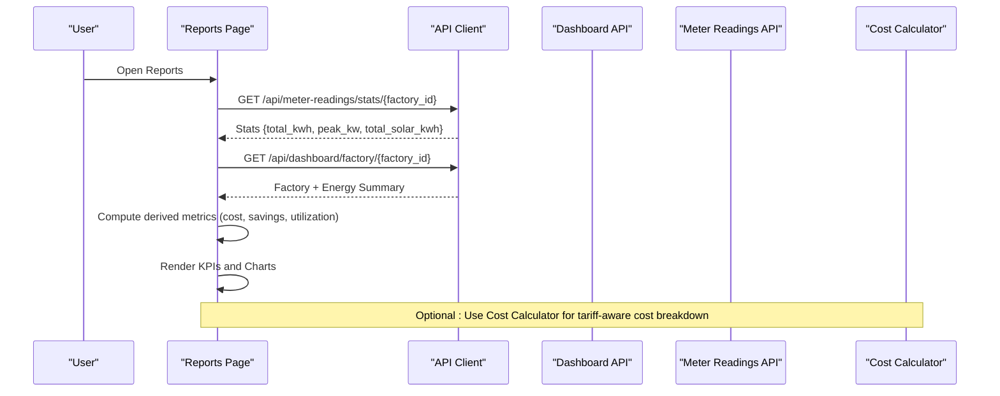
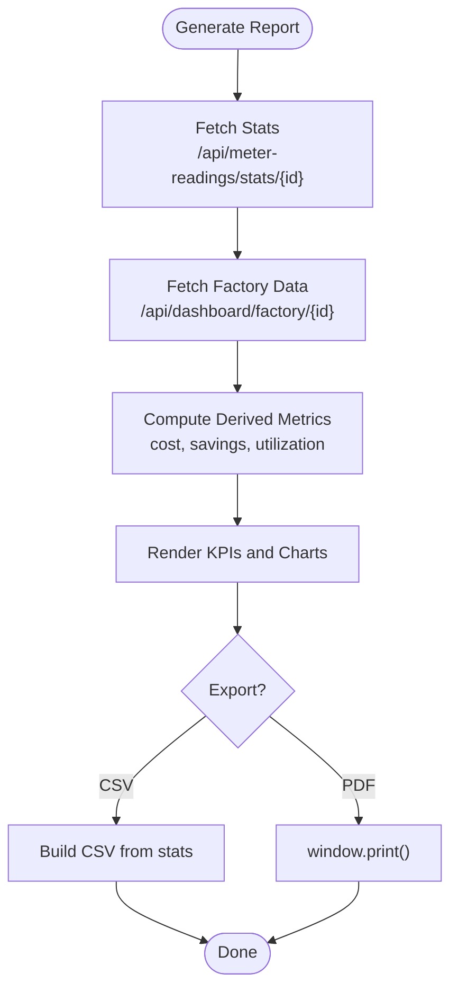
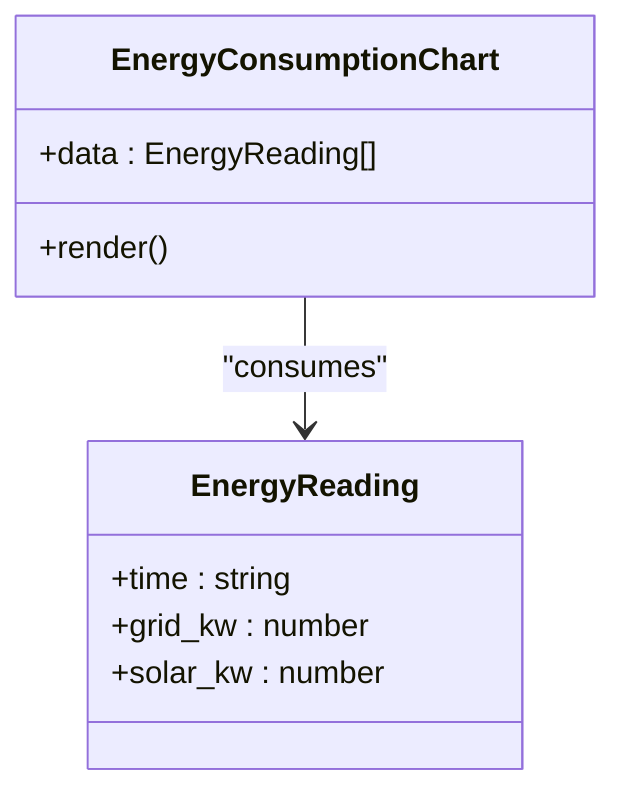
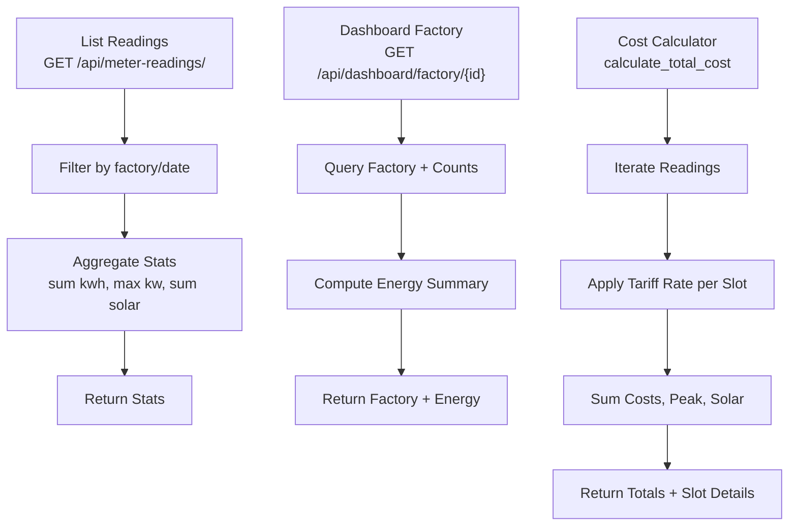
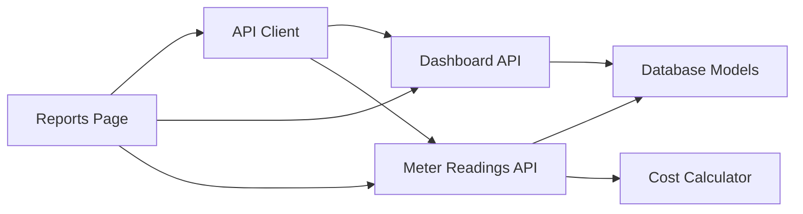

# Reports & Analytics

<cite>
**Referenced Files in This Document**
- [page.tsx](file://frontend/app/dashboard/reports/page.tsx)
- [energy_consumption_chart.tsx](file://frontend/components/charts/energy_consumption_chart.tsx)
- [cost_breakdown_chart.tsx](file://frontend/components/charts/cost_breakdown_chart.tsx)
- [dashboard.py](file://backend/app/api/dashboard.py)
- [meter_reading.py](file://backend/app/api/meter_reading.py)
- [cost_calculator.py](file://backend/app/services/cost_calculator.py)
- [index.ts](file://frontend/types/index.ts)
- [api.ts](file://frontend/lib/api.ts)
- [mock_data.ts](file://frontend/lib/mock_data.ts)
- [optimization.py](file://backend/app/api/optimization.py)
</cite>

## Table of Contents
1. Introduction
2. Project Structure
3. Core Components
4. Architecture Overview
5. Detailed Component Analysis
6. Dependency Analysis
7. Performance Considerations
8. Troubleshooting Guide
9. Conclusion

## Introduction
This document explains the Reports and Analytics page, covering report types (energy consumption, cost analysis, production efficiency, sustainability), generation workflow, customization options, export formats, scheduled delivery, data aggregation, chart visualizations, trend analysis, configuration examples, filtering criteria, interpretation guidelines, and performance optimization for large datasets.

## Project Structure
The Reports and Analytics feature spans frontend pages and charts with backend APIs that aggregate meter readings and provide dashboard summaries. Key areas:
- Frontend reports page: user interface for generating reports, exporting CSV/PDF, and displaying KPIs and charts.
- Chart components: reusable visualizations for energy consumption and cost breakdown.
- Backend APIs: endpoints to fetch aggregated stats and factory-level dashboard data.
- Cost calculation service: tariff-aware cost computation for energy usage.

**Diagram sources**
- [page.tsx:1-306](file://frontend/app/dashboard/reports/page.tsx#L1-L306)
- [energy_consumption_chart.tsx:1-65](file://frontend/components/charts/energy_consumption_chart.tsx#L1-L65)
- [cost_breakdown_chart.tsx:1-8](file://frontend/components/charts/cost_breakdown_chart.tsx#L1-L8)
- [dashboard.py:1-79](file://backend/app/api/dashboard.py#L1-L79)
- [meter_reading.py:1-141](file://backend/app/api/meter_reading.py#L1-L141)
- [cost_calculator.py:1-110](file://backend/app/services/cost_calculator.py#L1-L110)
- [api.ts:1-71](file://frontend/lib/api.ts#L1-L71)

**Section sources**
- [page.tsx:1-306](file://frontend/app/dashboard/reports/page.tsx#L1-L306)
- [dashboard.py:1-79](file://backend/app/api/dashboard.py#L1-L79)
- [meter_reading.py:1-141](file://backend/app/api/meter_reading.py#L1-L141)
- [cost_calculator.py:1-110](file://backend/app/services/cost_calculator.py#L1-L110)
- [api.ts:1-71](file://frontend/lib/api.ts#L1-L71)

## Core Components
- Reports Page: Displays KPI cards (total energy cost, total savings, average peak demand, average solar utilization), a cost breakdown pie chart, and a savings trend composed chart. It supports report generation, CSV export, and PDF download via print.
- Energy Consumption Chart: Area chart showing grid usage and solar generation over time.
- Cost Breakdown Chart: Placeholder component for future detailed cost breakdown visualization.
- Backend Stats and Dashboard APIs: Provide aggregated meter reading statistics and factory-level energy metrics.
- Cost Calculator Service: Computes costs based on tariffs and consumption, including slot-level details.

**Section sources**
- [page.tsx:33-306](file://frontend/app/dashboard/reports/page.tsx#L33-L306)
- [energy_consumption_chart.tsx:1-65](file://frontend/components/charts/energy_consumption_chart.tsx#L1-L65)
- [cost_breakdown_chart.tsx:1-8](file://frontend/components/charts/cost_breakdown_chart.tsx#L1-L8)
- [dashboard.py:44-79](file://backend/app/api/dashboard.py#L44-L79)
- [meter_reading.py:113-141](file://backend/app/api/meter_reading.py#L113-L141)
- [cost_calculator.py:12-110](file://backend/app/services/cost_calculator.py#L12-L110)

## Architecture Overview
The Reports page orchestrates data fetching from backend endpoints, computes derived metrics on the client, and renders charts. The backend aggregates meter readings and provides summary statistics. A cost calculator service can be used to compute tariff-based costs.

**Diagram sources**
- [page.tsx:41-72](file://frontend/app/dashboard/reports/page.tsx#L41-L72)
- [dashboard.py:44-79](file://backend/app/api/dashboard.py#L44-L79)
- [meter_reading.py:113-141](file://backend/app/api/meter_reading.py#L113-L141)
- [cost_calculator.py:52-90](file://backend/app/services/cost_calculator.py#L52-L90)

## Detailed Component Analysis

### Reports Page
- Purpose: Generate and display reports with KPIs, cost breakdown, and savings trends.
- Data Sources: Fetches stats from meter readings and factory dashboard endpoints.
- Export Options: CSV (client-side generation) and PDF (via browser print).
- Customization: Date range selector UI; role-based permissions restrict exports for supervisors.
- Visualization: Pie chart for cost breakdown; composed bar/line chart for savings trend.

**Diagram sources**
- [page.tsx:56-105](file://frontend/app/dashboard/reports/page.tsx#L56-L105)
- [page.tsx:148-192](file://frontend/app/dashboard/reports/page.tsx#L148-L192)
- [page.tsx:194-301](file://frontend/app/dashboard/reports/page.tsx#L194-L301)

**Section sources**
- [page.tsx:33-306](file://frontend/app/dashboard/reports/page.tsx#L33-L306)

### Energy Consumption Chart
- Purpose: Visualize grid usage and solar generation over time using area charts.
- Data Model: Uses EnergyReading type with time, grid_kw, solar_kw fields.
- Features: Responsive container, gradient fills, tooltips, legends.

**Diagram sources**
- [energy_consumption_chart.tsx:1-65](file://frontend/components/charts/energy_consumption_chart.tsx#L1-L65)
- [index.ts:41-46](file://frontend/types/index.ts#L41-L46)

**Section sources**
- [energy_consumption_chart.tsx:1-65](file://frontend/components/charts/energy_consumption_chart.tsx#L1-L65)
- [index.ts:41-46](file://frontend/types/index.ts#L41-L46)

### Cost Breakdown Chart
- Status: Placeholder component awaiting implementation.
- Future Use: Intended to show detailed cost categories (e.g., peak vs off-peak, solar offset).

**Section sources**
- [cost_breakdown_chart.tsx:1-8](file://frontend/components/charts/cost_breakdown_chart.tsx#L1-L8)

### Backend Aggregation and Cost Calculation
- Meter Readings Stats: Aggregates total kWh, average kWh, peak kW, and total solar kWh per factory.
- Dashboard Factory Endpoint: Returns factory info, counts, and energy summary.
- Cost Calculator: Computes slot-level costs using tariff periods and totals across readings.

**Diagram sources**
- [meter_reading.py:90-141](file://backend/app/api/meter_reading.py#L90-L141)
- [dashboard.py:44-79](file://backend/app/api/dashboard.py#L44-L79)
- [cost_calculator.py:52-110](file://backend/app/services/cost_calculator.py#L52-L110)

**Section sources**
- [meter_reading.py:90-141](file://backend/app/api/meter_reading.py#L90-L141)
- [dashboard.py:44-79](file://backend/app/api/dashboard.py#L44-L79)
- [cost_calculator.py:12-110](file://backend/app/services/cost_calculator.py#L12-L110)

### Optimization Integration (Production Efficiency)
- Compare Baseline vs Optimized: Provides schedule comparison data useful for production efficiency insights.
- Usage: Can be integrated into reports to show potential savings from optimized scheduling.

**Section sources**
- [optimization.py:31-48](file://backend/app/api/optimization.py#L31-L48)

## Dependency Analysis
- Reports Page depends on:
  - API client for authenticated requests.
  - Backend endpoints for stats and factory data.
  - Recharts for chart rendering.
- Backend APIs depend on:
  - Database models for meter readings and factories.
  - Cost calculator service for tariff-aware computations.

**Diagram sources**
- [page.tsx:1-306](file://frontend/app/dashboard/reports/page.tsx#L1-L306)
- [api.ts:1-71](file://frontend/lib/api.ts#L1-L71)
- [dashboard.py:1-79](file://backend/app/api/dashboard.py#L1-L79)
- [meter_reading.py:1-141](file://backend/app/api/meter_reading.py#L1-L141)
- [cost_calculator.py:1-110](file://backend/app/services/cost_calculator.py#L1-L110)

**Section sources**
- [page.tsx:1-306](file://frontend/app/dashboard/reports/page.tsx#L1-L306)
- [api.ts:1-71](file://frontend/lib/api.ts#L1-L71)
- [dashboard.py:1-79](file://backend/app/api/dashboard.py#L1-L79)
- [meter_reading.py:1-141](file://backend/app/api/meter_reading.py#L1-L141)
- [cost_calculator.py:1-110](file://backend/app/services/cost_calculator.py#L1-L110)

## Performance Considerations
- Pagination and Limits: Use skip/limit parameters when listing meter readings to avoid large payloads.
- Server-Side Aggregation: Prefer server-side aggregation for stats to reduce client processing overhead.
- Caching: Cache repeated stats and dashboard responses where appropriate.
- Chart Rendering: Limit data points for charts; consider downsampling or server-side aggregation for long time ranges.
- Export Handling: For large datasets, generate CSV/Excel on the server and stream downloads instead of building in-browser.

[No sources needed since this section provides general guidance]

## Troubleshooting Guide
- Authentication Errors: Ensure token is present; handle 401/403 responses gracefully.
- Missing Data: If stats are empty, verify factory_id and date filters; check database seeding.
- Export Failures: Validate CSV construction and browser print behavior; handle errors and show user feedback.
- API Errors: Parse error bodies for detailed messages; log and surface actionable errors.

**Section sources**
- [api.ts:27-49](file://frontend/lib/api.ts#L27-L49)
- [page.tsx:41-72](file://frontend/app/dashboard/reports/page.tsx#L41-L72)
- [meter_reading.py:41-89](file://backend/app/api/meter_reading.py#L41-L89)

## Conclusion
The Reports and Analytics page provides a cohesive view of energy consumption, cost analysis, and savings trends with export capabilities. Backend APIs supply aggregated metrics and factory context, while the cost calculator enables tariff-aware insights. Future enhancements include server-side report generation, advanced scheduling integration, and robust export pipelines for large datasets.

[No sources needed since this section summarizes without analyzing specific files]