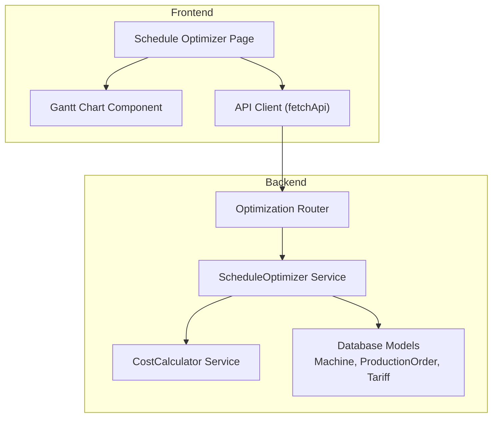
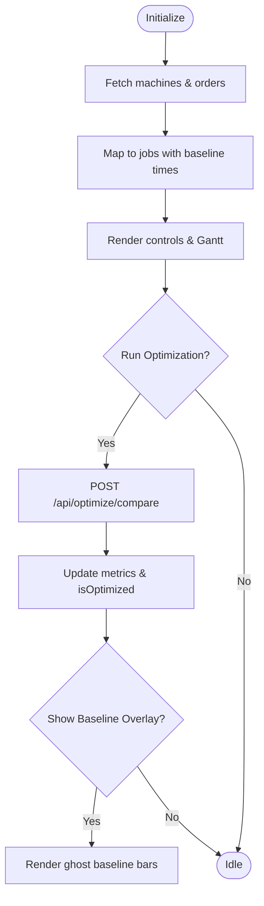
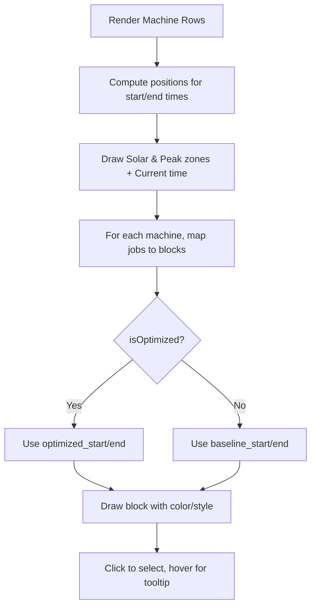
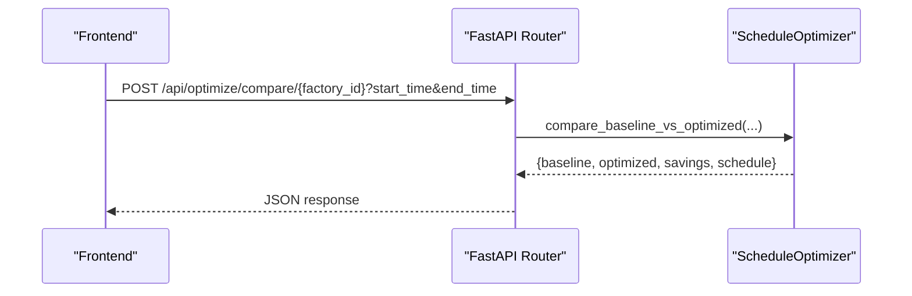
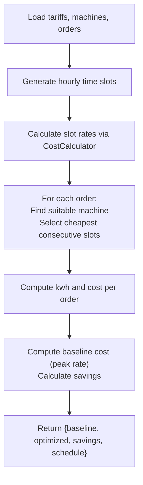
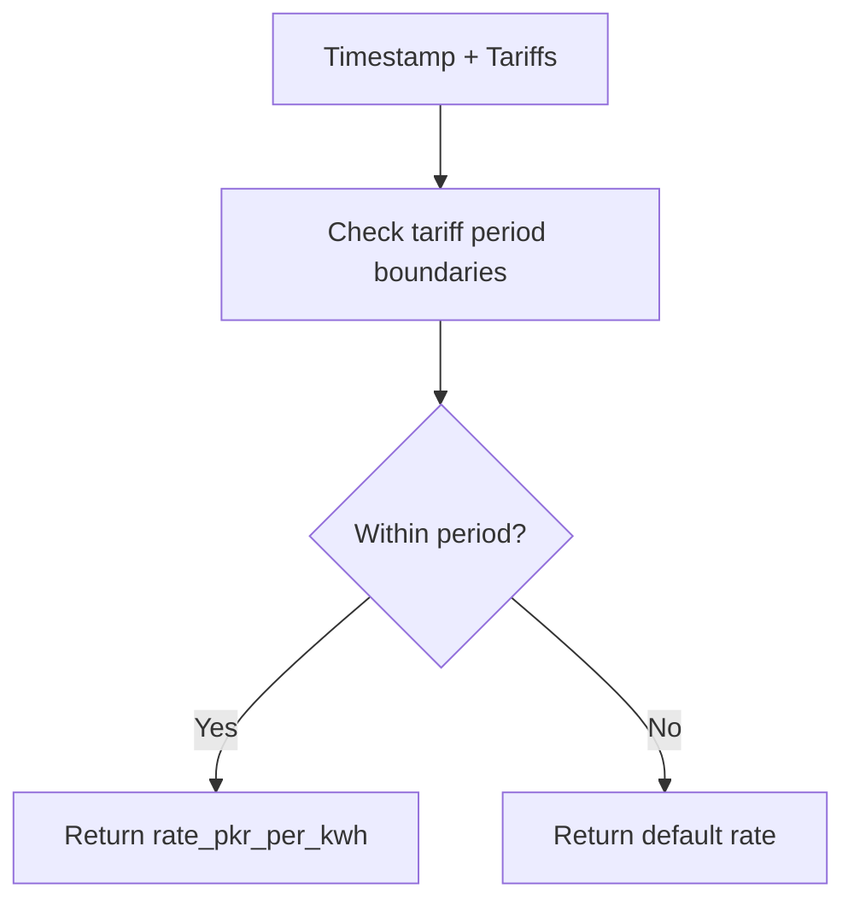
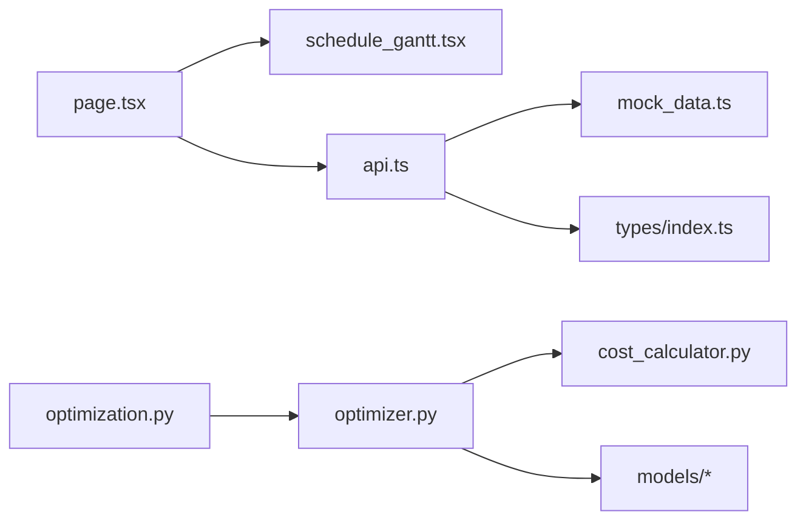

# Schedule Optimizer

<cite>
**Referenced Files in This Document**
- [page.tsx](file://frontend/app/dashboard/schedule_optimizer/page.tsx)
- [schedule_gantt.tsx](file://frontend/components/charts/schedule_gantt.tsx)
- [optimization.py](file://backend/app/api/optimization.py)
- [optimizer.py](file://backend/app/services/optimizer.py)
- [cost_calculator.py](file://backend/app/services/cost_calculator.py)
- [production_order.py](file://backend/app/models/production_order.py)
- [machine.py](file://backend/app/models/machine.py)
- [tariff.py](file://backend/app/models/tariff.py)
- [api.ts](file://frontend/lib/api.ts)
- [mock_data.ts](file://frontend/lib/mock_data.ts)
- [index.ts](file://frontend/types/index.ts)
</cite>

## Table of Contents
1. [Introduction](#introduction)
2. [Project Structure](#project-structure)
3. [Core Components](#core-components)
4. [Architecture Overview](#architecture-overview)
5. [Detailed Component Analysis](#detailed-component-analysis)
6. [Dependency Analysis](#dependency-analysis)
7. [Performance Considerations](#performance-considerations)
8. [Troubleshooting Guide](#troubleshooting-guide)
9. [Conclusion](#conclusion)
10. [Appendices](#appendices)

## Introduction
This document explains the Schedule Optimizer page, an AI-powered production scheduling interface that minimizes energy costs by shifting jobs to cheaper tariff periods while respecting machine constraints and order deadlines. It covers how users input production orders, configure machine constraints, and set tariff schedules; how the system generates optimized plans; and how results are visualized and compared against a baseline. It also details integration with optimization APIs, schedule comparison features, cost savings analysis, algorithm parameters, optimization strategies, and performance considerations.

## Project Structure
The Schedule Optimizer spans both frontend and backend:
- Frontend: A Next.js page renders a Gantt chart, control bar, and cost impact panel. It fetches machines and orders, triggers optimization via API, and displays baseline vs optimized schedules.
- Backend: FastAPI endpoints expose schedule generation and comparison. The optimizer service computes slot rates from tariffs, assigns orders to cheapest available slots per machine, and calculates savings versus a baseline.



**Diagram sources**
- [page.tsx:72-152](file://frontend/app/dashboard/schedule_optimizer/page.tsx#L72-L152)
- [schedule_gantt.tsx:27-179](file://frontend/components/charts/schedule_gantt.tsx#L27-L179)
- [optimization.py:11-48](file://backend/app/api/optimization.py#L11-L48)
- [optimizer.py:97-238](file://backend/app/services/optimizer.py#L97-L238)
- [cost_calculator.py:15-33](file://backend/app/services/cost_calculator.py#L15-L33)
- [machine.py:5-20](file://backend/app/models/machine.py#L5-L20)
- [production_order.py:5-20](file://backend/app/models/production_order.py#L5-L20)
- [tariff.py:5-19](file://backend/app/models/tariff.py#L5-L19)

**Section sources**
- [page.tsx:72-152](file://frontend/app/dashboard/schedule_optimizer/page.tsx#L72-L152)
- [optimization.py:11-48](file://backend/app/api/optimization.py#L11-L48)
- [optimizer.py:97-238](file://backend/app/services/optimizer.py#L97-L238)

## Core Components
- Schedule Optimizer Page: Initializes data (machines, orders), provides controls (filter, lock, reset, run optimization), shows cost impact and key movements, and toggles baseline overlay on the Gantt chart.
- Gantt Chart Component: Renders time windows for solar and peak tariff periods, overlays current time, and visualizes baseline vs optimized job blocks with tooltips and selection.
- Optimization API: Exposes endpoints to generate an optimized schedule and compare baseline vs optimized for a given factory and time window.
- Optimizer Service: Builds hourly time slots, maps tariffs to slot rates, assigns pending orders to suitable machines, selects cheapest consecutive slots per machine, and computes costs and savings.
- Cost Calculator: Determines applicable tariff rate for any timestamp, including overnight periods, and estimates costs for consumption.

Key responsibilities and interactions are detailed in the next sections.

**Section sources**
- [page.tsx:72-152](file://frontend/app/dashboard/schedule_optimizer/page.tsx#L72-L152)
- [schedule_gantt.tsx:27-179](file://frontend/components/charts/schedule_gantt.tsx#L27-L179)
- [optimization.py:11-48](file://backend/app/api/optimization.py#L11-L48)
- [optimizer.py:97-238](file://backend/app/services/optimizer.py#L97-L238)
- [cost_calculator.py:15-33](file://backend/app/services/cost_calculator.py#L15-L33)

## Architecture Overview
The user interacts with the Schedule Optimizer page to trigger optimization. The page calls the backend compare endpoint, which invokes the optimizer service to compute both baseline and optimized schedules and returns metrics and schedule details. The frontend then updates the Gantt chart and cost panels accordingly.

```mermaid
sequenceDiagram
participant User as "User"
participant Page as "Schedule Optimizer Page"
participant API as "Optimization API"
participant Opt as "ScheduleOptimizer"
participant Cost as "CostCalculator"
participant DB as "Models (Machines, Orders, Tariffs)"
User->>Page : Click "Run Optimization"
Page->>API : POST /api/optimize/compare/{factory_id}?start_time&end_time
API->>Opt : compare_baseline_vs_optimized(factory_id, start, end)
Opt->>DB : Load machines, orders, tariffs
Opt->>Cost : get_tariff_rate(tariffs, timestamp)
Cost-->>Opt : rate
Opt->>Opt : Generate hourly slots, assign orders, select cheapest slots
Opt-->>API : {baseline, optimized, savings, schedule}
API-->>Page : Response payload
Page->>Page : Update metrics and Gantt (baseline vs optimized)
```

**Diagram sources**
- [page.tsx:123-152](file://frontend/app/dashboard/schedule_optimizer/page.tsx#L123-L152)
- [optimization.py:31-48](file://backend/app/api/optimization.py#L31-L48)
- [optimizer.py:192-238](file://backend/app/services/optimizer.py#L192-L238)
- [cost_calculator.py:15-33](file://backend/app/services/cost_calculator.py#L15-L33)

## Detailed Component Analysis

### Schedule Optimizer Page
- Data initialization: Fetches machines and orders for a factory and prepares initial jobs for visualization.
- Controls: Filter by machine, show/hide baseline, lock selected jobs, reset to baseline, and run optimization.
- Optimization workflow: Calls compare endpoint with factory ID and ISO timestamps for today and tomorrow, then updates metrics and UI state.
- Visualization: Passes jobs and machines to the Gantt component; supports baseline ghost overlay when comparing.



**Diagram sources**
- [page.tsx:84-114](file://frontend/app/dashboard/schedule_optimizer/page.tsx#L84-L114)
- [page.tsx:123-152](file://frontend/app/dashboard/schedule_optimizer/page.tsx#L123-L152)
- [page.tsx:154-176](file://frontend/app/dashboard/schedule_optimizer/page.tsx#L154-L176)

**Section sources**
- [page.tsx:72-152](file://frontend/app/dashboard/schedule_optimizer/page.tsx#L72-L152)
- [page.tsx:178-358](file://frontend/app/dashboard/schedule_optimizer/page.tsx#L178-L358)

### Gantt Chart Component
- Time window: Displays hours from 06:00 to 22:00 with markers every two hours.
- Background zones: Highlights solar window and peak tariff period; draws a vertical line for current time.
- Job rendering: For each machine, shows job blocks using either baseline or optimized times based on UI state; supports locked jobs and energy type coloring.
- Interaction: Selection highlights, hover tooltips showing time ranges and status, and optional ghost baseline overlay.



**Diagram sources**
- [schedule_gantt.tsx:27-41](file://frontend/components/charts/schedule_gantt.tsx#L27-L41)
- [schedule_gantt.tsx:91-179](file://frontend/components/charts/schedule_gantt.tsx#L91-L179)
- [schedule_gantt.tsx:181-218](file://frontend/components/charts/schedule_gantt.tsx#L181-L218)

**Section sources**
- [schedule_gantt.tsx:27-218](file://frontend/components/charts/schedule_gantt.tsx#L27-L218)

### Optimization API
- Endpoints:
  - POST /api/optimize/schedule/{factory_id}: Generates an optimized schedule for a factory within a time window.
  - POST /api/optimize/compare/{factory_id}: Compares baseline vs optimized schedule and returns savings metrics plus schedule details.
- Parameters: Optional start_time and end_time; defaults to current hour and next 24 hours if not provided.



**Diagram sources**
- [optimization.py:11-48](file://backend/app/api/optimization.py#L11-L48)

**Section sources**
- [optimization.py:11-48](file://backend/app/api/optimization.py#L11-L48)

### Optimizer Service
- Data loading: Retrieves tariffs, machines, and pending orders for the factory.
- Time slot generation: Creates hourly slots between start and end times.
- Slot rate calculation: Uses CostCalculator to determine the applicable tariff rate for each slot.
- Assignment strategy: Matches orders to machines by process type; finds cheapest consecutive slots per machine while avoiding already used slots; computes energy usage and cost per order.
- Comparison logic: Computes baseline cost assuming all orders run at a fixed peak rate; calculates savings amount and percentage; returns schedule details.



**Diagram sources**
- [optimizer.py:21-64](file://backend/app/services/optimizer.py#L21-L64)
- [optimizer.py:66-95](file://backend/app/services/optimizer.py#L66-L95)
- [optimizer.py:97-190](file://backend/app/services/optimizer.py#L97-L190)
- [optimizer.py:192-238](file://backend/app/services/optimizer.py#L192-L238)

**Section sources**
- [optimizer.py:21-238](file://backend/app/services/optimizer.py#L21-L238)

### Cost Calculator
- Tariff lookup: Returns the correct rate for a timestamp, handling overnight periods where start_time > end_time.
- Estimation utilities: Provides helpers to calculate slot cost, total cost across readings, and estimate machine cost over a duration.



**Diagram sources**
- [cost_calculator.py:15-33](file://backend/app/services/cost_calculator.py#L15-L33)

**Section sources**
- [cost_calculator.py:15-110](file://backend/app/services/cost_calculator.py#L15-L110)

### Data Models
- ProductionOrder: Captures order metadata, duration, earliest start, deadline, priority, machine options, lock flag, and status.
- Machine: Defines machine identity, type, power consumption, minimum run/setup times, shiftability, availability windows, maintenance windows, and priority.
- Tariff: Defines tariff categories, period names, time ranges, rates, fixed charges, effective dates, source, verification timestamps.

These models underpin the optimizer’s ability to match orders to machines, respect availability and constraints, and apply correct tariff rates.

**Section sources**
- [production_order.py:5-20](file://backend/app/models/production_order.py#L5-L20)
- [machine.py:5-20](file://backend/app/models/machine.py#L5-L20)
- [tariff.py:5-19](file://backend/app/models/tariff.py#L5-L19)

## Dependency Analysis
- Frontend dependencies:
  - Page depends on Gantt component and API client.
  - Gantt depends on types and utility functions for styling and positioning.
  - API client handles authentication headers and error mapping.
- Backend dependencies:
  - Router depends on optimizer service.
  - Optimizer depends on cost calculator and database models.
  - Cost calculator depends on tariff model and optionally meter reading model.



**Diagram sources**
- [page.tsx:1-11](file://frontend/app/dashboard/schedule_optimizer/page.tsx#L1-L11)
- [schedule_gantt.tsx:1-5](file://frontend/components/charts/schedule_gantt.tsx#L1-L5)
- [api.ts:1-49](file://frontend/lib/api.ts#L1-L49)
- [mock_data.ts:1-60](file://frontend/lib/mock_data.ts#L1-L60)
- [index.ts:1-46](file://frontend/types/index.ts#L1-L46)
- [optimization.py:1-9](file://backend/app/api/optimization.py#L1-L9)
- [optimizer.py:1-19](file://backend/app/services/optimizer.py#L1-L19)
- [cost_calculator.py:1-11](file://backend/app/services/cost_calculator.py#L1-L11)

**Section sources**
- [api.ts:1-49](file://frontend/lib/api.ts#L1-L49)
- [optimizer.py:1-19](file://backend/app/services/optimizer.py#L1-L19)

## Performance Considerations
- Time granularity: Hourly slots balance accuracy and performance; reducing interval increases computation but improves precision.
- Sorting complexity: Slot selection sorts slot rates per job; overall complexity scales with number of orders and slots.
- Machine matching: Matching orders to machines by process reduces search space; ensure consistent naming to avoid fallbacks.
- Locking mechanism: Used slots per machine prevent conflicts; locking increases constraint satisfaction overhead slightly.
- Baseline assumption: Fixed peak rate simplifies baseline calculation; consider dynamic peak rates for more accurate comparisons.
- Frontend rendering: Gantt uses percentage-based positioning; large numbers of jobs may benefit from virtualization or filtering.

[No sources needed since this section provides general guidance]

## Troubleshooting Guide
- Authentication errors: If the API returns 401 or 403, the frontend throws descriptive errors; ensure token is present and permissions allow optimization actions.
- Missing data: If no machines or orders are found, the optimizer cannot schedule; verify factory_id and data population.
- Tariff mismatches: If no tariff matches a timestamp, a default rate is used; confirm tariff periods cover the entire day and handle overnight ranges correctly.
- Constraint violations: Ensure orders have valid durations and deadlines; check machine availability windows and maintenance windows.
- UI state issues: Reset button restores baseline view; use filter to isolate problematic machines.

**Section sources**
- [api.ts:27-49](file://frontend/lib/api.ts#L27-L49)
- [cost_calculator.py:15-33](file://backend/app/services/cost_calculator.py#L15-L33)
- [optimizer.py:120-133](file://backend/app/services/optimizer.py#L120-L133)

## Conclusion
The Schedule Optimizer integrates a user-friendly Gantt interface with a robust backend optimization engine to minimize energy costs by aligning production schedules with tariff periods. Users can configure constraints via machine and order data, run optimization, and visualize baseline vs optimized plans with clear cost savings insights. The system balances simplicity and effectiveness through hourly slotting, straightforward assignment logic, and transparent comparison metrics.

[No sources needed since this section summarizes without analyzing specific files]

## Appendices

### Example: Constraint Configuration
- Machines: Define machine_type, power_kw, min_run_minutes, setup_minutes, shiftable, availability windows, and maintenance windows to constrain scheduling.
- Orders: Set duration_minutes, earliest_start, deadline, priority, and machine_options to guide assignment and timing.
- Tariffs: Configure period_name, start_time, end_time, and rate_pkr_per_kwh to reflect real pricing, including overnight periods.

**Section sources**
- [machine.py:5-20](file://backend/app/models/machine.py#L5-L20)
- [production_order.py:5-20](file://backend/app/models/production_order.py#L5-L20)
- [tariff.py:5-19](file://backend/app/models/tariff.py#L5-L19)

### Example: Schedule Generation Workflow
- Initialize: Load machines, orders, tariffs.
- Generate slots: Create hourly intervals within the chosen time window.
- Calculate rates: Map each slot to its tariff rate.
- Assign orders: Match orders to suitable machines and pick cheapest consecutive slots per machine.
- Compute costs: Sum energy usage and costs; compare with baseline peak-rate assumption.
- Return results: Provide baseline, optimized, savings, and schedule details for visualization.

**Section sources**
- [optimizer.py:21-64](file://backend/app/services/optimizer.py#L21-L64)
- [optimizer.py:97-190](file://backend/app/services/optimizer.py#L97-L190)
- [optimizer.py:192-238](file://backend/app/services/optimizer.py#L192-L238)

### Example: Result Interpretation
- Metrics: Baseline cost, optimized cost, savings amount, and percentage indicate financial impact.
- Key movements: Highlighted jobs show shifts away from peak tariffs or into solar windows.
- Gantt overlay: Toggle baseline to see proposed changes visually; locked jobs remain fixed.

**Section sources**
- [page.tsx:116-152](file://frontend/app/dashboard/schedule_optimizer/page.tsx#L116-L152)
- [page.tsx:312-355](file://frontend/app/dashboard/schedule_optimizer/page.tsx#L312-L355)
- [schedule_gantt.tsx:111-179](file://frontend/components/charts/schedule_gantt.tsx#L111-L179)