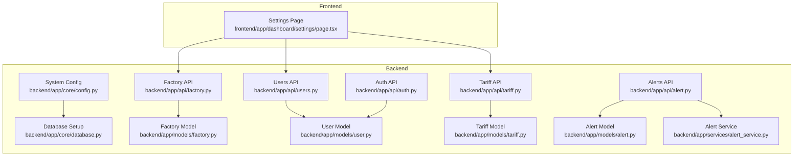
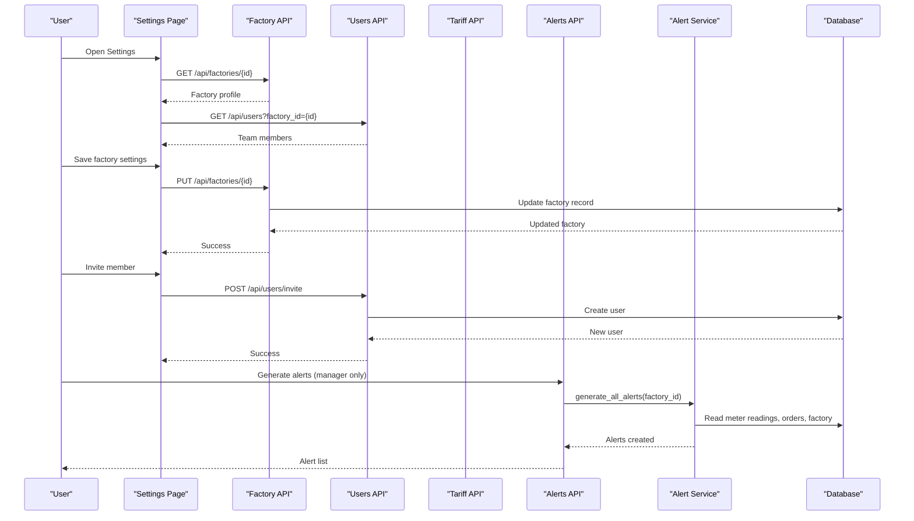
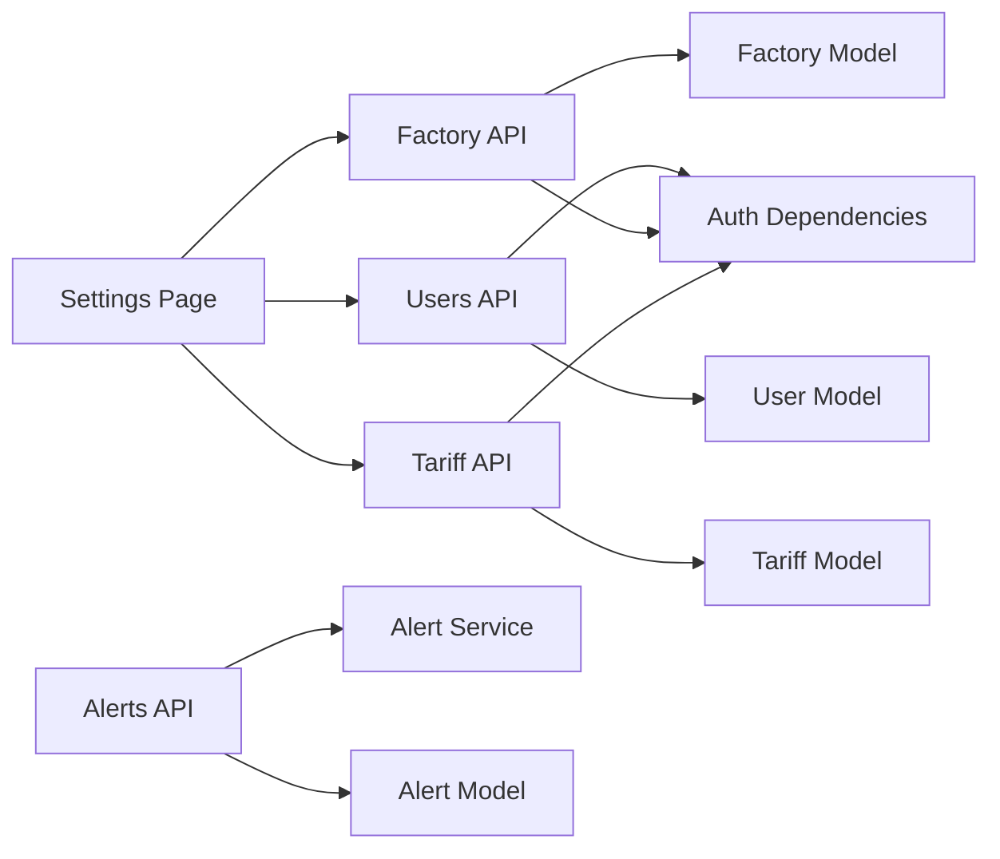
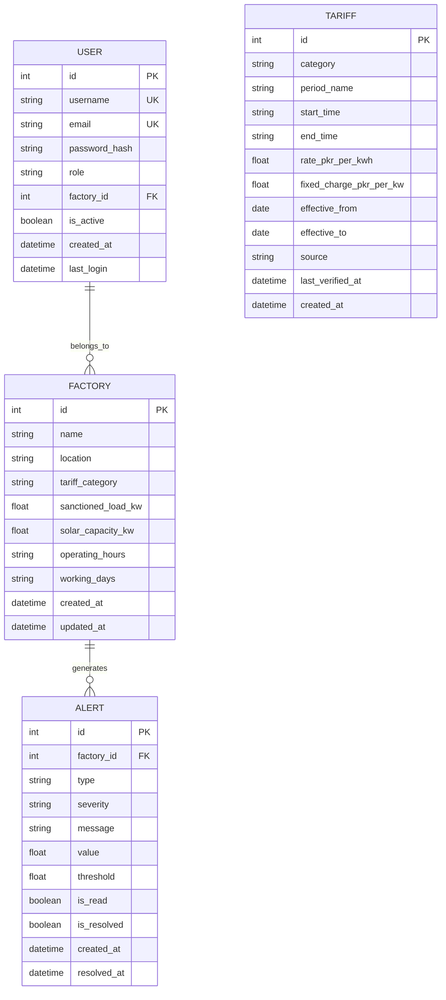

# Settings & Configuration

<cite>
**Referenced Files in This Document**
- [config.py](file://backend/app/core/config.py)
- [database.py](file://backend/app/core/database.py)
- [factory.py](file://backend/app/models/factory.py)
- [factory_api.py](file://backend/app/api/factory.py)
- [tariff.py](file://backend/app/models/tariff.py)
- [tariff_api.py](file://backend/app/api/tariff.py)
- [user_model.py](file://backend/app/models/user.py)
- [auth_api.py](file://backend/app/api/auth.py)
- [users_api.py](file://backend/app/api/users.py)
- [alert_model.py](file://backend/app/models/alert.py)
- [alert_api.py](file://backend/app/api/alert.py)
- [alert_service.py](file://backend/app/services/alert_service.py)
- [settings_page.tsx](file://frontend/app/dashboard/settings/page.tsx)
</cite>

## Table of Contents
1. Introduction
2. Project Structure
3. Core Components
4. Architecture Overview
5. Detailed Component Analysis
6. Dependency Analysis
7. Performance Considerations
8. Troubleshooting Guide
9. Conclusion
10. Appendices

## Introduction
This document explains the Settings and Configuration capabilities of TariffGuard, focusing on system-wide configuration, user preferences, notification settings, security configurations, factory-specific settings, tariff configurations, alert thresholds, integration parameters, user role management, permissions, audit logging considerations, initialization, backup/restore guidance, performance tuning, validation, environment-specific settings, and deployment considerations. It maps both backend APIs and the frontend Settings page to help administrators configure and operate the system effectively.

## Project Structure
The Settings and Configuration features span:
- Backend configuration and database setup
- Factory profile and tariff management
- User roles and permissions
- Alert generation and thresholds
- Frontend Settings UI for editing factory profile, tariffs, team members, and preferences

**Diagram sources**
- [settings_page.tsx:1-585](file://frontend/app/dashboard/settings/page.tsx#L1-L585)
- [config.py:1-21](file://backend/app/core/config.py#L1-L21)
- [database.py:1-37](file://backend/app/core/database.py#L1-L37)
- [factory_api.py:1-81](file://backend/app/api/factory.py#L1-L81)
- [tariff_api.py:1-90](file://backend/app/api/tariff.py#L1-L90)
- [auth_api.py:1-89](file://backend/app/api/auth.py#L1-L89)
- [users_api.py:1-109](file://backend/app/api/users.py#L1-L109)
- [alert_api.py:1-107](file://backend/app/api/alert.py#L1-L107)
- [alert_service.py:1-140](file://backend/app/services/alert_service.py#L1-L140)
- [factory.py:1-17](file://backend/app/models/factory.py#L1-L17)
- [tariff.py:1-19](file://backend/app/models/tariff.py#L1-L19)
- [user_model.py:1-16](file://backend/app/models/user.py#L1-L16)
- [alert_model.py:1-18](file://backend/app/models/alert.py#L1-L18)

**Section sources**
- [settings_page.tsx:1-585](file://frontend/app/dashboard/settings/page.tsx#L1-L585)
- [config.py:1-21](file://backend/app/core/config.py#L1-L21)
- [database.py:1-37](file://backend/app/core/database.py#L1-L37)

## Core Components
- System configuration: application name, environment flag, debug mode, database URL, and optional cloud integrations keys.
- Database engine and session management with environment-based connection options.
- Factory profile: name, location, tariff category, sanctioned load, solar capacity, operating hours, working days.
- Tariff periods: category, time windows, rates, fixed charges, effective dates, source, verification timestamps.
- Users and roles: registration, login, token handling, role-based access control (owner, manager, supervisor, viewer).
- Alerts: types, severity levels, thresholds, read/resolved status, statistics.
- Frontend Settings page: edit factory profile, manage tariffs, invite users, change roles, set preferences (default view, currency, time format, language), and toggle notifications.

**Section sources**
- [config.py:1-21](file://backend/app/core/config.py#L1-L21)
- [database.py:1-37](file://backend/app/core/database.py#L1-L37)
- [factory.py:1-17](file://backend/app/models/factory.py#L1-L17)
- [tariff.py:1-19](file://backend/app/models/tariff.py#L1-L19)
- [user_model.py:1-16](file://backend/app/models/user.py#L1-L16)
- [alert_model.py:1-18](file://backend/app/models/alert.py#L1-L18)
- [settings_page.tsx:1-585](file://frontend/app/dashboard/settings/page.tsx#L1-L585)

## Architecture Overview
The Settings and Configuration flow integrates frontend UI with backend APIs and services:
- The Settings page loads factory data and users, updates factory profile, invites users, changes roles, and displays tariff periods and preferences.
- Backend enforces authentication and role-based authorization via dependencies.
- Alerts are generated by a service that reads meter readings, production orders, and factory settings to create actionable alerts.

**Diagram sources**
- [settings_page.tsx:46-157](file://frontend/app/dashboard/settings/page.tsx#L46-L157)
- [factory_api.py:37-66](file://backend/app/api/factory.py#L37-L66)
- [users_api.py:17-64](file://backend/app/api/users.py#L17-L64)
- [alert_api.py:35-43](file://backend/app/api/alert.py#L35-L43)
- [alert_service.py:125-140](file://backend/app/services/alert_service.py#L125-L140)

## Detailed Component Analysis

### System-Wide Configuration
- Application-level settings include app name, environment, debug flag, database URL, and optional integration keys.
- Environment file support is enabled; case-sensitive variables are enforced.
- Database engine selection depends on the DATABASE_URL prefix; MySQL uses pooling and recycling, while SQLite uses thread-safe connect args.

Operational notes:
- Ensure DATABASE_URL points to the correct database server for your environment.
- Set DEBUG appropriately per environment to control verbose error output.
- Provide ALCHEMY_KEY and QWEN_API_KEY if using Alibaba Cloud or Qwen integrations.

**Section sources**
- [config.py:1-21](file://backend/app/core/config.py#L1-L21)
- [database.py:1-37](file://backend/app/core/database.py#L1-L37)

### Factory-Specific Settings
- Factory model stores name, location, tariff category, sanctioned load, solar capacity, operating hours, and working days.
- Factory API supports CRUD operations with role-based restrictions:
  - Create/Update require manager role.
  - Delete requires owner role.
  - List/Get require authenticated user.

Frontend behavior:
- Settings page loads factory details and allows editing fields based on role permissions.
- Supervisor cannot modify factory settings; save button disabled accordingly.

**Section sources**
- [factory.py:1-17](file://backend/app/models/factory.py#L1-L17)
- [factory_api.py:13-81](file://backend/app/api/factory.py#L13-L81)
- [settings_page.tsx:46-113](file://frontend/app/dashboard/settings/page.tsx#L46-L113)

### Tariff Configurations
- Tariff model defines category, period name, start/end times, rate, fixed charge, effective date range, source, and last verified timestamp.
- Tariff API provides endpoints to create, list, get, update, delete tariffs, and fetch active tariffs for a category.
- Active tariff filtering considers today’s date against effective_from and effective_to.

Frontend behavior:
- Settings page shows tariff periods table with add/edit/delete actions (disabled for supervisors).
- Add Period action currently shows a demo message directing to the Tariff Calendar page.

**Section sources**
- [tariff.py:1-19](file://backend/app/models/tariff.py#L1-L19)
- [tariff_api.py:12-90](file://backend/app/api/tariff.py#L12-L90)
- [settings_page.tsx:294-354](file://frontend/app/dashboard/settings/page.tsx#L294-L354)

### Alert Thresholds and Notifications
- Alert model includes type, severity, message, value, threshold, read/resolved flags, and timestamps.
- Alert API lists alerts with filters, generates alerts (manager-only), retrieves unresolved alerts, updates status, and returns stats.
- Alert Service checks peak demand, deadlines, and low solar generation, creating alerts with appropriate severity and thresholds.

Notification preferences:
- Frontend Preferences section includes toggles for Email and WhatsApp notifications for high-severity alerts.
- Registration form indicates phone number usage for WhatsApp alerts.

Note: Actual email/WhatsApp delivery implementation is not present in the analyzed files; preferences are UI-level toggles.

**Section sources**
- [alert_model.py:1-18](file://backend/app/models/alert.py#L1-L18)
- [alert_api.py:14-107](file://backend/app/api/alert.py#L14-L107)
- [alert_service.py:19-140](file://backend/app/services/alert_service.py#L19-L140)
- [settings_page.tsx:482-497](file://frontend/app/dashboard/settings/page.tsx#L482-L497)
- [signup page snippet:123-136](file://frontend/app/(auth)/signup/page.tsx#L123-L136)

### User Role Management and Permissions
- User model includes username, email, password hash, role, factory association, active status, and login timestamps.
- Auth API handles register, login, logout, current user retrieval, and role requirement dependency.
- Users API manages listing users, inviting new users, deleting users, and updating roles with strict role-based checks:
  - Only owners/managers can list users.
  - Managers cannot create owner accounts.
  - Only owners can update roles.
  - Managers cannot delete owner accounts.
  - Cannot delete own account.

Frontend behavior:
- Settings page restricts editing based on role:
  - Supervisor cannot edit factory settings or tariff periods.
  - Owner-only actions include inviting members and changing roles.
  - Non-supervisor users see team members section.

**Section sources**
- [user_model.py:1-16](file://backend/app/models/user.py#L1-L16)
- [auth_api.py:15-89](file://backend/app/api/auth.py#L15-L89)
- [users_api.py:17-109](file://backend/app/api/users.py#L17-L109)
- [settings_page.tsx:15-157](file://frontend/app/dashboard/settings/page.tsx#L15-L157)

### Security Configurations
- Authentication uses Bearer tokens stored in-memory for the session; tokens are invalidated on logout.
- Role-based access control is enforced via dependencies on endpoints requiring specific roles.
- Passwords are hashed before storage (via AuthService), ensuring secure credential handling.

Deployment considerations:
- In-memory token storage is suitable for development; for production, consider persistent token storage and rotation strategies.
- Securely manage DATABASE_URL and any API keys via environment variables.

**Section sources**
- [auth_api.py:37-89](file://backend/app/api/auth.py#L37-L89)
- [config.py:1-21](file://backend/app/core/config.py#L1-L21)

### Audit Logging Configuration
- Alert records include creation and resolution timestamps, providing an audit trail for operational events.
- No explicit general-purpose audit log table was found in the analyzed models; consider adding an audit log model for comprehensive tracking of configuration changes.

Recommendation:
- Implement an audit log endpoint/model to record who changed what and when, especially for factory and tariff updates.

**Section sources**
- [alert_model.py:1-18](file://backend/app/models/alert.py#L1-L18)

### Examples: Initialization, Backup/Restore, Performance Tuning

Initialization:
- Database tables are created via init_db, which builds metadata and creates all tables.
- Ensure the database URL is correctly configured for your environment before running initialization.

Backup and Restore:
- Use standard database tools for your chosen backend (e.g., mysqldump for MySQL, pg_dump for PostgreSQL) to back up and restore data.
- For SQLite fallback, copy the database file safely during backups.

Performance Tuning:
- MySQL engine uses pool_pre_ping and pool_recycle to maintain healthy connections; adjust pool size and timeouts based on workload.
- Avoid enabling echo=True in production to reduce logging overhead.
- Limit query results using skip/limit parameters where applicable.

**Section sources**
- [database.py:1-37](file://backend/app/core/database.py#L1-L37)

### Configuration Validation and Environment-Specific Settings
- Pydantic BaseSettings validates and loads configuration from environment variables and .env file.
- Case sensitivity is enforced for variable names.
- Environment-specific behavior can be controlled via ENVIRONMENT and DEBUG flags.

Validation tips:
- Validate required fields like DATABASE_URL and ensure proper credentials.
- Use separate .env files per environment (development, staging, production).

**Section sources**
- [config.py:1-21](file://backend/app/core/config.py#L1-L21)

### Deployment Considerations
- Expose only necessary API endpoints behind a reverse proxy and enforce HTTPS.
- Restrict admin endpoints with strong authentication and role checks.
- Configure CORS appropriately if serving frontend from a different origin.
- Monitor database connections and tune pool settings for production workloads.
- Centralize logs and integrate with monitoring systems.

[No sources needed since this section provides general guidance]

## Dependency Analysis
The Settings and Configuration feature relies on cohesive modules with clear separation of concerns:
- Frontend Settings page interacts with Factory, Users, and Tariff APIs.
- Backend APIs depend on models and services for data operations and business logic.
- Authentication and role checks are centralized in auth dependencies.

**Diagram sources**
- [settings_page.tsx:46-157](file://frontend/app/dashboard/settings/page.tsx#L46-L157)
- [factory_api.py:1-81](file://backend/app/api/factory.py#L1-L81)
- [users_api.py:1-109](file://backend/app/api/users.py#L1-L109)
- [tariff_api.py:1-90](file://backend/app/api/tariff.py#L1-L90)
- [alert_api.py:1-107](file://backend/app/api/alert.py#L1-L107)
- [alert_service.py:1-140](file://backend/app/services/alert_service.py#L1-L140)

**Section sources**
- [settings_page.tsx:46-157](file://frontend/app/dashboard/settings/page.tsx#L46-L157)
- [factory_api.py:1-81](file://backend/app/api/factory.py#L1-L81)
- [users_api.py:1-109](file://backend/app/api/users.py#L1-L109)
- [tariff_api.py:1-90](file://backend/app/api/tariff.py#L1-L90)
- [alert_api.py:1-107](file://backend/app/api/alert.py#L1-L107)
- [alert_service.py:1-140](file://backend/app/services/alert_service.py#L1-L140)

## Performance Considerations
- Use pagination (skip/limit) on list endpoints to avoid large result sets.
- Tune database connection pools for MySQL to handle concurrent requests efficiently.
- Minimize unnecessary logging in production (echo=False).
- Cache frequently accessed configuration values at the application layer if needed.
- Profile alert generation frequency to avoid excessive database queries.

[No sources needed since this section provides general guidance]

## Troubleshooting Guide
Common issues and resolutions:
- Authentication failures:
  - Ensure Bearer token is included in Authorization header.
  - Verify token is valid and not expired; re-login if necessary.
- Permission errors:
  - Check user role; certain actions require owner or manager roles.
  - Confirm that managers cannot perform owner-only actions (e.g., delete factories, create owner accounts).
- Database connectivity:
  - Validate DATABASE_URL and credentials.
  - Ensure database server is reachable and ports are open.
- Alert generation:
  - Confirm factory has meter readings and production orders.
  - Check thresholds and time windows in alert service logic.

**Section sources**
- [auth_api.py:63-89](file://backend/app/api/auth.py#L63-L89)
- [users_api.py:23-109](file://backend/app/api/users.py#L23-L109)
- [factory_api.py:13-81](file://backend/app/api/factory.py#L13-L81)
- [alert_service.py:19-140](file://backend/app/services/alert_service.py#L19-L140)

## Conclusion
TariffGuard’s Settings and Configuration provide a robust foundation for managing factory profiles, tariffs, user roles, and alerts. The frontend offers intuitive controls aligned with backend permissions, while the backend enforces security and business rules. Proper environment configuration, database setup, and role-based access control are essential for reliable operation. Extending audit logging and notification delivery mechanisms will further enhance operational visibility and responsiveness.

[No sources needed since this section summarizes without analyzing specific files]

## Appendices

### Data Models Overview

**Diagram sources**
- [factory.py:1-17](file://backend/app/models/factory.py#L1-L17)
- [user_model.py:1-16](file://backend/app/models/user.py#L1-L16)
- [tariff.py:1-19](file://backend/app/models/tariff.py#L1-L19)
- [alert_model.py:1-18](file://backend/app/models/alert.py#L1-L18)