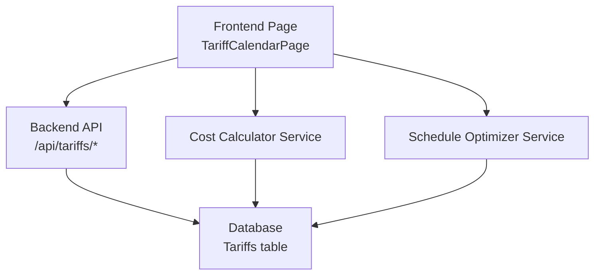
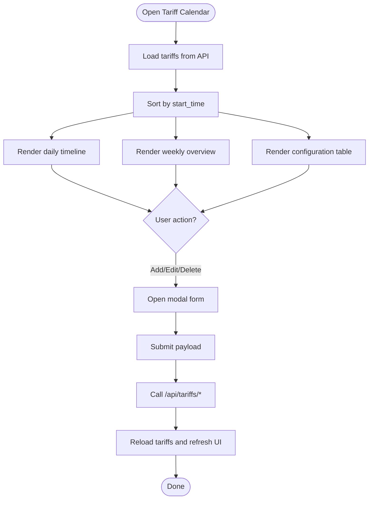
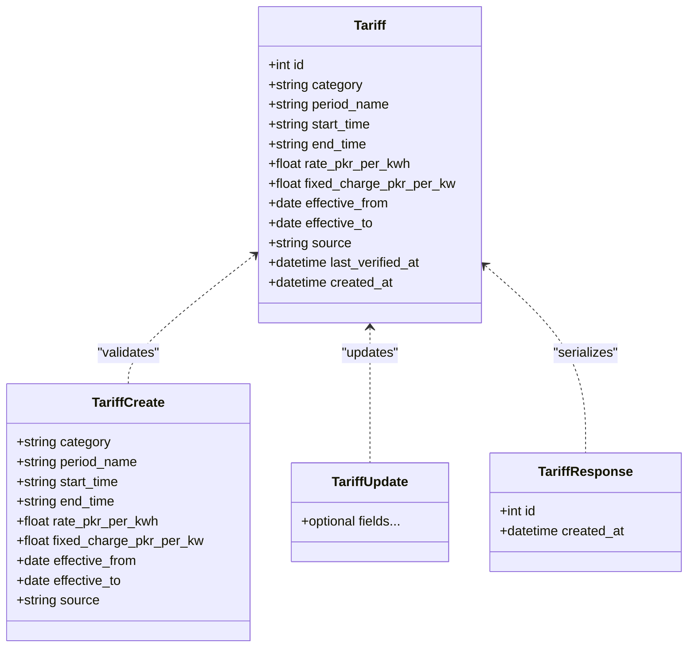
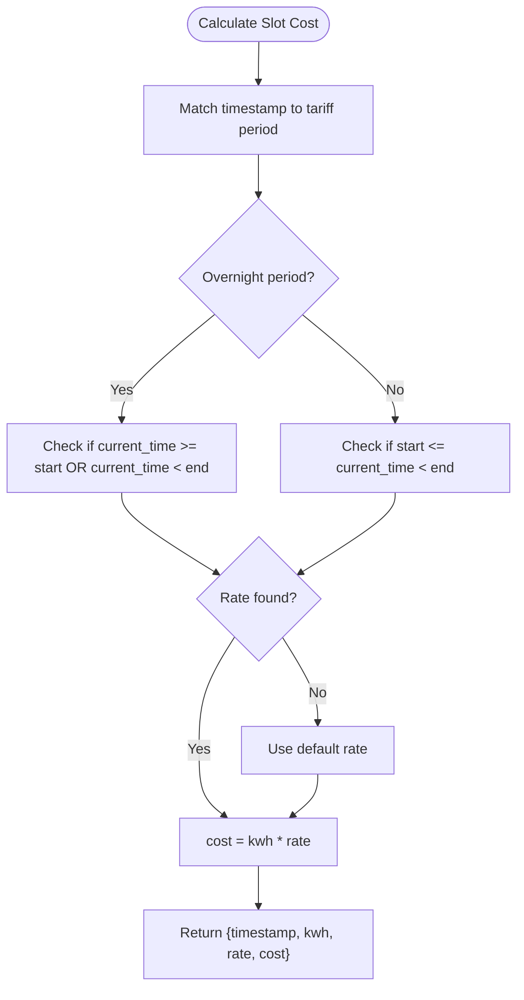
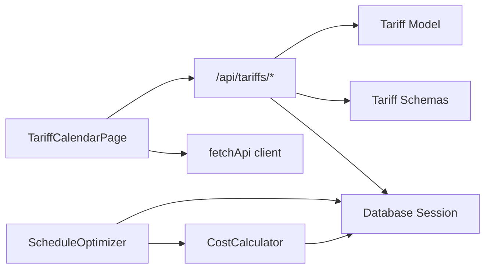

# Tariff Calendar

<cite>
**Referenced Files in This Document**
- [page.tsx](file://frontend/app/dashboard/tariff_calendar/page.tsx)
- [tariff.py](file://backend/app/api/tariff.py)
- [tariff.py (model)](file://backend/app/models/tariff.py)
- [tariff.py (schema)](file://backend/app/schemas/tariff.py)
- [cost_calculator.py](file://backend/app/services/cost_calculator.py)
- [optimizer.py](file://backend/app/services/optimizer.py)
- [api.ts](file://frontend/lib/api.ts)
- [API.md](file://docs/API.md)
</cite>

## Table of Contents
1. Introduction
2. Project Structure
3. Core Components
4. Architecture Overview
5. Detailed Component Analysis
6. Dependency Analysis
7. Performance Considerations
8. Troubleshooting Guide
9. Conclusion
10. Appendices

## Introduction
This document explains the Tariff Calendar feature that visualizes time-based electricity pricing, manages tariff rates, and supports seasonal adjustments. It covers the calendar interface for viewing peak/off-peak/night rates, creating and modifying tariff plans, and analyzing their impact on production costs. It also details integration with tariff management APIs, rate calculation engines, and cost projection features, including examples of configuration, navigation, and optimization recommendations based on tariff structures.

## Project Structure
The Tariff Calendar spans frontend UI components and backend API endpoints:
- Frontend page renders a daily timeline, weekly overview, and a configuration table to manage tariffs.
- Backend exposes CRUD endpoints for tariffs and provides services for cost calculation and schedule optimization.



**Diagram sources**
- [page.tsx:31-44](file://frontend/app/dashboard/tariff_calendar/page.tsx#L31-L44)
- [tariff.py:12-90](file://backend/app/api/tariff.py#L12-L90)
- [cost_calculator.py:12-110](file://backend/app/services/cost_calculator.py#L12-L110)
- [optimizer.py:14-238](file://backend/app/services/optimizer.py#L14-L238)

**Section sources**
- [page.tsx:10-437](file://frontend/app/dashboard/tariff_calendar/page.tsx#L10-L437)
- [tariff.py:1-90](file://backend/app/api/tariff.py#L1-L90)

## Core Components
- Tariff Calendar UI: Displays today’s tariff schedule, weekly overview, and a configuration table with add/edit/delete operations.
- Tariff Management API: Provides endpoints to list, create, update, delete, and query active tariffs by category.
- Cost Calculation Engine: Determines applicable tariff rates per timestamp and computes slot-level and total energy costs.
- Schedule Optimizer: Generates optimized production schedules using tariff rates to minimize energy costs and compares baseline vs optimized scenarios.

Key responsibilities:
- UI: Fetches tariffs, sorts them by start time, renders a horizontal timeline with a “NOW” indicator, and allows users to manage tariff periods.
- API: Validates payloads via schemas, persists changes, and filters active tariffs by effective date ranges.
- Services: Compute per-slot costs, aggregate totals, and propose optimal run times for production orders.

**Section sources**
- [page.tsx:10-437](file://frontend/app/dashboard/tariff_calendar/page.tsx#L10-L437)
- [tariff.py:12-90](file://backend/app/api/tariff.py#L12-L90)
- [cost_calculator.py:12-110](file://backend/app/services/cost_calculator.py#L12-L110)
- [optimizer.py:14-238](file://backend/app/services/optimizer.py#L14-L238)

## Architecture Overview
The Tariff Calendar integrates UI, API, and services to visualize and optimize energy costs:

```mermaid
sequenceDiagram
participant User as "User"
participant FE as "TariffCalendarPage"
participant API as "Tariff API"
participant DB as "Database"
participant CC as "CostCalculator"
participant OPT as "ScheduleOptimizer"
User->>FE : Open Tariff Calendar
FE->>API : GET /api/tariffs
API->>DB : Query tariffs
DB-->>API : List[Tariff]
API-->>FE : Tariffs[]
FE->>FE : Render timeline & table
User->>FE : Add/Edit/Delete Tariff
FE->>API : POST/PUT/DELETE /api/tariffs/*
API->>DB : Persist changes
DB-->>API : Success
API-->>FE : Updated tariffs
FE->>FE : Refresh view
Note over FE,OPT : Optional : Use optimizer to project costs
FE->>OPT : Create optimized schedule
OPT->>CC : Get tariff rates per slot
CC->>DB : Read tariffs
DB-->>CC : Tariffs[]
CC-->>OPT : Rates per slot
OPT-->>FE : Optimized schedule & savings
```

**Diagram sources**
- [page.tsx:31-44](file://frontend/app/dashboard/tariff_calendar/page.tsx#L31-L44)
- [tariff.py:12-90](file://backend/app/api/tariff.py#L12-L90)
- [cost_calculator.py:16-50](file://backend/app/services/cost_calculator.py#L16-L50)
- [optimizer.py:97-190](file://backend/app/services/optimizer.py#L97-L190)

## Detailed Component Analysis

### Tariff Calendar UI
- Loads tariffs on mount, sorts by start time, and renders:
  - A daily timeline with segments proportional to period durations and a “NOW” marker.
  - A weekly grid showing each day’s tariff blocks.
  - A configuration table listing period name, start/end times, rate, active status, and actions.
- Supports adding, editing, and deleting tariff periods through a modal form with fields for category, period name, start/end time, rate, and effective date.
- Enforces role-based restrictions for edit/add/delete actions.



**Diagram sources**
- [page.tsx:31-44](file://frontend/app/dashboard/tariff_calendar/page.tsx#L31-L44)
- [page.tsx:72-123](file://frontend/app/dashboard/tariff_calendar/page.tsx#L72-L123)
- [page.tsx:160-210](file://frontend/app/dashboard/tariff_calendar/page.tsx#L160-L210)
- [page.tsx:248-323](file://frontend/app/dashboard/tariff_calendar/page.tsx#L248-L323)

**Section sources**
- [page.tsx:10-437](file://frontend/app/dashboard/tariff_calendar/page.tsx#L10-L437)

### Tariff Management API
- Endpoints:
  - POST /api/tariffs/: Create a new tariff period.
  - GET /api/tariffs/: List tariffs with optional category filter and active-only filtering by effective dates.
  - GET /api/tariffs/{id}: Retrieve a specific tariff.
  - PUT /api/tariffs/{id}: Update an existing tariff.
  - DELETE /api/tariffs/{id}: Delete a tariff.
  - GET /api/tariffs/active/{category}: Get currently active tariff for a category based on effective_from and effective_to.
- Validation and response models are defined via Pydantic schemas.



**Diagram sources**
- [tariff.py (model):5-19](file://backend/app/models/tariff.py#L5-L19)
- [tariff.py (schema):5-35](file://backend/app/schemas/tariff.py#L5-L35)
- [tariff.py:12-90](file://backend/app/api/tariff.py#L12-L90)

**Section sources**
- [tariff.py:12-90](file://backend/app/api/tariff.py#L12-L90)
- [tariff.py (model):5-19](file://backend/app/models/tariff.py#L5-L19)
- [tariff.py (schema):5-35](file://backend/app/schemas/tariff.py#L5-L35)

### Rate Calculation Engine
- Determines the applicable tariff rate for a given timestamp by matching time-of-day against tariff start/end times, handling overnight periods where start > end.
- Computes per-slot costs and aggregates totals across meter readings, including solar offset and peak demand tracking.
- Estimates machine run costs based on power, duration, and starting timestamp.



**Diagram sources**
- [cost_calculator.py:16-50](file://backend/app/services/cost_calculator.py#L16-L50)

**Section sources**
- [cost_calculator.py:12-110](file://backend/app/services/cost_calculator.py#L12-L110)

### Schedule Optimizer and Impact Analysis
- Generates hourly time slots within a specified window and calculates tariff rates for each slot.
- Finds optimal consecutive slots for each order while respecting locked slots per machine.
- Produces an optimized schedule with estimated costs and kWh, and compares baseline vs optimized to quantify savings.

```mermaid
sequenceDiagram
participant FE as "Frontend"
participant OPT as "ScheduleOptimizer"
participant CC as "CostCalculator"
participant DB as "Database"
FE->>OPT : create_optimized_schedule(factory_id, start, end)
OPT->>DB : Get tariffs, machines, pending orders
OPT->>OPT : Generate time slots
OPT->>CC : get_tariff_rate per slot
CC->>DB : Read tariffs
DB-->>CC : Tariffs[]
CC-->>OPT : Rates per slot
OPT->>OPT : Find optimal slots per order
OPT-->>FE : Optimized schedule, costs, savings
```

**Diagram sources**
- [optimizer.py:97-190](file://backend/app/services/optimizer.py#L97-L190)
- [cost_calculator.py:16-50](file://backend/app/services/cost_calculator.py#L16-L50)

**Section sources**
- [optimizer.py:14-238](file://backend/app/services/optimizer.py#L14-L238)

## Dependency Analysis
- Frontend depends on backend tariff endpoints for data and uses a shared API client for HTTP requests and error handling.
- Backend API depends on SQLAlchemy models and Pydantic schemas for validation and persistence.
- Services depend on models and database sessions to compute costs and generate optimized schedules.



**Diagram sources**
- [page.tsx:31-44](file://frontend/app/dashboard/tariff_calendar/page.tsx#L31-L44)
- [api.ts:7-49](file://frontend/lib/api.ts#L7-L49)
- [tariff.py:12-90](file://backend/app/api/tariff.py#L12-L90)
- [cost_calculator.py:12-110](file://backend/app/services/cost_calculator.py#L12-L110)
- [optimizer.py:14-238](file://backend/app/services/optimizer.py#L14-L238)

**Section sources**
- [api.ts:7-49](file://frontend/lib/api.ts#L7-L49)
- [tariff.py:12-90](file://backend/app/api/tariff.py#L12-L90)

## Performance Considerations
- Sorting tariffs by start_time on the client ensures consistent timeline rendering; consider server-side sorting for large datasets.
- Active tariff queries use date range filters to reduce result sets; ensure indexes on effective_from/effective_to for performance at scale.
- Cost calculations iterate over meter readings; batch processing or caching can improve throughput for large histories.
- Optimization generates hourly slots; adjust interval_minutes to balance granularity and computation time.

[No sources needed since this section provides general guidance]

## Troubleshooting Guide
- Authentication/Authorization:
  - The frontend API client throws errors for 401/403 responses; ensure tokens are present and roles permit actions.
- Tariff Not Found:
  - Backend returns 404 when retrieving/updating/deleting non-existent tariffs; verify IDs and existence before mutations.
- No Active Tariff:
  - Querying active tariffs by category may fail if no tariff is effective for the current date; check effective_from/effective_to values.
- Data Consistency:
  - After mutations, the UI reloads tariffs; if updates do not reflect, confirm successful API responses and re-fetch.

**Section sources**
- [api.ts:27-49](file://frontend/lib/api.ts#L27-L49)
- [tariff.py:44-75](file://backend/app/api/tariff.py#L44-L75)
- [tariff.py:77-90](file://backend/app/api/tariff.py#L77-L90)

## Conclusion
The Tariff Calendar provides a comprehensive interface to visualize and manage time-based electricity pricing, enabling operators to configure tariff periods, understand daily and weekly patterns, and leverage cost calculation and scheduling tools to optimize production costs. By integrating tariff APIs, rate engines, and optimization services, the system supports informed decisions about when to run equipment to minimize energy expenses.

[No sources needed since this section summarizes without analyzing specific files]

## Appendices

### API Reference Summary
- Base URL: http://localhost:8000
- Tariffs endpoints:
  - POST /api/tariffs/
  - GET /api/tariffs/
  - GET /api/tariffs/{id}
  - PUT /api/tariffs/{id}
  - DELETE /api/tariffs/{id}
  - GET /api/tariffs/active/{category}

**Section sources**
- [API.md:39-46](file://docs/API.md#L39-L46)

### Example: Tariff Configuration
- Fields:
  - Category: e.g., Industrial TOU — A-1, Industrial TOU — A-2, Commercial
  - Period Name: e.g., Peak, Off-Peak, Night
  - Start Time: HH:mm
  - End Time: HH:mm (use 00:00 to represent midnight)
  - Rate (Rs/kWh): numeric value
  - Effective From: YYYY-MM-DD
- Actions:
  - Add Period: Opens modal to create a new tariff entry.
  - Edit Period: Pre-fills modal with existing values for modification.
  - Delete Period: Removes a tariff entry after confirmation.

**Section sources**
- [page.tsx:22-29](file://frontend/app/dashboard/tariff_calendar/page.tsx#L22-L29)
- [page.tsx:72-123](file://frontend/app/dashboard/tariff_calendar/page.tsx#L72-L123)
- [page.tsx:325-432](file://frontend/app/dashboard/tariff_calendar/page.tsx#L325-L432)

### Example: Calendar Navigation
- Daily Timeline:
  - Segments represent tariff periods; width proportional to duration.
  - “NOW” indicator shows current time position.
- Weekly Overview:
  - Grid displays each day’s tariff blocks; click placeholders for detailed views.
- Configuration Table:
  - Lists all tariff periods with start/end times, rates, and actions.

**Section sources**
- [page.tsx:160-210](file://frontend/app/dashboard/tariff_calendar/page.tsx#L160-L210)
- [page.tsx:212-246](file://frontend/app/dashboard/tariff_calendar/page.tsx#L212-L246)
- [page.tsx:248-323](file://frontend/app/dashboard/tariff_calendar/page.tsx#L248-L323)

### Example: Cost Projection and Optimization Recommendations
- Per-Slot Cost:
  - Determine applicable tariff rate for a timestamp and multiply by consumption to estimate cost.
- Total Cost Aggregation:
  - Sum slot costs across meter readings, accounting for solar generation and peak demand.
- Machine Run Estimation:
  - Estimate cost for running a machine at a given power and duration starting at a specific time.
- Optimization:
  - Generate hourly slots, calculate rates, find cheapest consecutive slots per order, and compare baseline vs optimized to quantify savings.

**Section sources**
- [cost_calculator.py:16-110](file://backend/app/services/cost_calculator.py#L16-L110)
- [optimizer.py:36-190](file://backend/app/services/optimizer.py#L36-L190)