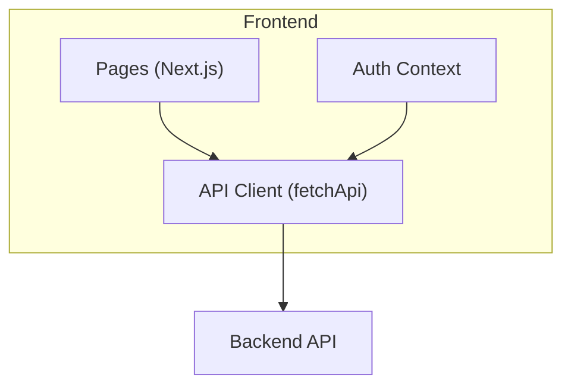
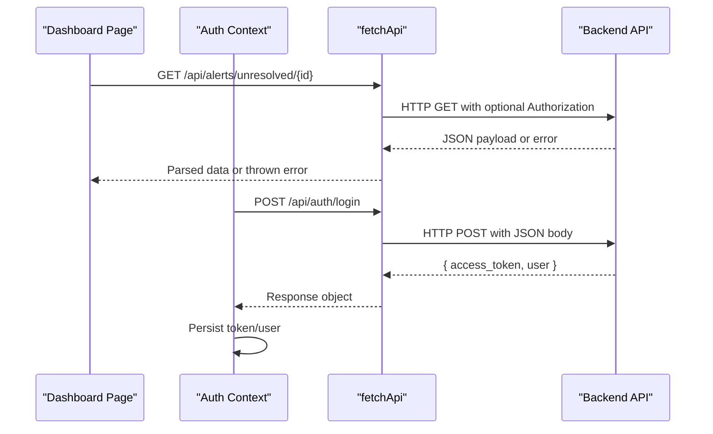
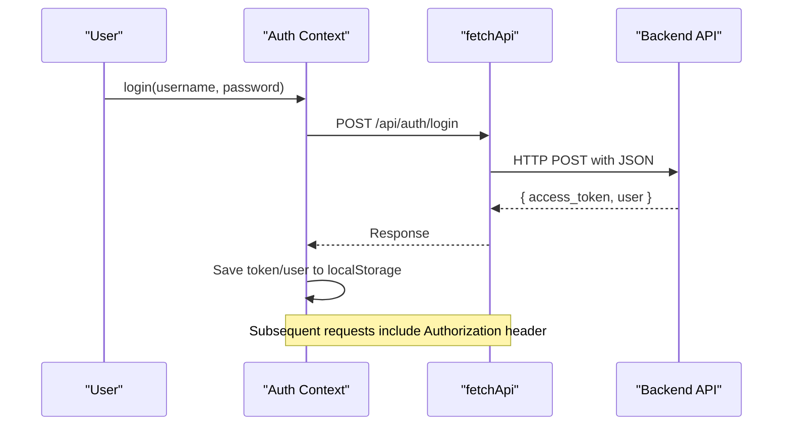
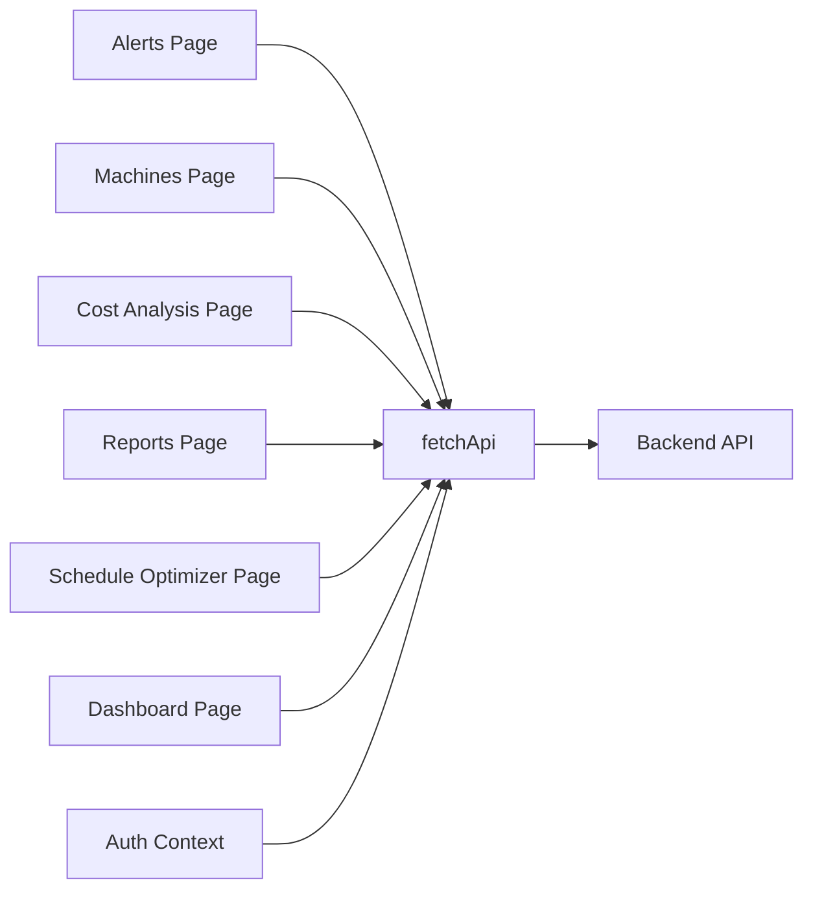

# API Client Utilities

<cite>
**Referenced Files in This Document**
- [api.ts](file://frontend/lib/api.ts)
- [auth_context.tsx](file://frontend/context/auth_context.tsx)
- [alerts/page.tsx](file://frontend/app/dashboard/alerts/page.tsx)
- [machines/page.tsx](file://frontend/app/dashboard/machines/page.tsx)
- [cost_analysis/page.tsx](file://frontend/app/dashboard/cost_analysis/page.tsx)
- [reports/page.tsx](file://frontend/app/dashboard/reports/page.tsx)
- [schedule_optimizer/page.tsx](file://frontend/app/dashboard/schedule_optimizer/page.tsx)
- [dashboard/page.tsx](file://frontend/app/dashboard/page.tsx)
</cite>

## Table of Contents
1. Introduction
2. Project Structure
3. Core Components
4. Architecture Overview
5. Detailed Component Analysis
6. Dependency Analysis
7. Performance Considerations
8. Troubleshooting Guide
9. Conclusion

## Introduction
This document explains the frontend API client utilities used across TariffGuard’s Next.js application. It focuses on the fetchApi function, HTTP request handling, response processing, error management, authentication header injection, endpoint configuration, and usage patterns for GET, POST, PUT, and DELETE requests. It also covers best practices for loading states, retry strategies, timeouts, interceptors, and caching approaches observed in the codebase.

## Project Structure
The API client is centralized under the lib directory and consumed by dashboard pages and the authentication context. Pages import a single fetchApi utility to perform all network calls. The auth context stores tokens and uses the same client for login/register flows.

[No sources needed since this diagram shows conceptual workflow, not actual code structure]

## Core Components
- fetchApi: Centralized HTTP client used by pages and auth context. It encapsulates base URL configuration, headers, JSON serialization, error handling, and response unwrapping.
- Authentication integration: Auth context persists tokens and passes them via fetchApi when calling protected endpoints.
- Page-level consumers: Dashboard pages call fetchApi for data fetching and mutations, managing local loading and error states.

Key responsibilities:
- Build absolute URLs using a configured base path.
- Attach Authorization header from stored token when present.
- Serialize request bodies to JSON and parse responses as JSON.
- Normalize errors into a consistent shape with messages.
- Provide a stable interface for GET/POST/PUT/DELETE operations.

Usage examples across the app:
- GET: Fetching alerts, stats, machines, meter readings, dashboard summaries.
- POST: Submitting optimization comparisons or login payloads.
- PUT: Updating alert resolution status.
- DELETE: Not directly shown in the referenced files; can be implemented via fetchApi with method 'DELETE'.

**Section sources**
- [api.ts](file://frontend/lib/api.ts)
- [auth_context.tsx:35-52](file://frontend/context/auth_context.tsx#L35-L52)
- [alerts/page.tsx:33-69](file://frontend/app/dashboard/alerts/page.tsx#L33-L69)
- [machines/page.tsx:50-90](file://frontend/app/dashboard/machines/page.tsx#L50-L90)
- [cost_analysis/page.tsx:55-65](file://frontend/app/dashboard/cost_analysis/page.tsx#L55-L65)
- [reports/page.tsx:40-65](file://frontend/app/dashboard/reports/page.tsx#L40-L65)
- [schedule_optimizer/page.tsx:80-140](file://frontend/app/dashboard/schedule_optimizer/page.tsx#L80-L140)
- [dashboard/page.tsx:20-40](file://frontend/app/dashboard/page.tsx#L20-L40)

## Architecture Overview
The client follows a thin wrapper around the native fetch API with centralized configuration and error normalization. Pages remain decoupled from networking details and focus on UI state.

**Diagram sources**
- [alerts/page.tsx:33-69](file://frontend/app/dashboard/alerts/page.tsx#L33-L69)
- [auth_context.tsx:35-52](file://frontend/context/auth_context.tsx#L35-L52)
- [api.ts](file://frontend/lib/api.ts)

## Detailed Component Analysis

### fetchApi: Request Handling and Response Processing
- Base URL and endpoints:
  - Uses a configurable base URL to prefix all endpoints.
  - Supports relative paths like '/api/alerts/...' which are resolved against the base URL.
- Headers and authentication:
  - Sets Content-Type: application/json for requests with a body.
  - Attaches Authorization: Bearer <token> when a token exists in storage.
- Request transformation:
  - Serializes request bodies to JSON automatically when provided.
  - Accepts standard fetch options (method, headers, body).
- Response transformation:
  - Parses JSON responses into typed objects where applicable.
  - Returns the parsed data directly to callers.
- Error management:
  - Throws normalized errors with message fields for non-OK responses.
  - Includes network errors and server-side validation errors consistently.
- Timeouts and retries:
  - No built-in timeout or retry logic in the client; callers should implement retries if needed.
  - Timeouts can be added at the caller level or extended within the client.

Best practices observed:
- Always wrap fetchApi calls in try/catch to handle errors gracefully.
- Manage loading states locally per request or per page section.
- Use Promise.all for parallel requests to improve performance.

**Section sources**
- [api.ts](file://frontend/lib/api.ts)
- [alerts/page.tsx:33-69](file://frontend/app/dashboard/alerts/page.tsx#L33-L69)
- [auth_context.tsx:35-52](file://frontend/context/auth_context.tsx#L35-L52)

### Authentication Flow and Header Injection
- Token persistence:
  - Tokens are stored in localStorage after successful login.
- Header injection:
  - fetchApi reads the token from storage and attaches it to the Authorization header for subsequent requests.
- Protected endpoints:
  - Login/register use POST to authenticate and register users.
  - Other endpoints rely on the injected Authorization header for authorization checks.

**Diagram sources**
- [auth_context.tsx:35-52](file://frontend/context/auth_context.tsx#L35-L52)
- [api.ts](file://frontend/lib/api.ts)

**Section sources**
- [auth_context.tsx:23-72](file://frontend/context/auth_context.tsx#L23-L72)
- [api.ts](file://frontend/lib/api.ts)

### GET Requests: Data Fetching Patterns
- Parallel fetching:
  - Use Promise.all to fetch multiple resources concurrently (e.g., alerts and stats).
- Loading and error states:
  - Set loading flags before requests and clear them in finally blocks.
  - Display user-friendly error messages on failure.
- Query parameters:
  - Pass query strings directly in the URL (e.g., factory_id, limit).

Examples:
- Alerts and stats: Parallel GET for unresolved alerts and stats.
- Machines list: GET with factory_id filter.
- Meter readings stats: GET for reporting dashboards.
- Dashboard summary: GET with fallback handling for missing data.

**Section sources**
- [alerts/page.tsx:33-53](file://frontend/app/dashboard/alerts/page.tsx#L33-L53)
- [machines/page.tsx:50-60](file://frontend/app/dashboard/machines/page.tsx#L50-L60)
- [reports/page.tsx:40-65](file://frontend/app/dashboard/reports/page.tsx#L40-L65)
- [cost_analysis/page.tsx:55-65](file://frontend/app/dashboard/cost_analysis/page.tsx#L55-L65)
- [dashboard/page.tsx:20-40](file://frontend/app/dashboard/page.tsx#L20-L40)

### POST Requests: Creating and Optimizing
- Optimization comparison:
  - POST to compare schedules with time range parameters.
- Authentication:
  - POST to login and register endpoints with JSON payloads.

Patterns:
- Construct query parameters using encodeURIComponent for safe URL encoding.
- Handle responses that may contain new IDs or updated state.

**Section sources**
- [schedule_optimizer/page.tsx:120-140](file://frontend/app/dashboard/schedule_optimizer/page.tsx#L120-L140)
- [auth_context.tsx:35-52](file://frontend/context/auth_context.tsx#L35-L52)

### PUT Requests: Updating Resources
- Alert resolution:
  - PUT to mark alerts as resolved with a JSON body containing the update payload.
- Bulk updates:
  - Map over items and issue multiple PUT requests concurrently using Promise.all.

Error handling:
- Wrap bulk operations in try/catch to ensure partial failures are handled gracefully.
- Reset loading states in finally blocks.

**Section sources**
- [alerts/page.tsx:59-89](file://frontend/app/dashboard/alerts/page.tsx#L59-L89)

### DELETE Requests: Removing Resources
- Not explicitly used in the referenced files.
- Can be implemented by calling fetchApi with method 'DELETE' and appropriate URL.

Recommendation:
- Confirm destructive actions with user prompts before issuing DELETE requests.
- Update local state optimistically or refetch after success.

[No sources needed since this section provides general guidance]

### Interceptors, Retries, and Timeouts
- Interceptors:
  - No explicit interceptor layer; behavior is embedded in fetchApi.
- Retries:
  - No built-in retry logic; implement at the caller level or extend fetchApi with exponential backoff.
- Timeouts:
  - No built-in timeout; add AbortController-based timeouts in fetchApi or per-request wrappers.

Suggested enhancements:
- Add a global retry policy for transient errors (network, 5xx).
- Implement request cancellation to avoid stale updates.
- Centralize logging and metrics for failed requests.

[No sources needed since this section provides general guidance]

### Endpoint Configuration and Base URL
- Base URL:
  - Configured centrally to avoid hardcoding domains in pages.
- Relative paths:
  - Pages use relative paths prefixed with '/api', resolved against the base URL.
- Environment-specific configuration:
  - Consider environment variables for dev/prod base URLs.

**Section sources**
- [api.ts](file://frontend/lib/api.ts)

## Dependency Analysis
The following diagram shows how pages and the auth context depend on the API client.

**Diagram sources**
- [alerts/page.tsx:33-69](file://frontend/app/dashboard/alerts/page.tsx#L33-L69)
- [machines/page.tsx:50-90](file://frontend/app/dashboard/machines/page.tsx#L50-L90)
- [cost_analysis/page.tsx:55-65](file://frontend/app/dashboard/cost_analysis/page.tsx#L55-L65)
- [reports/page.tsx:40-65](file://frontend/app/dashboard/reports/page.tsx#L40-L65)
- [schedule_optimizer/page.tsx:80-140](file://frontend/app/dashboard/schedule_optimizer/page.tsx#L80-L140)
- [dashboard/page.tsx:20-40](file://frontend/app/dashboard/page.tsx#L20-L40)
- [auth_context.tsx:35-52](file://frontend/context/auth_context.tsx#L35-L52)
- [api.ts](file://frontend/lib/api.ts)

**Section sources**
- [alerts/page.tsx:33-69](file://frontend/app/dashboard/alerts/page.tsx#L33-L69)
- [machines/page.tsx:50-90](file://frontend/app/dashboard/machines/page.tsx#L50-L90)
- [cost_analysis/page.tsx:55-65](file://frontend/app/dashboard/cost_analysis/page.tsx#L55-L65)
- [reports/page.tsx:40-65](file://frontend/app/dashboard/reports/page.tsx#L40-L65)
- [schedule_optimizer/page.tsx:80-140](file://frontend/app/dashboard/schedule_optimizer/page.tsx#L80-L140)
- [dashboard/page.tsx:20-40](file://frontend/app/dashboard/page.tsx#L20-L40)
- [auth_context.tsx:35-52](file://frontend/context/auth_context.tsx#L35-L52)
- [api.ts](file://frontend/lib/api.ts)

## Performance Considerations
- Parallel requests:
  - Use Promise.all to reduce total latency when fetching independent resources.
- Minimal re-renders:
  - Keep loading and error states scoped to specific sections to avoid unnecessary reflows.
- Payload size:
  - Ensure only necessary fields are sent and received to minimize bandwidth.
- Caching strategy:
  - Consider in-memory caches for frequently accessed data (e.g., factories, machines) to reduce redundant requests.
  - For longer-lived data, consider browser cache or service worker strategies.

[No sources needed since this section provides general guidance]

## Troubleshooting Guide
Common issues and resolutions:
- Network errors:
  - Check connectivity and CORS settings.
  - Validate base URL configuration.
- Authentication failures:
  - Ensure token is present and valid in localStorage.
  - Verify Authorization header is attached to requests.
- Server errors:
  - Inspect error messages returned by the backend.
  - Log request payloads and URLs for debugging.
- Timeout handling:
  - Implement request timeouts to prevent hanging UI.
  - Retry transient errors with backoff.

Patterns observed in the app:
- Try/catch around fetchApi calls with user-facing error messages.
- Loading indicators during async operations.
- Graceful degradation when optional endpoints fail (e.g., .catch(() => null)).

**Section sources**
- [alerts/page.tsx:33-69](file://frontend/app/dashboard/alerts/page.tsx#L33-L69)
- [cost_analysis/page.tsx:55-65](file://frontend/app/dashboard/cost_analysis/page.tsx#L55-L65)
- [dashboard/page.tsx:20-40](file://frontend/app/dashboard/page.tsx#L20-L40)

## Conclusion
TariffGuard’s frontend centralizes API interactions through a single fetchApi utility, providing consistent request/response handling, authentication header injection, and error normalization. Pages manage their own loading and error states while leveraging parallel requests for performance. To further strengthen resilience, consider adding retries, timeouts, and caching layers within the client or at the caller level.

[No sources needed since this section summarizes without analyzing specific files]