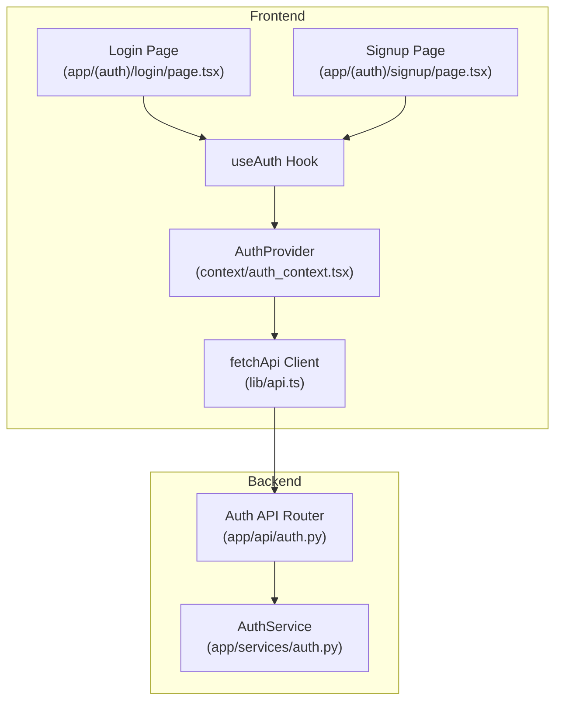
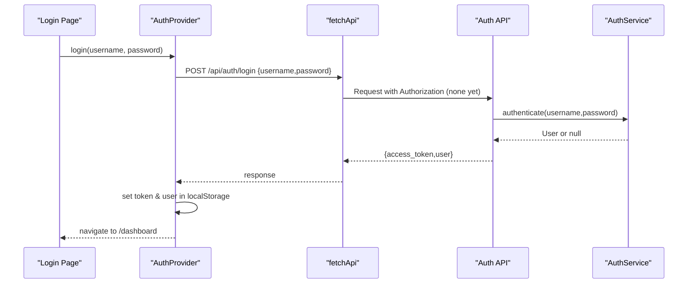
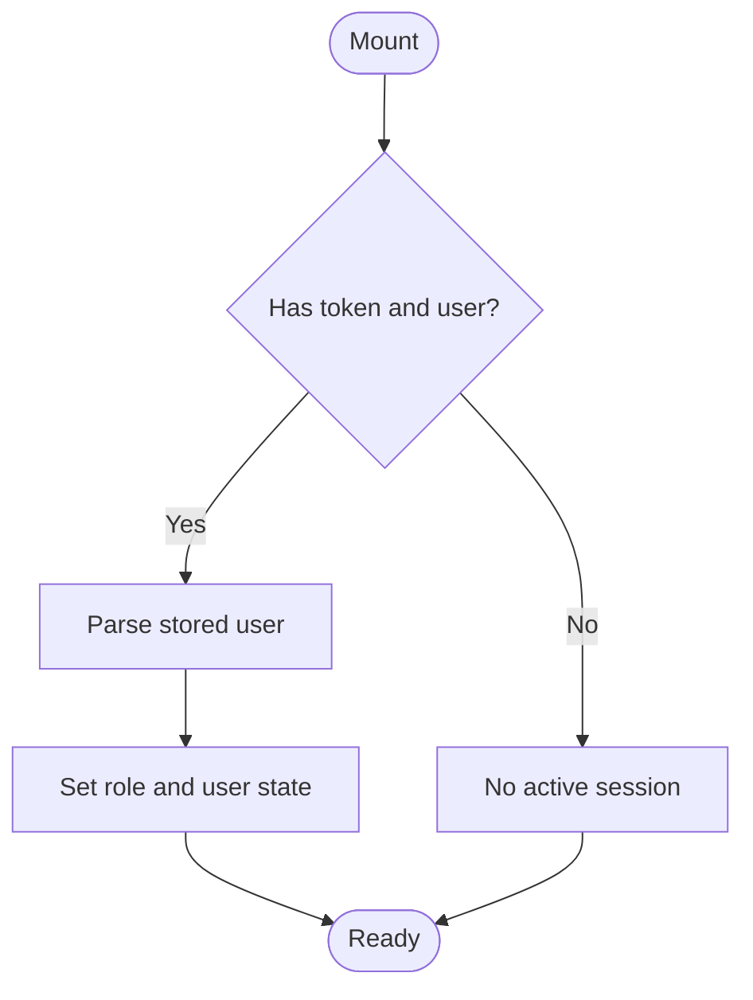
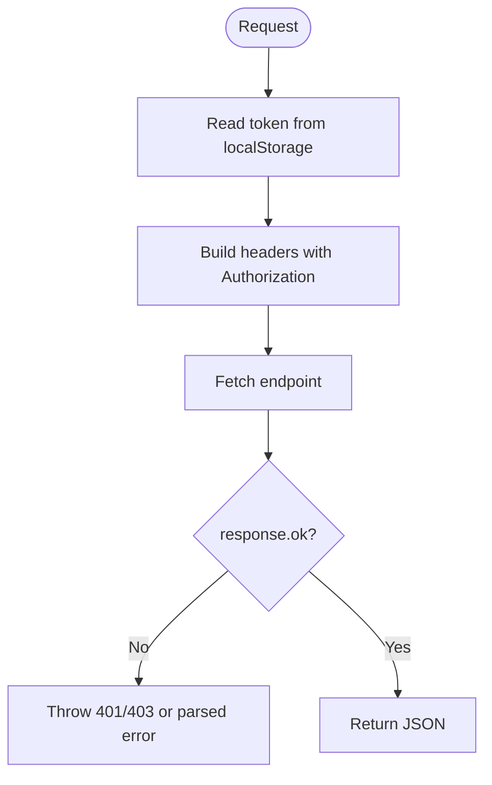
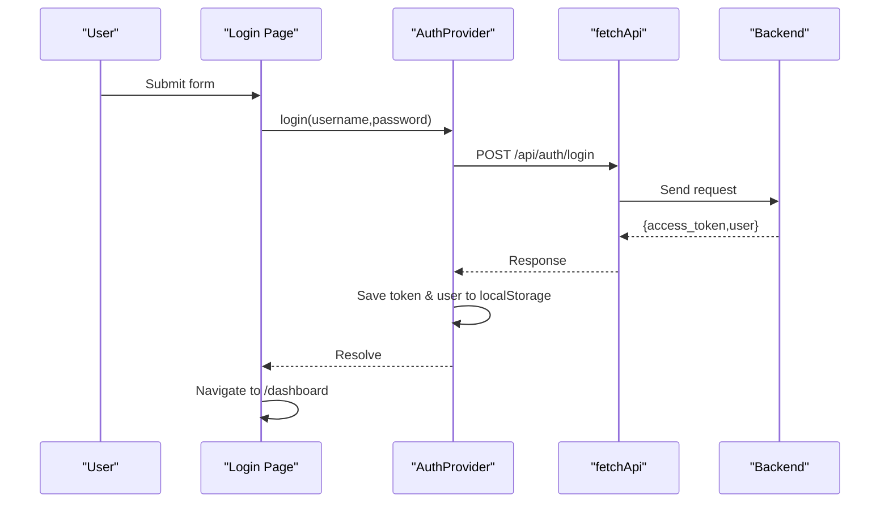
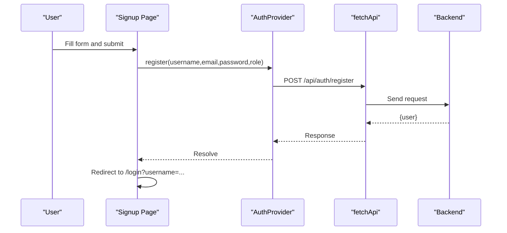
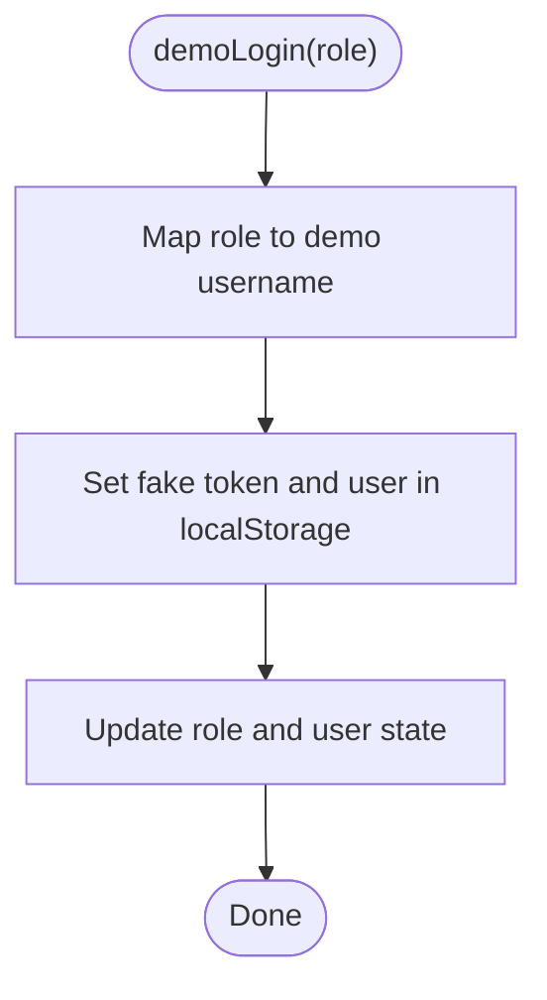
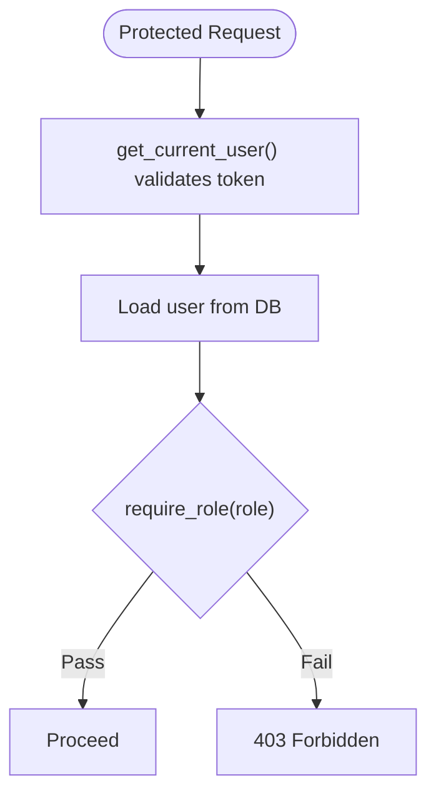
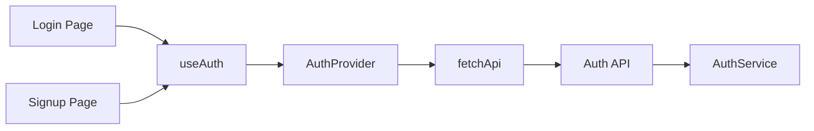

# Authentication Context

<cite>
**Referenced Files in This Document**
- [auth_context.tsx](file://frontend/context/auth_context.tsx)
- [api.ts](file://frontend/lib/api.ts)
- [login/page.tsx](file://frontend/app/(auth)/login/page.tsx)
- [signup/page.tsx](file://frontend/app/(auth)/signup/page.tsx)
- [auth.py (API)](file://backend/app/api/auth.py)
- [auth.py (Service)](file://backend/app/services/auth.py)
</cite>

## Table of Contents
1. Introduction
2. Project Structure
3. Core Components
4. Architecture Overview
5. Detailed Component Analysis
6. Dependency Analysis
7. Performance Considerations
8. Troubleshooting Guide
9. Conclusion

## Introduction
This document explains the authentication context implementation in TariffGuard’s frontend, focusing on the AuthProvider component, user session management, role-based access control, and authentication state persistence. It details how login, register, logout, and demoLogin work with localStorage for token storage, the supported roles (Owner, Manager, Supervisor) including both capitalized and lowercase variants, and how to use the useAuth hook in components. It also covers protected routes patterns, security considerations, token validation behavior, and error handling throughout the authentication flow.

## Project Structure
The authentication system spans the frontend React/Next.js app and a FastAPI backend:
- Frontend context and hooks manage auth state and provide actions like login/register/logout/demoLogin.
- The API client attaches Bearer tokens from localStorage to requests and centralizes error handling.
- Login and signup pages orchestrate user flows and navigation.
- Backend endpoints handle registration, login, logout, and role checks.

**Diagram sources**
- [auth_context.tsx:19-87](file://frontend/context/auth_context.tsx#L19-L87)
- [api.ts:7-49](file://frontend/lib/api.ts#L7-L49)
- [login/page.tsx:34-56](file://frontend/app/(auth)/login/page.tsx#L34-L56)
- [signup/page.tsx:28-49](file://frontend/app/(auth)/signup/page.tsx#L28-L49)
- [auth.py (API):15-61](file://backend/app/api/auth.py#L15-L61)
- [auth.py (Service):8-53](file://backend/app/services/auth.py#L8-L53)

**Section sources**
- [auth_context.tsx:1-88](file://frontend/context/auth_context.tsx#L1-L88)
- [api.ts:1-71](file://frontend/lib/api.ts#L1-L71)
- [login/page.tsx:1-181](file://frontend/app/(auth)/login/page.tsx#L1-L181)
- [signup/page.tsx:1-176](file://frontend/app/(auth)/signup/page.tsx#L1-L176)
- [auth.py (API):1-89](file://backend/app/api/auth.py#L1-L89)
- [auth.py (Service):1-53](file://backend/app/services/auth.py#L1-L53)

## Core Components
- AuthProvider: Provides role, user, isAuthenticated, and methods login, register, demoLogin, logout. Persists token and user to localStorage and restores them on mount.
- useAuth: Hook to consume AuthContext; throws if used outside provider.
- fetchApi: Centralized HTTP client that reads token from localStorage and attaches Authorization header; handles 401/403 errors and parses backend error messages.
- Login page: Uses useAuth.login and useAuth.demoLogin; navigates to dashboard on success; shows errors for invalid credentials.
- Signup page: Uses useAuth.register; validates password match; redirects to login with username parameter on success.

Key behaviors:
- Role model supports Owner, Manager, Supervisor and their lowercase variants.
- Token stored under key 'token'; user object under 'user'.
- On mount, AuthProvider restores session from localStorage.

**Section sources**
- [auth_context.tsx:5-15](file://frontend/context/auth_context.tsx#L5-L15)
- [auth_context.tsx:19-87](file://frontend/context/auth_context.tsx#L19-L87)
- [api.ts:7-49](file://frontend/lib/api.ts#L7-L49)
- [login/page.tsx:34-56](file://frontend/app/(auth)/login/page.tsx#L34-L56)
- [signup/page.tsx:28-49](file://frontend/app/(auth)/signup/page.tsx#L28-L49)

## Architecture Overview
End-to-end authentication flow:
- Login: UI calls useAuth.login which POSTs to /api/auth/login. Backend authenticates via AuthService, issues a token, returns token and user. Frontend stores token and user in localStorage and updates context state.
- Register: UI calls useAuth.register which POSTs to /api/auth/register. Backend creates user and returns user data.
- Logout: Clears localStorage and resets context state.
- Protected requests: fetchApi automatically adds Authorization header using token from localStorage. Backend middleware validates token and enforces roles where required.

**Diagram sources**
- [login/page.tsx:34-56](file://frontend/app/(auth)/login/page.tsx#L34-L56)
- [auth_context.tsx:35-44](file://frontend/context/auth_context.tsx#L35-L44)
- [api.ts:7-49](file://frontend/lib/api.ts#L7-L49)
- [auth.py (API):37-52](file://backend/app/api/auth.py#L37-L52)
- [auth.py (Service):40-53](file://backend/app/services/auth.py#L40-L53)

## Detailed Component Analysis

### AuthProvider and useAuth
Responsibilities:
- Maintain role, user, and isAuthenticated state.
- Restore session from localStorage on mount.
- Provide login, register, demoLogin, logout functions.
- Expose useAuth hook with safety check when used outside provider.

Role support:
- Roles include Owner, Manager, Supervisor and lowercase owner, manager, supervisor.
- demoLogin maps role variants to demo usernames and sets a fake token.

Session persistence:
- Stores token and user JSON in localStorage keys 'token' and 'user'.
- On mount, reads and parses stored user to restore role and user state.

Error handling:
- No explicit try/catch around localStorage parsing; silently ignores parse errors.

**Diagram sources**
- [auth_context.tsx:23-33](file://frontend/context/auth_context.tsx#L23-L33)

**Section sources**
- [auth_context.tsx:5-15](file://frontend/context/auth_context.tsx#L5-L15)
- [auth_context.tsx:19-87](file://frontend/context/auth_context.tsx#L19-L87)

### API Client (fetchApi)
Responsibilities:
- Attach Authorization header with Bearer token read from localStorage.
- Handle non-ok responses:
  - 403: throw permission error.
  - 401: throw login-required error.
  - Other: parse error body detail and throw descriptive message.

Security note:
- Automatically includes token for all authenticated requests.
- Does not validate token format beyond presence.

**Diagram sources**
- [api.ts:7-49](file://frontend/lib/api.ts#L7-L49)

**Section sources**
- [api.ts:7-49](file://frontend/lib/api.ts#L7-L49)

### Login Flow
- Collects username/password and triggers login.
- On success, navigates to /dashboard.
- Handles 401/invalid errors by showing user-friendly messages.
- Supports demo login for quick access.

**Diagram sources**
- [login/page.tsx:34-56](file://frontend/app/(auth)/login/page.tsx#L34-L56)
- [auth_context.tsx:35-44](file://frontend/context/auth_context.tsx#L35-L44)
- [api.ts:7-49](file://frontend/lib/api.ts#L7-L49)
- [auth.py (API):37-52](file://backend/app/api/auth.py#L37-L52)

**Section sources**
- [login/page.tsx:34-56](file://frontend/app/(auth)/login/page.tsx#L34-L56)

### Register Flow
- Validates password confirmation locally.
- Calls register with selected role (lowercased).
- Redirects to login with username query param on success.
- Displays backend errors such as duplicate username/email.

**Diagram sources**
- [signup/page.tsx:28-49](file://frontend/app/(auth)/signup/page.tsx#L28-L49)
- [auth_context.tsx:46-52](file://frontend/context/auth_context.tsx#L46-L52)
- [auth.py (API):15-35](file://backend/app/api/auth.py#L15-L35)

**Section sources**
- [signup/page.tsx:28-49](file://frontend/app/(auth)/signup/page.tsx#L28-L49)

### Demo Login
- Maps role variants to demo usernames and sets a fake token.
- Persists mock user and token to localStorage and updates context.
- Useful for development and quick exploration without backend.

**Diagram sources**
- [auth_context.tsx:54-65](file://frontend/context/auth_context.tsx#L54-L65)

**Section sources**
- [auth_context.tsx:54-65](file://frontend/context/auth_context.tsx#L54-L65)

### Logout
- Removes token and user from localStorage.
- Resets role and user state to null.
- Sets isAuthenticated to false.

**Section sources**
- [auth_context.tsx:67-72](file://frontend/context/auth_context.tsx#L67-L72)

### Role-Based Access Control (RBAC)
- Frontend roles: Owner, Manager, Supervisor and lowercase variants are accepted and persisted.
- Backend role enforcement:
  - get_current_user dependency validates Bearer token and retrieves user.
  - require_role dependency enforces specific roles; currently allows owner as a super-role in one place.
- For new protected endpoints, apply require_role('Manager') or require_role('Supervisor') as needed.

**Diagram sources**
- [auth.py (API):63-89](file://backend/app/api/auth.py#L63-L89)

**Section sources**
- [auth.py (API):63-89](file://backend/app/api/auth.py#L63-L89)

### Using useAuth in Components
- Import useAuth from the auth context.
- Call login, register, demoLogin, logout as needed.
- Read role, user, and isAuthenticated to conditionally render UI or guard routes.

Example usage patterns:
- Conditional rendering: show admin controls only when role is Owner or owner.
- Navigation guards: redirect unauthenticated users to login when isAuthenticated is false.
- Action handlers: wrap API calls with try/catch to display errors returned by fetchApi.

[No sources needed since this section provides general guidance]

### Implementing Protected Routes
Recommended pattern:
- Create a wrapper component that checks isAuthenticated and role before rendering children.
- If not authenticated, redirect to /login.
- If authenticated but insufficient role, redirect to an unauthorized page or show a message.
- Place the wrapper at the layout level for protected route groups.

[No sources needed since this section provides general guidance]

## Dependency Analysis
- AuthProvider depends on fetchApi for network calls and uses localStorage for persistence.
- Login and Signup pages depend on useAuth for actions and Next.js router for navigation.
- fetchApi depends on environment variable for API base URL and reads token from localStorage.
- Backend Auth API depends on AuthService for password hashing and verification, and on SQLAlchemy for database operations.

**Diagram sources**
- [login/page.tsx:34-56](file://frontend/app/(auth)/login/page.tsx#L34-L56)
- [signup/page.tsx:28-49](file://frontend/app/(auth)/signup/page.tsx#L28-L49)
- [auth_context.tsx:35-52](file://frontend/context/auth_context.tsx#L35-L52)
- [api.ts:7-49](file://frontend/lib/api.ts#L7-L49)
- [auth.py (API):37-52](file://backend/app/api/auth.py#L37-L52)
- [auth.py (Service):40-53](file://backend/app/services/auth.py#L40-L53)

**Section sources**
- [auth_context.tsx:19-87](file://frontend/context/auth_context.tsx#L19-L87)
- [api.ts:7-49](file://frontend/lib/api.ts#L7-L49)
- [auth.py (API):37-89](file://backend/app/api/auth.py#L37-L89)
- [auth.py (Service):8-53](file://backend/app/services/auth.py#L8-L53)

## Performance Considerations
- LocalStorage reads/writes are synchronous and fast; avoid excessive reads by caching values in component state where appropriate.
- Debounce or throttle repeated API calls if necessary; current design makes one call per action.
- Avoid storing large payloads in localStorage; keep token and minimal user info.

[No sources needed since this section provides general guidance]

## Troubleshooting Guide
Common issues and resolutions:
- Invalid credentials:
  - Backend returns 401; frontend login page displays “Invalid username or password”.
  - Verify username/password and ensure backend user exists.
- Duplicate registration:
  - Backend returns 400 with detail about existing username/email; signup page shows corresponding error.
- Permission denied:
  - Backend returns 403; fetchApi throws a permission error; handle in UI to inform user.
- Not authenticated:
  - Backend returns 401; fetchApi throws “Please login again”; redirect to login.
- Session not restored:
  - Ensure localStorage contains valid token and user; verify AuthProvider effect runs and parses user correctly.

**Section sources**
- [login/page.tsx:34-56](file://frontend/app/(auth)/login/page.tsx#L34-L56)
- [signup/page.tsx:28-49](file://frontend/app/(auth)/signup/page.tsx#L28-L49)
- [api.ts:27-49](file://frontend/lib/api.ts#L27-L49)
- [auth.py (API):15-61](file://backend/app/api/auth.py#L15-L61)

## Conclusion
TariffGuard’s authentication context provides a clear separation between UI state and network concerns. AuthProvider manages session lifecycle and exposes simple actions through useAuth. The centralized fetchApi ensures consistent token handling and error reporting. The backend implements secure registration, login, logout, and role enforcement. Together, these pieces enable robust authentication, role-based access control, and a smooth developer experience for building protected features.

[No sources needed since this section summarizes without analyzing specific files]