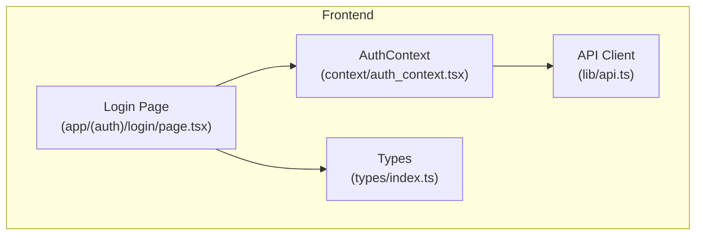
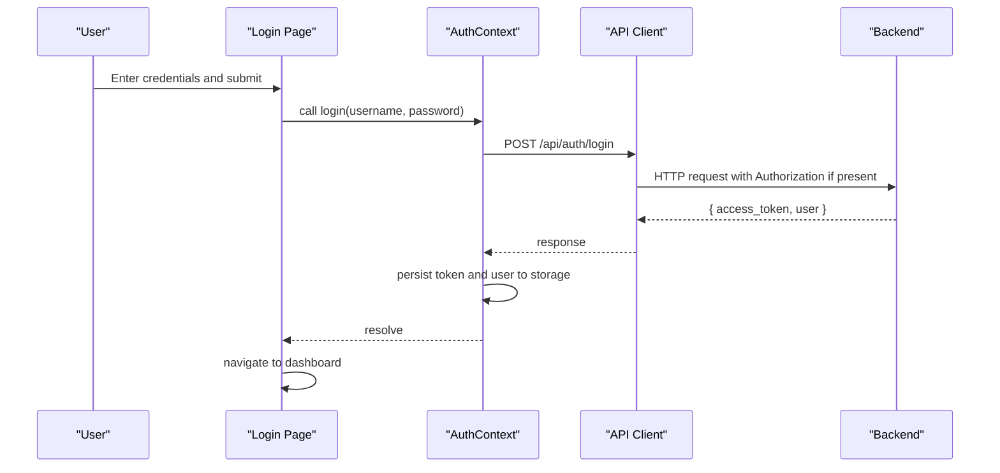
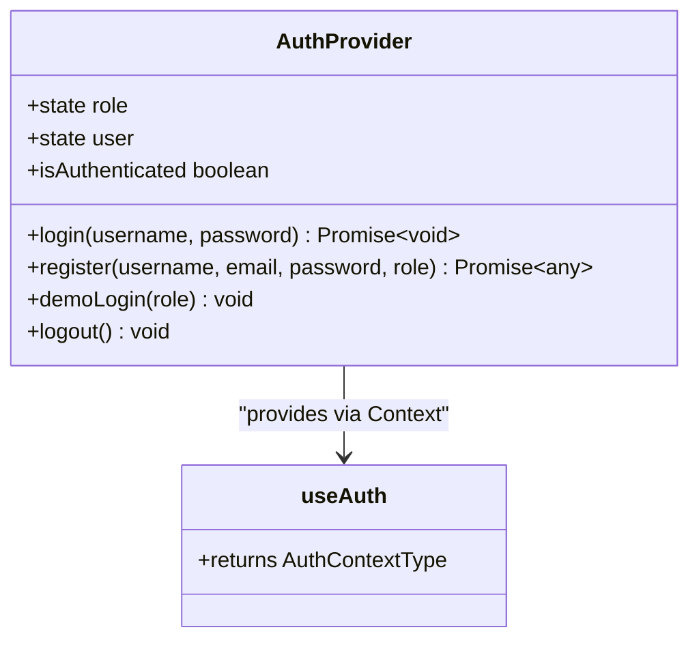
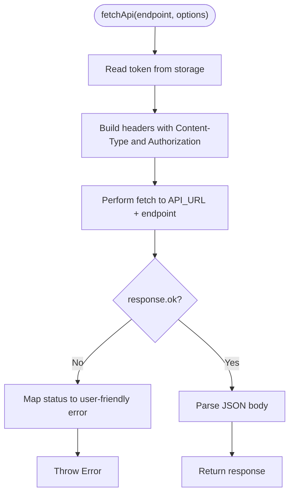
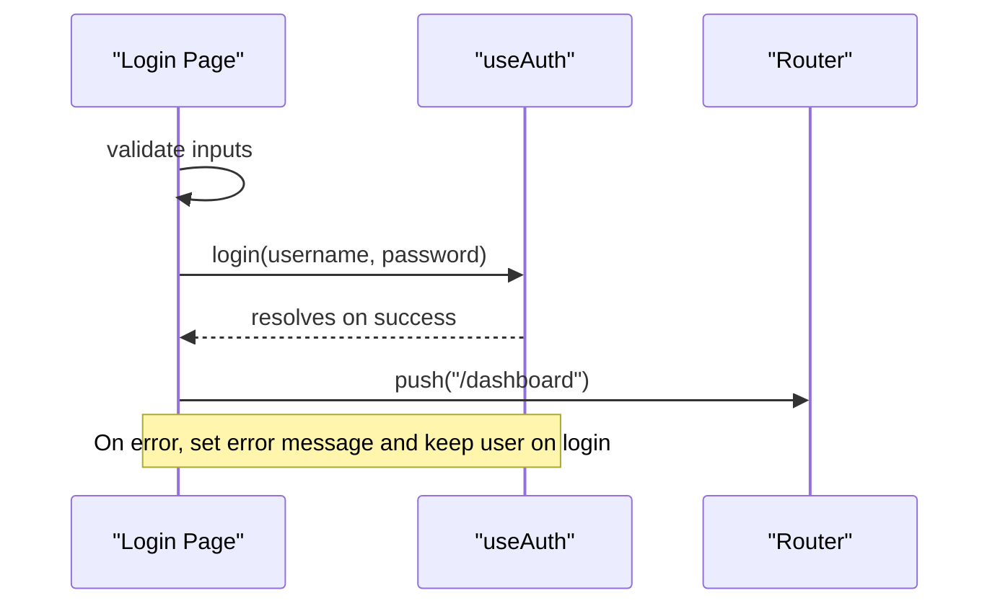
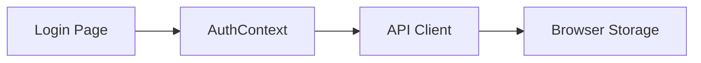

# State Management

<cite>
**Referenced Files in This Document**
- [auth_context.tsx](file://frontend/context/auth_context.tsx)
- [api.ts](file://frontend/lib/api.ts)
- [login_page.tsx](file://frontend/app/(auth)/login/page.tsx)
- [types_index.ts](file://frontend/types/index.ts)
</cite>

## Table of Contents
1. [Introduction](#introduction)
2. [Project Structure](#project-structure)
3. [Core Components](#core-components)
4. [Architecture Overview](#architecture-overview)
5. [Detailed Component Analysis](#detailed-component-analysis)
6. [Dependency Analysis](#dependency-analysis)
7. [Performance Considerations](#performance-considerations)
8. [Troubleshooting Guide](#troubleshooting-guide)
9. [Conclusion](#conclusion)

## Introduction
This document explains TariffGuard’s state management approach on the frontend, focusing on React Context and custom hooks for authentication, global state patterns, data flow between components, and synchronization strategies. It also covers the API client utilities for HTTP requests, response handling, error states, and guidance for creating custom hooks, managing component-specific state, implementing optimistic updates, persistence, caching, and performance optimization techniques used throughout the application.

## Project Structure
The relevant parts of the frontend are organized as follows:
- Authentication context and provider live under the context directory.
- The API client is centralized in a library module to handle HTTP requests, token injection, and error mapping.
- Pages consume the auth context via a custom hook and manage local UI state with React hooks.
- Shared TypeScript types define domain models used across components.

**Diagram sources**
- [auth_context.tsx:1-88](file://frontend/context/auth_context.tsx#L1-L88)
- [api.ts:1-71](file://frontend/lib/api.ts#L1-L71)
- [login_page.tsx:1-181](file://frontend/app/(auth)/login/page.tsx#L1-L181)
- [types_index.ts:1-46](file://frontend/types/index.ts#L1-L46)

**Section sources**
- [auth_context.tsx:1-88](file://frontend/context/auth_context.tsx#L1-L88)
- [api.ts:1-71](file://frontend/lib/api.ts#L1-L71)
- [login_page.tsx:1-181](file://frontend/app/(auth)/login/page.tsx#L1-L181)
- [types_index.ts:1-46](file://frontend/types/index.ts#L1-L46)

## Core Components
- AuthContext and useAuth: Provide role-based authentication state, login/register flows, demo mode, logout, and session restoration from storage.
- API client: Centralized fetch wrapper that injects Authorization headers, handles 401/403 errors, parses error bodies, and returns JSON responses. Also exposes convenience methods currently backed by mock data.
- Login page: Uses the auth context to perform login or demo login, manages local form state, and navigates after success.

Key responsibilities:
- Global auth state (role, user) and lifecycle (persist/rehydrate).
- Token handling and propagation to API calls.
- Error translation and user feedback at the UI layer.

**Section sources**
- [auth_context.tsx:1-88](file://frontend/context/auth_context.tsx#L1-L88)
- [api.ts:1-71](file://frontend/lib/api.ts#L1-L71)
- [login_page.tsx:1-181](file://frontend/app/(auth)/login/page.tsx#L1-L181)

## Architecture Overview
The authentication flow uses React Context to maintain global state and a custom hook to access it. The API client ensures consistent request/response handling and error mapping.

**Diagram sources**
- [auth_context.tsx:35-44](file://frontend/context/auth_context.tsx#L35-L44)
- [api.ts:7-49](file://frontend/lib/api.ts#L7-L49)
- [login_page.tsx:34-51](file://frontend/app/(auth)/login/page.tsx#L34-L51)

## Detailed Component Analysis

### Authentication Context and Custom Hook
- Provides role and user state, with initialization from storage to restore sessions on reload.
- Exposes login, register, demoLogin, logout, and an isAuthenticated flag derived from role presence.
- Custom hook useAuth enforces usage within a provider and returns the context value.

**Diagram sources**
- [auth_context.tsx:19-87](file://frontend/context/auth_context.tsx#L19-L87)

**Section sources**
- [auth_context.tsx:1-88](file://frontend/context/auth_context.tsx#L1-L88)

### API Client Utilities
- fetchApi centralizes:
  - Token retrieval from storage and Authorization header injection.
  - Error handling for 401/403 and generic parsing of error detail.
  - JSON response return path for successful requests.
- Convenience api methods currently return mock data; they can be wired to fetchApi when backend endpoints are ready.

**Diagram sources**
- [api.ts:7-49](file://frontend/lib/api.ts#L7-L49)

**Section sources**
- [api.ts:1-71](file://frontend/lib/api.ts#L1-L71)

### Login Page: Local State and Flow
- Manages form fields, loading, and error/success messages using local state.
- Calls useAuth.login or useAuth.demoLogin and navigates on success.
- Demonstrates how to surface API errors to users and guide next steps.

**Diagram sources**
- [login_page.tsx:34-56](file://frontend/app/(auth)/login/page.tsx#L34-L56)
- [auth_context.tsx:35-65](file://frontend/context/auth_context.tsx#L35-L65)

**Section sources**
- [login_page.tsx:1-181](file://frontend/app/(auth)/login/page.tsx#L1-L181)

### Data Models and Types
- Shared interfaces define core entities such as Machine, ProductionOrder, TariffPeriod, KPI, Alert, and EnergyReading.
- These types support consistent state shapes and improve developer experience across components.

**Section sources**
- [types_index.ts:1-46](file://frontend/types/index.ts#L1-L46)

## Dependency Analysis
- Login Page depends on AuthContext via useAuth for authentication actions and state.
- AuthContext depends on the API client for network calls and persists tokens/user to storage.
- API client depends on environment configuration for base URL and reads tokens from storage.

**Diagram sources**
- [login_page.tsx:1-181](file://frontend/app/(auth)/login/page.tsx#L1-L181)
- [auth_context.tsx:1-88](file://frontend/context/auth_context.tsx#L1-L88)
- [api.ts:1-71](file://frontend/lib/api.ts#L1-L71)

**Section sources**
- [login_page.tsx:1-181](file://frontend/app/(auth)/login/page.tsx#L1-L181)
- [auth_context.tsx:1-88](file://frontend/context/auth_context.tsx#L1-L88)
- [api.ts:1-71](file://frontend/lib/api.ts#L1-L71)

## Performance Considerations
- Minimize re-renders:
  - Keep auth state minimal (role, user) and avoid storing large payloads in context.
  - Use memoization in components consuming context where appropriate.
- Network efficiency:
  - Centralize error handling and token injection in the API client to reduce duplication.
  - When integrating real endpoints, consider caching responses and deduplicating concurrent requests.
- Storage operations:
  - Persist only necessary data (token, minimal user profile) to reduce I/O overhead.
- Mock vs real data:
  - Current API methods return mock data; when switching to real endpoints, implement caching and pagination to prevent unnecessary refetches.

[No sources needed since this section provides general guidance]

## Troubleshooting Guide
Common issues and resolutions:
- 401 Unauthorized:
  - The API client throws a user-friendly error; ensure the login flow clears stale tokens and prompts re-authentication.
- 403 Forbidden:
  - Indicates insufficient permissions; verify the user’s role and route guards.
- Invalid or missing token:
  - Confirm that storage contains a valid token before making authenticated requests.
- Parsing errors:
  - The API client attempts to parse error details; if parsing fails, a fallback message is shown.

Operational tips:
- Wrap API calls in try/catch at the component level to display friendly messages.
- For demo mode, ensure the mock token and user are set consistently.

**Section sources**
- [api.ts:27-45](file://frontend/lib/api.ts#L27-L45)
- [login_page.tsx:34-51](file://frontend/app/(auth)/login/page.tsx#L34-L51)

## Conclusion
TariffGuard’s frontend employs a clear separation of concerns:
- React Context plus a custom hook provide a simple yet effective global authentication state with session persistence.
- A centralized API client standardizes HTTP interactions, token handling, and error mapping.
- Pages manage local UI state and orchestrate flows using the context and router.
To scale further, consider introducing dedicated data fetching hooks, caching layers, optimistic updates, and more granular permission checks based on roles.

[No sources needed since this section summarizes without analyzing specific files]