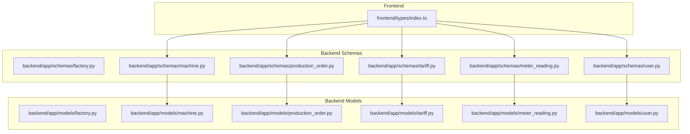
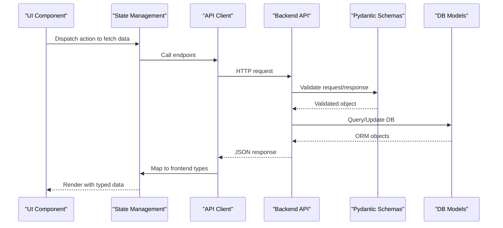
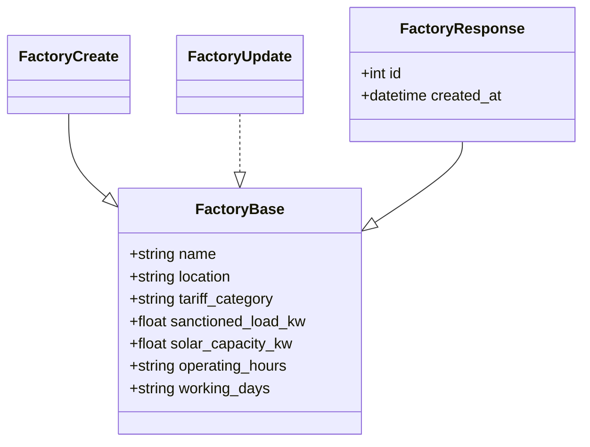
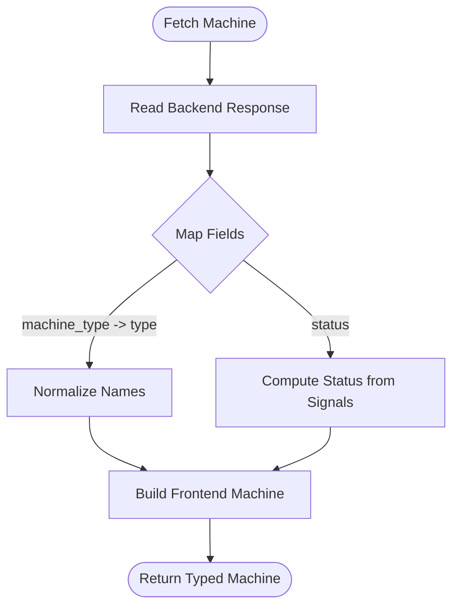
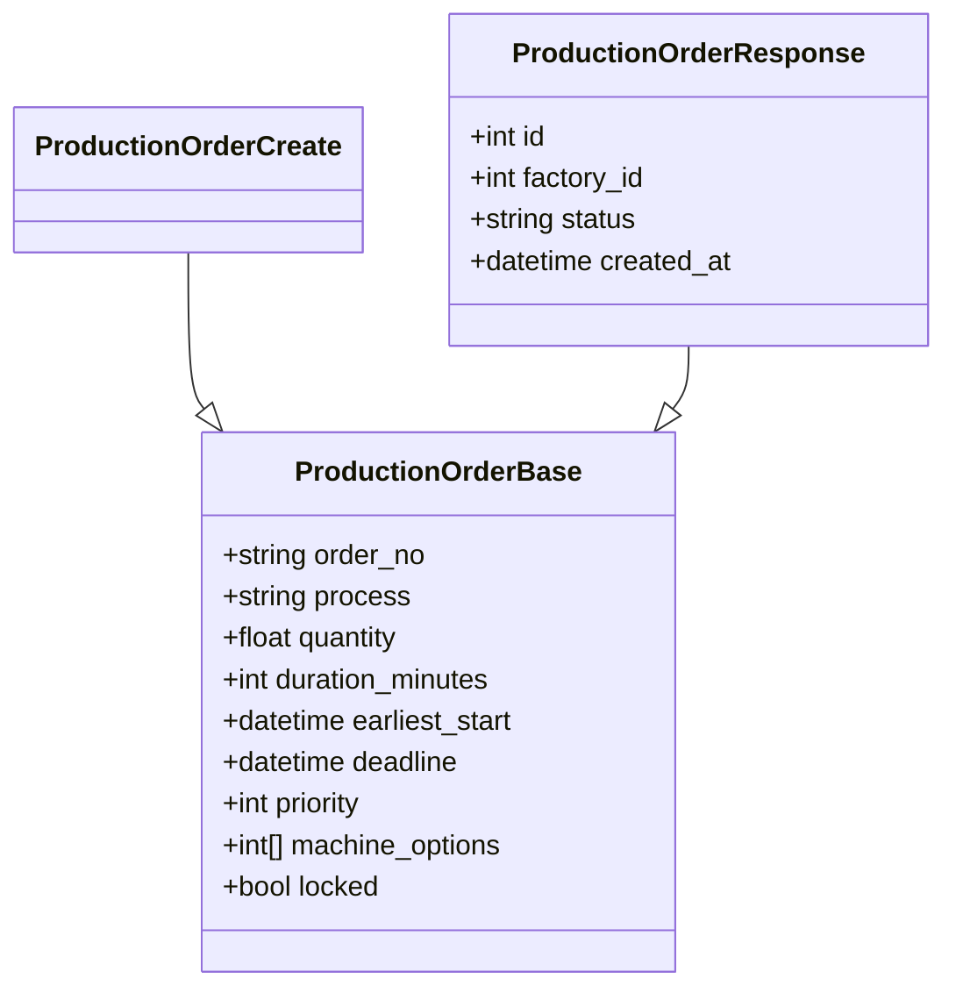
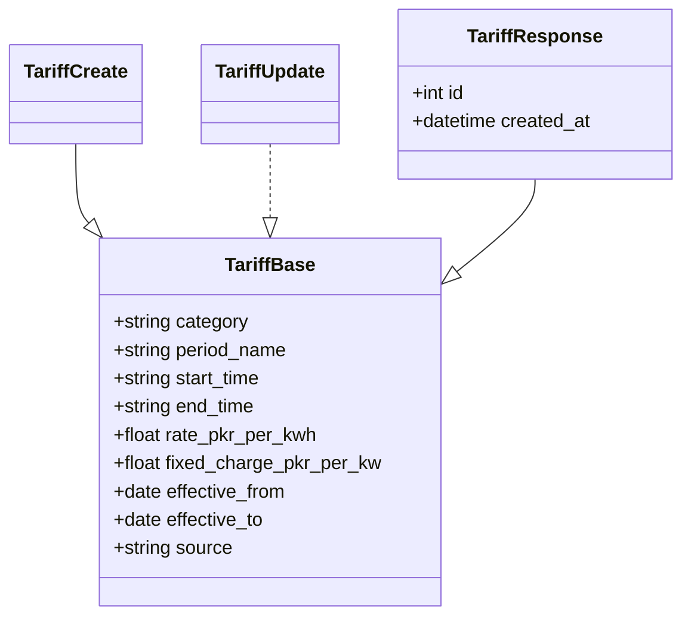
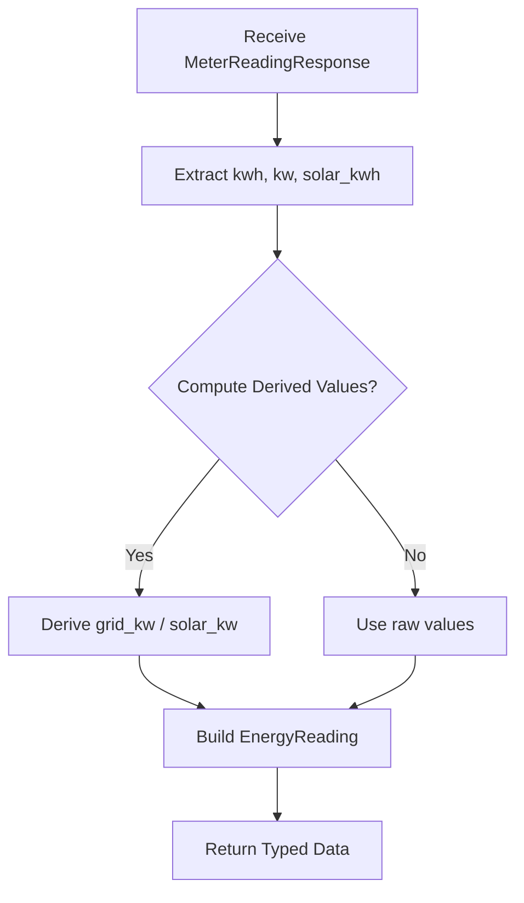
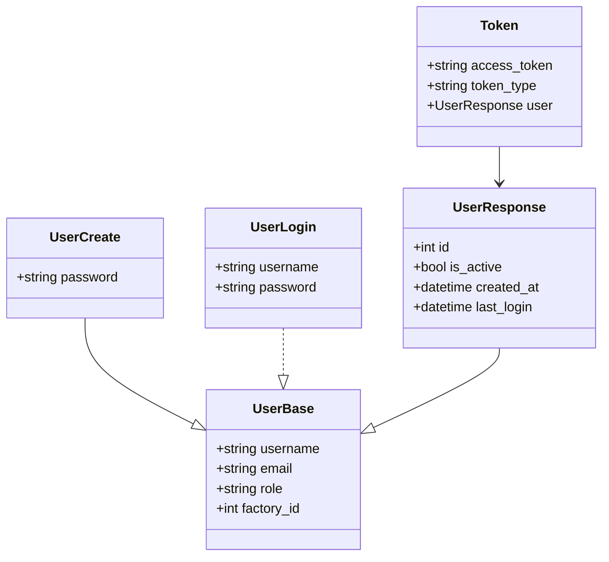

# Type Definitions

<cite>
**Referenced Files in This Document**
- [frontend/types/index.ts](file://frontend/types/index.ts)
- [backend/app/schemas/__init__.py](file://backend/app/schemas/__init__.py)
- [backend/app/schemas/factory.py](file://backend/app/schemas/factory.py)
- [backend/app/schemas/machine.py](file://backend/app/schemas/machine.py)
- [backend/app/schemas/production_order.py](file://backend/app/schemas/production_order.py)
- [backend/app/schemas/tariff.py](file://backend/app/schemas/tariff.py)
- [backend/app/schemas/meter_reading.py](file://backend/app/schemas/meter_reading.py)
- [backend/app/schemas/user.py](file://backend/app/schemas/user.py)
- [backend/app/models/factory.py](file://backend/app/models/factory.py)
- [backend/app/models/machine.py](file://backend/app/models/machine.py)
- [backend/app/models/production_order.py](file://backend/app/models/production_order.py)
- [backend/app/models/tariff.py](file://backend/app/models/tariff.py)
- [backend/app/models/meter_reading.py](file://backend/app/models/meter_reading.py)
- [backend/app/models/user.py](file://backend/app/models/user.py)
</cite>

## Table of Contents
1. Introduction
2. Project Structure
3. Core Components
4. Architecture Overview
5. Detailed Component Analysis
6. Dependency Analysis
7. Performance Considerations
8. Troubleshooting Guide
9. Conclusion
10. Appendices

## Introduction
This document explains the TypeScript type definitions used across TariffGuard’s frontend and maps them to backend API schemas and database models. It focuses on how types define data structures for factory, machine, production order, tariff, meter reading, and user entities; how these types ensure consistency between UI components, API responses, and state management; and how to maintain type safety as the API evolves.

## Project Structure
The frontend centralizes shared types in a single module, while the backend defines Pydantic schemas for request/response validation and SQLAlchemy models for persistence. The mapping between frontend types and backend schemas is one-to-one for most entities, with minor differences in field naming and optional fields.

**Diagram sources**
- [frontend/types/index.ts:1-46](file://frontend/types/index.ts#L1-L46)
- [backend/app/schemas/machine.py:1-26](file://backend/app/schemas/machine.py#L1-L26)
- [backend/app/schemas/production_order.py:1-26](file://backend/app/schemas/production_order.py#L1-L26)
- [backend/app/schemas/tariff.py:1-35](file://backend/app/schemas/tariff.py#L1-L35)
- [backend/app/schemas/meter_reading.py:1-27](file://backend/app/schemas/meter_reading.py#L1-L27)
- [backend/app/schemas/user.py:1-30](file://backend/app/schemas/user.py#L1-L30)
- [backend/app/models/machine.py:1-20](file://backend/app/models/machine.py#L1-L20)
- [backend/app/models/production_order.py:1-20](file://backend/app/models/production_order.py#L1-L20)
- [backend/app/models/tariff.py:1-19](file://backend/app/models/tariff.py#L1-L19)
- [backend/app/models/meter_reading.py:1-17](file://backend/app/models/meter_reading.py#L1-L17)
- [backend/app/models/user.py:1-16](file://backend/app/models/user.py#L1-L16)

**Section sources**
- [frontend/types/index.ts:1-46](file://frontend/types/index.ts#L1-L46)
- [backend/app/schemas/__init__.py:1-15](file://backend/app/schemas/__init__.py#L1-L15)

## Core Components
This section summarizes the primary frontend types and their backend counterparts.

- Machine
  - Frontend: id, name, type, power_kw, status (union of allowed states).
  - Backend schema: MachineResponse includes id, factory_id, timestamps, plus base fields like machine_type, power_kw, availability windows, maintenance windows.
  - Notes: Frontend uses “type” vs backend “machine_type”; frontend status is a union string, backend stores machine metadata without a status field.

- ProductionOrder
  - Frontend: id, order_no, process, quantity, duration_minutes, deadline, status (union).
  - Backend schema: ProductionOrderResponse includes id, factory_id, timestamps, priority, earliest_start, deadline, machine_options, locked, status.
  - Notes: Frontend omits some backend fields; consider aligning if needed.

- TariffPeriod
  - Frontend: id, period_name, start_time, end_time, rate_pkr_per_kwh.
  - Backend schema: TariffResponse includes category, fixed_charge_pkr_per_kw, effective_from/to, source, timestamps.
  - Notes: Frontend simplifies tariff representation; consider extending if you need category or fixed charges.

- KPI
  - Frontend-only aggregate metrics: daily_cost, peak_demand_kw, solar_utilization, orders_on_time.
  - No direct backend schema; computed by services or aggregated endpoints.

- Alert
  - Frontend: id, type (warning|critical|info), message, timestamp.
  - Backend: Alert model exists but no schema exposed in __init__; can be added when exposing alerts via API.

- EnergyReading
  - Frontend: time, grid_kw, solar_kw.
  - Backend schema: MeterReadingResponse includes kwh, kw, solar_kwh, voltage, current, power_factor, timestamps.
  - Notes: Field names differ; map accordingly at the API boundary.

**Section sources**
- [frontend/types/index.ts:1-46](file://frontend/types/index.ts#L1-L46)
- [backend/app/schemas/machine.py:1-26](file://backend/app/schemas/machine.py#L1-L26)
- [backend/app/schemas/production_order.py:1-26](file://backend/app/schemas/production_order.py#L1-L26)
- [backend/app/schemas/tariff.py:1-35](file://backend/app/schemas/tariff.py#L1-L35)
- [backend/app/schemas/meter_reading.py:1-27](file://backend/app/schemas/meter_reading.py#L1-L27)
- [backend/app/schemas/user.py:1-30](file://backend/app/schemas/user.py#L1-L30)
- [backend/app/models/machine.py:1-20](file://backend/app/models/machine.py#L1-L20)
- [backend/app/models/production_order.py:1-20](file://backend/app/models/production_order.py#L1-L20)
- [backend/app/models/tariff.py:1-19](file://backend/app/models/tariff.py#L1-L19)
- [backend/app/models/meter_reading.py:1-17](file://backend/app/models/meter_reading.py#L1-L17)
- [backend/app/models/user.py:1-16](file://backend/app/models/user.py#L1-L16)

## Architecture Overview
The frontend types serve as the contract for UI components and state. When calling APIs, responses are validated against backend Pydantic schemas before being transformed into frontend types. This ensures that downstream components always receive consistent shapes.

**Diagram sources**
- [backend/app/schemas/__init__.py:1-15](file://backend/app/schemas/__init__.py#L1-L15)
- [backend/app/schemas/machine.py:1-26](file://backend/app/schemas/machine.py#L1-L26)
- [backend/app/schemas/production_order.py:1-26](file://backend/app/schemas/production_order.py#L1-L26)
- [backend/app/schemas/tariff.py:1-35](file://backend/app/schemas/tariff.py#L1-L35)
- [backend/app/schemas/meter_reading.py:1-27](file://backend/app/schemas/meter_reading.py#L1-L27)
- [backend/app/schemas/user.py:1-30](file://backend/app/schemas/user.py#L1-L30)

## Detailed Component Analysis

### Factory Types
- Backend schemas define creation, update, and response shapes for factories, including location, tariff category, load capacity, solar capacity, operating hours, and working days.
- Response includes identifiers and timestamps.
- Frontend currently does not expose a Factory type; consider adding one to mirror FactoryResponse for consistency.

**Diagram sources**
- [backend/app/schemas/factory.py:1-31](file://backend/app/schemas/factory.py#L1-L31)

**Section sources**
- [backend/app/schemas/factory.py:1-31](file://backend/app/schemas/factory.py#L1-L31)
- [backend/app/models/factory.py:1-17](file://backend/app/models/factory.py#L1-L17)

### Machine Types
- Frontend Machine has a status union; backend MachineResponse lacks status and includes additional scheduling fields.
- Mapping considerations:
  - Map backend machine_type to frontend type.
  - Decide whether to compute or store status in frontend based on runtime signals.

**Diagram sources**
- [frontend/types/index.ts:1-7](file://frontend/types/index.ts#L1-L7)
- [backend/app/schemas/machine.py:1-26](file://backend/app/schemas/machine.py#L1-L26)

**Section sources**
- [frontend/types/index.ts:1-7](file://frontend/types/index.ts#L1-L7)
- [backend/app/schemas/machine.py:1-26](file://backend/app/schemas/machine.py#L1-L26)
- [backend/app/models/machine.py:1-20](file://backend/app/models/machine.py#L1-L20)

### Production Order Types
- Frontend ProductionOrder is a simplified view; backend includes scheduling constraints and machine options.
- Use backend fields to enrich frontend display and planning features.

**Diagram sources**
- [backend/app/schemas/production_order.py:1-26](file://backend/app/schemas/production_order.py#L1-L26)

**Section sources**
- [frontend/types/index.ts:9-17](file://frontend/types/index.ts#L9-L17)
- [backend/app/schemas/production_order.py:1-26](file://backend/app/schemas/production_order.py#L1-L26)
- [backend/app/models/production_order.py:1-20](file://backend/app/models/production_order.py#L1-L20)

### Tariff Types
- Frontend TariffPeriod captures basic time-based pricing; backend TariffResponse adds category, fixed charges, validity dates, and source.
- Recommendation: Extend frontend TariffPeriod to include category and fixed charges if needed by UI.

**Diagram sources**
- [backend/app/schemas/tariff.py:1-35](file://backend/app/schemas/tariff.py#L1-L35)

**Section sources**
- [frontend/types/index.ts:19-25](file://frontend/types/index.ts#L19-L25)
- [backend/app/schemas/tariff.py:1-35](file://backend/app/schemas/tariff.py#L1-L35)
- [backend/app/models/tariff.py:1-19](file://backend/app/models/tariff.py#L1-L19)

### Meter Reading Types
- Frontend EnergyReading shows time plus grid and solar kW; backend MeterReadingResponse includes cumulative kWh, instantaneous kW, solar kWh, voltage, current, and power factor.
- Mapping strategy:
  - Convert backend kwh/kw to frontend grid_kw where appropriate.
  - Use solar_kwh for solar contribution.

**Diagram sources**
- [frontend/types/index.ts:41-46](file://frontend/types/index.ts#L41-L46)
- [backend/app/schemas/meter_reading.py:1-27](file://backend/app/schemas/meter_reading.py#L1-L27)

**Section sources**
- [frontend/types/index.ts:41-46](file://frontend/types/index.ts#L41-L46)
- [backend/app/schemas/meter_reading.py:1-27](file://backend/app/schemas/meter_reading.py#L1-L27)
- [backend/app/models/meter_reading.py:1-17](file://backend/app/models/meter_reading.py#L1-L17)

### User Types
- Backend exposes authentication-related schemas: UserCreate, UserLogin, UserResponse, Token.
- Frontend should define corresponding types for login payload, user profile, and token to ensure type-safe auth flows.

**Diagram sources**
- [backend/app/schemas/user.py:1-30](file://backend/app/schemas/user.py#L1-L30)

**Section sources**
- [backend/app/schemas/user.py:1-30](file://backend/app/schemas/user.py#L1-L30)
- [backend/app/models/user.py:1-16](file://backend/app/models/user.py#L1-L16)

## Dependency Analysis
- Frontend types depend on backend schemas through API contracts. Any change in backend schemas requires updates to frontend types and any transformation logic.
- Backend schemas depend on models for persistence; changes in models may cascade to schemas if response shapes change.

**Diagram sources**
- [frontend/types/index.ts:1-46](file://frontend/types/index.ts#L1-L46)
- [backend/app/schemas/__init__.py:1-15](file://backend/app/schemas/__init__.py#L1-L15)

**Section sources**
- [backend/app/schemas/__init__.py:1-15](file://backend/app/schemas/__init__.py#L1-L15)

## Performance Considerations
- Keep frontend types minimal to reduce memory footprint in large lists (e.g., meter readings).
- Prefer transforming only necessary fields at the API boundary.
- Use discriminated unions for enums to avoid unnecessary branching.

[No sources needed since this section provides general guidance]

## Troubleshooting Guide
Common issues and resolutions:
- Field name mismatches between frontend and backend (e.g., type vs machine_type, time vs timestamp).
  - Resolution: Centralize mapping functions to normalize payloads before assigning to frontend types.
- Missing optional fields causing runtime errors.
  - Resolution: Ensure all optional backend fields are handled gracefully in frontend types or mapped to defaults.
- Enum drift when backend adds new statuses.
  - Resolution: Update frontend unions and add migration notes; use runtime guards to handle unknown values.

**Section sources**
- [frontend/types/index.ts:1-46](file://frontend/types/index.ts#L1-L46)
- [backend/app/schemas/machine.py:1-26](file://backend/app/schemas/machine.py#L1-L26)
- [backend/app/schemas/meter_reading.py:1-27](file://backend/app/schemas/meter_reading.py#L1-L27)

## Conclusion
TariffGuard’s frontend types provide a concise, type-safe contract for core entities. By aligning these types with backend Pydantic schemas and applying consistent mapping strategies, the application maintains strong typing across components, API interactions, and state management. As the API evolves, follow the migration strategies below to keep types synchronized and robust.

[No sources needed since this section summarizes without analyzing specific files]

## Appendices

### Type Safety Patterns and Best Practices
- Use strict unions for enums (e.g., status, alert type) to catch invalid values at compile time.
- Define explicit request/response types for each API call to prevent accidental shape mismatches.
- Centralize transformations in dedicated mappers to isolate backend/frontend differences.

[No sources needed since this section provides general guidance]

### Migration Strategies for Evolving APIs
- Versioned endpoints: Introduce /v1, /v2 paths while maintaining backward compatibility.
- Incremental type updates: Add new fields as optional in frontend types first, then enforce required usage gradually.
- Deprecation notices: Mark old fields as deprecated in types and log warnings during migration.
- Automated checks: Use lint rules or tests to validate that all consumers handle new fields.

[No sources needed since this section provides general guidance]