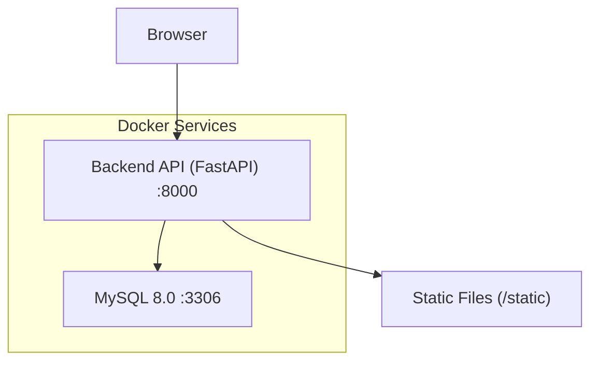
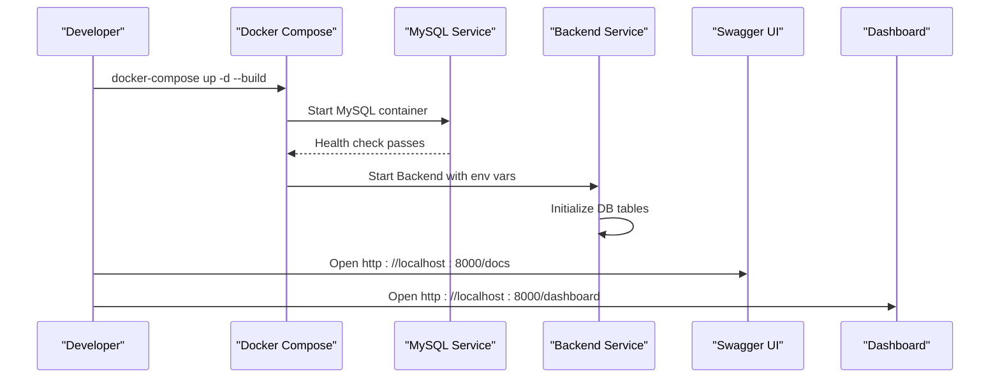
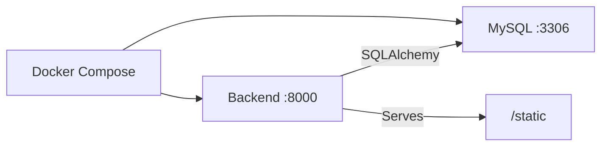

# Getting Started

<cite>
**Referenced Files in This Document**
- [README.md](file://README.md)
- [docker-compose.yml](file://docker-compose.yml)
- [backend/main.py](file://backend/main.py)
- [backend/seed.py](file://backend/seed.py)
- [backend/app/core/config.py](file://backend/app/core/config.py)
- [backend/app/core/database.py](file://backend/app/core/database.py)
- [backend/Dockerfile](file://backend/Dockerfile)
- [backend/requirements.txt](file://backend/requirements.txt)
- [frontend/README.md](file://frontend/README.md)
- [frontend/package.json](file://frontend/package.json)
- [docs/API.md](file://docs/API.md)
</cite>

## Table of Contents
1. Introduction
2. Project Structure
3. Core Components
4. Architecture Overview
5. Detailed Component Analysis
6. Dependency Analysis
7. Performance Considerations
8. Troubleshooting Guide
9. Conclusion
10. Appendices

## Introduction
TariffGuard is an AI-powered energy and production optimization platform for small textile factories. It converts electricity tariffs, production requirements, solar availability, and maximum-demand constraints into actionable schedules. The system includes a FastAPI backend, MySQL database, and a Next.js frontend dashboard.

This guide helps you install, configure, and run TariffGuard locally using Docker Compose, seed demo data, and access the API via Swagger UI and the dashboard. It also covers development vs. production deployment approaches and common troubleshooting steps.

## Project Structure
At a high level:
- Backend (FastAPI): Provides REST APIs, serves static files, and initializes the database on startup.
- Database (MySQL 8.0): Managed by Docker Compose with persistent volumes.
- Frontend (Next.js): Dashboard interface served statically by the backend during development.

**Diagram sources**
- [docker-compose.yml:4-46](file://docker-compose.yml#L4-L46)
- [backend/main.py:59-64](file://backend/main.py#L59-L64)

**Section sources**
- [README.md:10-18](file://README.md#L10-L18)
- [docker-compose.yml:4-46](file://docker-compose.yml#L4-L46)

## Core Components
- Backend API server: FastAPI application with routers for factories, machines, orders, tariffs, meter readings, dashboard, optimization, alerts, auth, and users. Serves static files and exposes health and root endpoints.
- Database layer: SQLAlchemy engine configured from environment variables; supports MySQL or SQLite fallback.
- Seed script: Creates demo factory, machines, tariffs, production orders, and meter readings to explore features quickly.
- Frontend: Next.js dashboard that can be developed independently or served via the backend’s static mount.

Key configuration:
- Environment variables for database URL, environment mode, debug flag, and optional keys.
- Docker Compose orchestrates services, sets up networking, and ensures the database is healthy before starting the backend.

**Section sources**
- [backend/main.py:18-64](file://backend/main.py#L18-L64)
- [backend/app/core/config.py:4-21](file://backend/app/core/config.py#L4-L21)
- [backend/app/core/database.py:1-37](file://backend/app/core/database.py#L1-L37)
- [backend/seed.py:17-455](file://backend/seed.py#L17-L455)
- [docker-compose.yml:4-46](file://docker-compose.yml#L4-L46)

## Architecture Overview
The runtime architecture consists of three main services orchestrated by Docker Compose:
- MySQL service provides persistence with a named volume.
- Backend service runs the FastAPI app with hot reload enabled in development.
- Static assets are mounted under /static and served at /dashboard.

**Diagram sources**
- [docker-compose.yml:4-46](file://docker-compose.yml#L4-L46)
- [backend/main.py:66-69](file://backend/main.py#L66-L69)

**Section sources**
- [docker-compose.yml:4-46](file://docker-compose.yml#L4-L46)
- [backend/main.py:66-69](file://backend/main.py#L66-L69)

## Detailed Component Analysis

### Installation and Setup (Development)
Prerequisites:
- Docker Desktop installed and running
- Git available in your PATH

Steps:
1. Clone the repository and navigate to the project root.
2. Build and start all services:
   - Run the compose command to build images and start containers.
3. Wait for the database to become healthy and the backend to initialize.
4. Seed demo data to populate the database with sample entities.
5. Access:
   - Swagger UI: http://localhost:8000/docs
   - Dashboard: http://localhost:8000/dashboard
   - Health check: http://localhost:8000/health

Notes:
- The backend uses hot reload in development via the compose command flags.
- The database credentials and connection string are set in the compose file.

**Section sources**
- [README.md:51-82](file://README.md#L51-L82)
- [docker-compose.yml:26-46](file://docker-compose.yml#L26-L46)
- [backend/main.py:66-69](file://backend/main.py#L66-L69)

### Environment Configuration
Environment variables used by the backend:
- DATABASE_URL: Connection string for MySQL (set in compose).
- ENVIRONMENT: Set to development for local runs.
- DEBUG: Enables debug mode.
- Optional keys: ALCHEMY_KEY, QWEN_API_KEY (with defaults if not provided).

Configuration behavior:
- The settings class loads values from environment and optionally .env files.
- The database module reads DATABASE_URL and configures SQLAlchemy accordingly.

**Section sources**
- [docker-compose.yml:35-40](file://docker-compose.yml#L35-L40)
- [backend/app/core/config.py:4-21](file://backend/app/core/config.py#L4-L21)
- [backend/app/core/database.py:1-21](file://backend/app/core/database.py#L1-L21)

### Database Initialization and Seed Data
Initialization:
- On application startup, the backend creates all tables defined by SQLAlchemy models.

Seed data:
- The seed script clears existing data, then creates a factory, machines, tariffs, production orders, and meter readings for demonstration.
- After seeding, you can query example resources using the API.

Verification:
- Use the health endpoint and test endpoint to confirm the backend is reachable.
- Query seeded resources via Swagger UI or curl.

**Section sources**
- [backend/main.py:66-69](file://backend/main.py#L66-L69)
- [backend/seed.py:17-455](file://backend/seed.py#L17-L455)
- [docs/API.md:9-14](file://docs/API.md#L9-L14)

### Accessing the API and Dashboard
- Swagger UI: Interactive documentation and testing at http://localhost:8000/docs.
- Dashboard: Static HTML served at http://localhost:8000/dashboard.
- Health check: http://localhost:8000/health returns a simple status object.

Example verification requests:
- GET /health
- GET /api/test
- GET /api/factories/ (after seeding)

**Section sources**
- [backend/main.py:71-91](file://backend/main.py#L71-L91)
- [docs/API.md:9-14](file://docs/API.md#L9-L14)
- [README.md:77-82](file://README.md#L77-L82)

### Development vs. Production Deployment

Development:
- Use Docker Compose with hot reload enabled for rapid iteration.
- Database persists data in a named volume.
- Debug mode is enabled for detailed error messages.

Production considerations:
- Disable debug mode and restrict CORS origins.
- Use strong secrets for database credentials and any API keys.
- Pin image versions and use non-root user execution (already configured in the Dockerfile).
- Ensure proper logging, monitoring, and backups for the database volume.
- Consider reverse proxy (e.g., Nginx) and TLS termination.

Frontend development:
- The Next.js frontend can be developed independently using its dev server.
- For production builds, follow the frontend README instructions.

**Section sources**
- [docker-compose.yml:26-46](file://docker-compose.yml#L26-L46)
- [backend/Dockerfile:29-34](file://backend/Dockerfile#L29-L34)
- [frontend/README.md:3-17](file://frontend/README.md#L3-L17)
- [frontend/package.json:5-11](file://frontend/package.json#L5-L11)

## Dependency Analysis
Service dependencies and ports:
- Backend depends on MySQL being healthy before starting.
- Ports exposed:
  - Backend: 8000
  - Database: 3306 (for direct access if needed)

Runtime dependencies:
- Python packages listed in requirements.txt are installed during image build.
- The backend mounts the source directory for live reload in development.

**Diagram sources**
- [docker-compose.yml:4-46](file://docker-compose.yml#L4-L46)
- [backend/requirements.txt:1-16](file://backend/requirements.txt#L1-L16)

**Section sources**
- [docker-compose.yml:4-46](file://docker-compose.yml#L4-L46)
- [backend/requirements.txt:1-16](file://backend/requirements.txt#L1-L16)

## Performance Considerations
- Use MySQL with appropriate indexes for large datasets (schema-level tuning is outside this guide).
- Avoid excessive logging in production; tune SQLAlchemy echo and Uvicorn workers as needed.
- Cache frequent read operations at the application or reverse-proxy layer.
- Monitor database connections and pool settings for high concurrency.

[No sources needed since this section provides general guidance]

## Troubleshooting Guide
Common issues and resolutions:
- Cannot connect to database:
  - Verify the database service is healthy and the DATABASE_URL matches the compose configuration.
  - Check network connectivity between containers and ensure the correct host name “db” is used inside the compose network.
- Backend fails to start:
  - Inspect logs for dependency errors or missing environment variables.
  - Ensure the database schema is created on startup.
- Seed data errors:
  - Re-run the seed script after ensuring the database is ready.
  - If data appears inconsistent, re-seed to reset to a known state.
- Port conflicts:
  - If port 8000 or 3306 is already in use, change the mapping in docker-compose.yml and update client URLs accordingly.
- CORS or dashboard loading issues:
  - Confirm the backend serves static files and that the browser can reach /dashboard and /static.

Verification steps:
- Health endpoint should return a healthy status.
- Test endpoint should succeed and show the configured DATABASE_URL.
- Swagger UI should list all routes and allow interactive testing.

**Section sources**
- [docker-compose.yml:18-24](file://docker-compose.yml#L18-L24)
- [backend/main.py:71-91](file://backend/main.py#L71-L91)
- [backend/seed.py:393-455](file://backend/seed.py#L393-L455)

## Conclusion
You now have TariffGuard running locally with a seeded dataset, accessible via Swagger UI and the dashboard. Use the provided endpoints to explore functionality, and adapt the environment and deployment steps for production needs. For independent frontend development, follow the frontend README to run the Next.js dev server.

[No sources needed since this section summarizes without analyzing specific files]

## Appendices

### Quick Start Checklist
- Install Docker Desktop and Git.
- Clone the repository.
- Start services with Docker Compose.
- Seed demo data.
- Open Swagger UI and Dashboard.
- Verify health and test endpoints.

**Section sources**
- [README.md:51-82](file://README.md#L51-L82)
- [docker-compose.yml:26-46](file://docker-compose.yml#L26-L46)
- [backend/seed.py:393-455](file://backend/seed.py#L393-L455)

### First-Time User Examples
- View health: GET http://localhost:8000/health
- View test info: GET http://localhost:8000/api/test
- Explore API: Open http://localhost:8000/docs
- Load dashboard: Open http://localhost:8000/dashboard

**Section sources**
- [backend/main.py:71-91](file://backend/main.py#L71-L91)
- [docs/API.md:9-14](file://docs/API.md#L9-L14)
- [README.md:77-82](file://README.md#L77-L82)