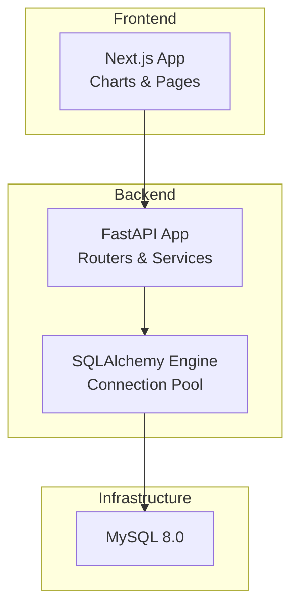
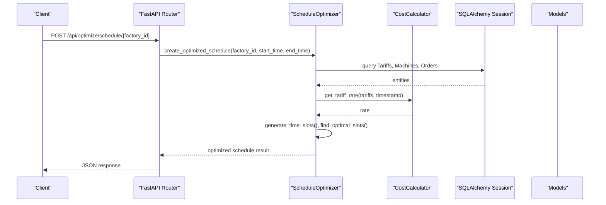
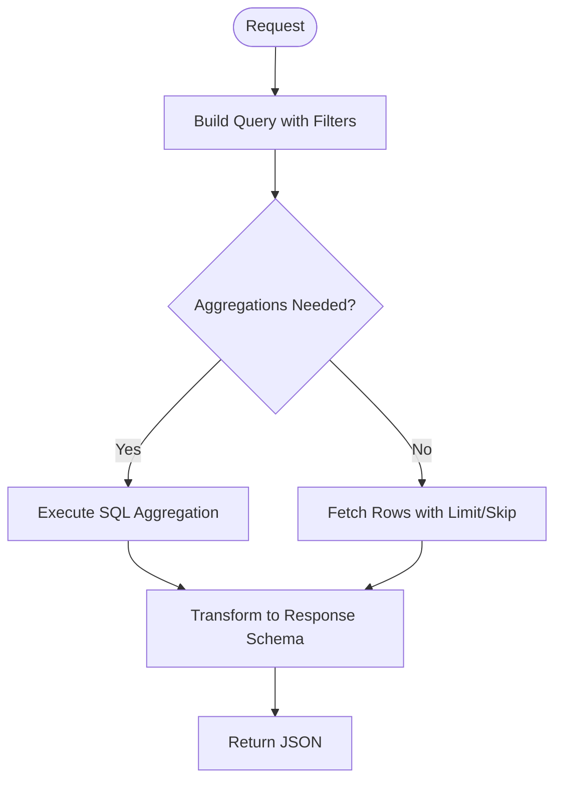
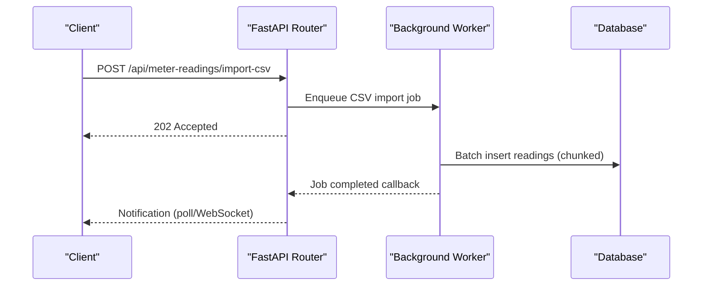
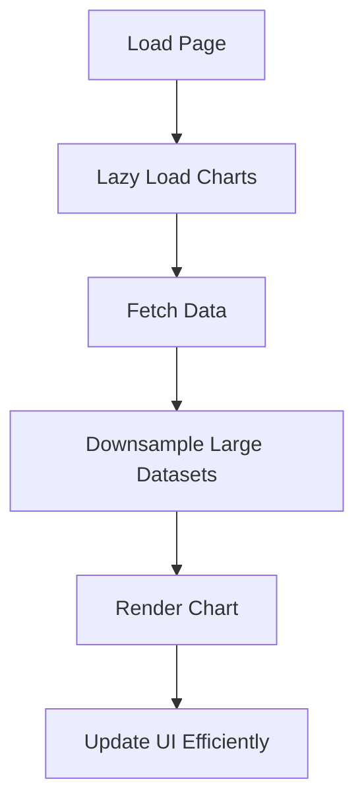
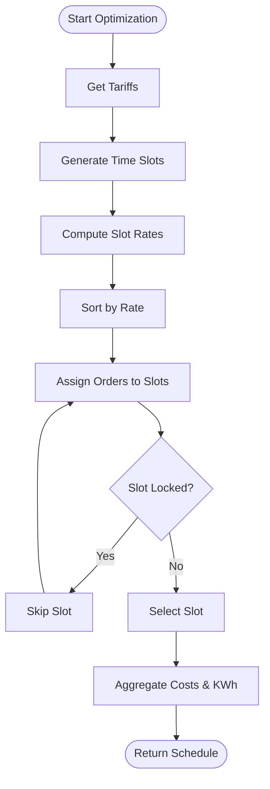
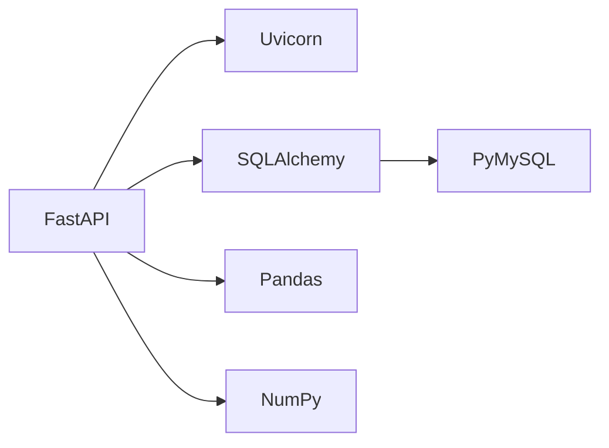

# Performance Optimization

<cite>
**Referenced Files in This Document**
- [main.py](file://backend/main.py)
- [config.py](file://backend/app/core/config.py)
- [database.py](file://backend/app/core/database.py)
- [requirements.txt](file://backend/requirements.txt)
- [optimizer.py](file://backend/app/services/optimizer.py)
- [cost_calculator.py](file://backend/app/services/cost_calculator.py)
- [dashboard.py](file://backend/app/api/dashboard.py)
- [optimization.py](file://backend/app/api/optimization.py)
- [meter_reading.py](file://backend/app/api/meter_reading.py)
- [machine.py](file://backend/app/models/machine.py)
- [production_order.py](file://backend/app/models/production_order.py)
- [tariff.py](file://backend/app/models/tariff.py)
- [package.json](file://frontend/package.json)
- [next.config.ts](file://frontend/next.config.ts)
- [schedule_gantt.tsx](file://frontend/components/charts/schedule_gantt.tsx)
- [energy_consumption_chart.tsx](file://frontend/components/charts/energy_consumption_chart.tsx)
- [docker-compose.yml](file://docker-compose.yml)
</cite>

## Table of Contents
1. [Introduction](#introduction)
2. [Project Structure](#project-structure)
3. [Core Components](#core-components)
4. [Architecture Overview](#architecture-overview)
5. [Detailed Component Analysis](#detailed-component-analysis)
6. [Dependency Analysis](#dependency-analysis)
7. [Performance Considerations](#performance-considerations)
8. [Troubleshooting Guide](#troubleshooting-guide)
9. [Conclusion](#conclusion)
10. [Appendices](#appendices)

## Introduction
This document provides comprehensive performance optimization guidance for TariffGuard across database, backend API, frontend UI, scheduling algorithm, real-time data processing, and cloud deployment. It includes actionable strategies, diagrams, benchmarks, checklists, and troubleshooting steps tailored to the current codebase.

## Project Structure
TariffGuard consists of:
- Backend (FastAPI + SQLAlchemy): REST APIs for dashboard, meter readings, optimization, and more; uses MySQL or SQLite with connection pooling configured for production databases.
- Frontend (Next.js + React + Recharts): Dashboard pages and charts for energy consumption and schedule Gantt visualization.
- Infrastructure: Docker Compose orchestrates MySQL and the FastAPI service.

**Diagram sources**
- [main.py:18-68](file://backend/main.py#L18-L68)
- [database.py:1-37](file://backend/app/core/database.py#L1-L37)
- [docker-compose.yml:3-46](file://docker-compose.yml#L3-L46)

**Section sources**
- [main.py:18-68](file://backend/main.py#L18-L68)
- [docker-compose.yml:3-46](file://docker-compose.yml#L3-L46)

## Core Components
- Database layer: Engine creation, session factory, and initialization.
- API layer: Routers for dashboard, meter readings, and optimization endpoints.
- Services: Schedule optimizer and cost calculator.
- Models: Machine, ProductionOrder, Tariff, MeterReading.
- Frontend: Next.js app with chart components for energy and schedule visualization.

Key performance-critical areas:
- Query patterns in dashboard and meter reading endpoints.
- Scheduling algorithm complexity and memory usage.
- Chart rendering performance on large datasets.
- Connection pool settings and engine configuration.

**Section sources**
- [database.py:1-37](file://backend/app/core/database.py#L1-L37)
- [dashboard.py:15-79](file://backend/app/api/dashboard.py#L15-L79)
- [meter_reading.py:90-141](file://backend/app/api/meter_reading.py#L90-L141)
- [optimizer.py:14-238](file://backend/app/services/optimizer.py#L14-L238)
- [cost_calculator.py:12-110](file://backend/app/services/cost_calculator.py#L12-L110)
- [machine.py:5-20](file://backend/app/models/machine.py#L5-L20)
- [production_order.py:5-20](file://backend/app/models/production_order.py#L5-L20)
- [tariff.py:5-19](file://backend/app/models/tariff.py#L5-L19)
- [energy_consumption_chart.tsx:1-65](file://frontend/components/charts/energy_consumption_chart.tsx#L1-L65)
- [schedule_gantt.tsx:1-222](file://frontend/components/charts/schedule_gantt.tsx#L1-L222)

## Architecture Overview
The system exposes REST endpoints that query relational data via SQLAlchemy and return JSON responses. The scheduler computes optimal time slots based on tariffs and machine constraints. The frontend renders charts using Recharts and a custom Gantt component.

**Diagram sources**
- [optimization.py:11-29](file://backend/app/api/optimization.py#L11-L29)
- [optimizer.py:97-190](file://backend/app/services/optimizer.py#L97-L190)
- [cost_calculator.py:15-33](file://backend/app/services/cost_calculator.py#L15-L33)
- [database.py:27-32](file://backend/app/core/database.py#L27-L32)

## Detailed Component Analysis

### Database Optimization Strategies
- Connection pooling:
  - For MySQL, the engine is created with pool_pre_ping and pool_recycle to manage stale connections and health checks.
  - For SQLite fallback, connect_args disables thread checking for single-process usage.
- Session management:
  - Use dependency-injected sessions per request to ensure proper lifecycle and resource cleanup.
- Query optimization:
  - Use aggregation functions (count, sum, max, avg) directly in SQL via SQLAlchemy to reduce data transfer.
  - Filter early and limit results where possible (e.g., pagination with skip/limit).
- Indexing strategy:
  - Ensure indexes on foreign keys and frequently filtered columns:
    - machines.factory_id
    - production_orders.factory_id, status, deadline
    - meter_readings.factory_id, timestamp
    - tariffs effective date ranges if queried by period
- Caching mechanisms:
  - Cache static tariff tables and derived slot rates for short-lived windows to avoid repeated computations.
  - Cache dashboard summary aggregates for a short TTL to reduce heavy queries under load.

**Diagram sources**
- [dashboard.py:15-79](file://backend/app/api/dashboard.py#L15-L79)
- [meter_reading.py:90-141](file://backend/app/api/meter_reading.py#L90-L141)
- [database.py:1-37](file://backend/app/core/database.py#L1-L37)

**Section sources**
- [database.py:1-37](file://backend/app/core/database.py#L1-L37)
- [dashboard.py:15-79](file://backend/app/api/dashboard.py#L15-L79)
- [meter_reading.py:90-141](file://backend/app/api/meter_reading.py#L90-L141)

### Backend Performance Tuning
- API response optimization:
  - Minimize payload size by returning only necessary fields.
  - Use fast JSON serialization and avoid heavy object graphs.
  - Apply compression at the reverse proxy level (e.g., gzip/brotli).
- Background task processing:
  - Offload long-running tasks (CSV import, heavy calculations) to background workers (e.g., Celery/RQ) to keep API latency low.
  - Implement idempotent operations and progress tracking for long jobs.
- Memory management:
  - Stream large CSV imports instead of loading entire files into memory.
  - Use generators and chunked processing for large datasets.
  - Avoid retaining large objects in request-scoped variables beyond their use.

**Diagram sources**
- [meter_reading.py:41-88](file://backend/app/api/meter_reading.py#L41-L88)
- [main.py:18-68](file://backend/main.py#L18-L68)

**Section sources**
- [meter_reading.py:41-88](file://backend/app/api/meter_reading.py#L41-L88)
- [main.py:18-68](file://backend/main.py#L18-L68)

### Frontend Performance Optimization
- Component lazy loading:
  - Use dynamic imports for heavy components (e.g., charts) to reduce initial bundle size.
  - Defer non-critical interactions until after first paint.
- Chart rendering optimization:
  - Downsample time series data before rendering to maintain interactivity.
  - Use memoization and stable keys to prevent unnecessary re-renders.
  - Prefer virtualized lists for large timelines.
- Bundle size reduction:
  - Tree-shake unused dependencies.
  - Remove dev-only libraries from production builds.
  - Configure Next.js optimizations (e.g., minification, asset optimization).

**Diagram sources**
- [energy_consumption_chart.tsx:1-65](file://frontend/components/charts/energy_consumption_chart.tsx#L1-L65)
- [schedule_gantt.tsx:1-222](file://frontend/components/charts/schedule_gantt.tsx#L1-L222)
- [package.json:12-19](file://frontend/package.json#L12-L19)
- [next.config.ts:1-8](file://frontend/next.config.ts#L1-L8)

**Section sources**
- [energy_consumption_chart.tsx:1-65](file://frontend/components/charts/energy_consumption_chart.tsx#L1-L65)
- [schedule_gantt.tsx:1-222](file://frontend/components/charts/schedule_gantt.tsx#L1-L222)
- [package.json:12-19](file://frontend/package.json#L12-L19)
- [next.config.ts:1-8](file://frontend/next.config.ts#L1-L8)

### Schedule Optimizer Algorithm Optimization
Current behavior:
- Generates hourly time slots and sorts them by tariff rate to select cheapest consecutive slots per machine while avoiding locked slots.
- Computes costs per slot and aggregates totals.

Optimization opportunities:
- Precompute and cache slot rates per factory/time window to avoid repeated tariff lookups.
- Use efficient data structures (e.g., hash sets) for locked slots to reduce lookup time.
- Sort once and reuse sorted order across orders to minimize redundant sorting.
- Consider priority-aware scheduling to respect deadlines and machine availability windows.
- Parallelize independent order assignments when feasible.

**Diagram sources**
- [optimizer.py:21-95](file://backend/app/services/optimizer.py#L21-L95)
- [cost_calculator.py:15-33](file://backend/app/services/cost_calculator.py#L15-L33)

**Section sources**
- [optimizer.py:21-95](file://backend/app/services/optimizer.py#L21-L95)
- [cost_calculator.py:15-33](file://backend/app/services/cost_calculator.py#L15-L33)

### Real-Time Data Processing and Large Dataset Handling
- Streaming ingestion:
  - Process CSV uploads in chunks to avoid memory spikes.
  - Use batch inserts with appropriate transaction boundaries.
- Downsampling and aggregation:
  - Pre-aggregate meter readings into hourly/daily buckets for dashboards.
  - Store raw data separately for detailed analysis.
- Pagination and filtering:
  - Always apply filters and limits to list endpoints to control payload size.

**Section sources**
- [meter_reading.py:41-88](file://backend/app/api/meter_reading.py#L41-L88)
- [meter_reading.py:90-141](file://backend/app/api/meter_reading.py#L90-L141)

## Dependency Analysis
Key runtime dependencies and versions influence performance:
- FastAPI and Uvicorn provide async concurrency.
- SQLAlchemy manages ORM and connection pooling.
- Pandas/Numpy used for data processing in meter reading imports.

**Diagram sources**
- [requirements.txt:1-16](file://backend/requirements.txt#L1-L16)

**Section sources**
- [requirements.txt:1-16](file://backend/requirements.txt#L1-L16)

## Performance Considerations
- Database:
  - Tune connection pool sizes based on expected concurrency.
  - Add indexes on foreign keys and filter columns.
  - Use read replicas for heavy read workloads.
- Backend:
  - Enable response compression.
  - Offload heavy tasks to background workers.
  - Profile CPU-bound sections (e.g., scheduling) and consider parallelization.
- Frontend:
  - Lazy-load charts and defer non-critical scripts.
  - Downsample datasets for interactive charts.
  - Optimize bundle size and enable caching headers.
- Cloud resources:
  - Right-size containers and set resource limits.
  - Use auto-scaling policies based on CPU/memory and request latency.
  - Place databases in managed services with storage IOPS tuned for workload.

[No sources needed since this section provides general guidance]

## Troubleshooting Guide
Common issues and resolutions:
- Slow dashboard queries:
  - Verify indexes on factory_id and timestamps.
  - Reduce payload by aggregating in SQL.
- High memory usage during CSV import:
  - Chunk processing and avoid loading full files into memory.
- Stale database connections:
  - Ensure pool_pre_ping and pool_recycle are configured for MySQL.
- Frontend chart lag:
  - Downsample data and memoize computations.
  - Avoid excessive re-renders by stabilizing keys and state updates.

**Section sources**
- [dashboard.py:15-79](file://backend/app/api/dashboard.py#L15-L79)
- [meter_reading.py:41-88](file://backend/app/api/meter_reading.py#L41-L88)
- [database.py:1-37](file://backend/app/core/database.py#L1-L37)
- [energy_consumption_chart.tsx:1-65](file://frontend/components/charts/energy_consumption_chart.tsx#L1-L65)
- [schedule_gantt.tsx:1-222](file://frontend/components/charts/schedule_gantt.tsx#L1-L222)

## Conclusion
TariffGuard’s performance can be significantly improved through targeted database indexing, query aggregation, background task offloading, frontend lazy loading and data downsampling, and careful scheduling algorithm optimizations. With proper monitoring, profiling, and cloud scaling configurations, the platform can handle growing data volumes and user loads efficiently.

[No sources needed since this section summarizes without analyzing specific files]

## Appendices

### Monitoring and Profiling Tools
- Backend:
  - Use application metrics (request latency, error rates) and database query profiling.
  - Integrate APM tools to trace slow endpoints and identify bottlenecks.
- Frontend:
  - Measure bundle size, render times, and chart interaction latency.
  - Use browser performance panels to detect re-renders and layout thrashing.
- Infrastructure:
  - Monitor container CPU/memory and database IOPS.
  - Set alerts for high latency and error rates.

[No sources needed since this section provides general guidance]

### Load Testing Approaches
- Define scenarios:
  - Dashboard summary and factory-specific queries under concurrent load.
  - Meter reading bulk imports and listing endpoints.
  - Schedule optimization requests with varying time windows.
- Metrics:
  - P95/P99 latency, throughput, error rates, resource utilization.
- Tools:
  - Use load testing frameworks to simulate realistic traffic patterns.

[No sources needed since this section provides general guidance]

### Scalability Considerations
- Horizontal scaling:
  - Run multiple backend instances behind a load balancer.
  - Scale database vertically or add read replicas.
- Statelessness:
  - Keep API stateless; externalize sessions and caches.
- Caching:
  - Use distributed caches for hot data (tariffs, summaries).

[No sources needed since this section provides general guidance]

### Resource Utilization Optimization
- Backend:
  - Tune worker processes and threads based on CPU cores.
  - Adjust database connection pool sizes to match concurrency.
- Frontend:
  - Minimize JavaScript execution time and DOM manipulations.
  - Use efficient chart libraries and virtualization for large datasets.
- Cloud:
  - Auto-scale based on CPU/memory and request latency thresholds.
  - Use managed services with autoscaling and storage tiering.

[No sources needed since this section provides general guidance]

### Optimization Checklist
- Database:
  - Add indexes on foreign keys and frequent filters.
  - Use aggregation queries and pagination.
  - Configure connection pooling parameters.
- Backend:
  - Offload heavy tasks to background workers.
  - Enable compression and optimize payloads.
  - Profile and parallelize CPU-bound logic.
- Frontend:
  - Lazy-load heavy components.
  - Downsample data for charts.
  - Reduce bundle size and enable caching.
- Scheduling:
  - Cache slot rates and sort once.
  - Use efficient lookups for locked slots.
  - Respect priorities and deadlines.
- Cloud:
  - Right-size resources and set limits.
  - Configure auto-scaling policies.
  - Monitor and alert on key metrics.

[No sources needed since this section provides general guidance]

### Cloud Resource Optimization and Auto-Scaling Configurations
- Container orchestration:
  - Set CPU/memory requests and limits.
  - Use rolling updates for zero-downtime deployments.
- Auto-scaling:
  - Scale out on high CPU/memory or elevated request latency.
  - Scale down during low traffic to save costs.
- Database:
  - Use managed databases with automated backups and scaling.
  - Monitor query performance and adjust indexes.

[No sources needed since this section provides general guidance]