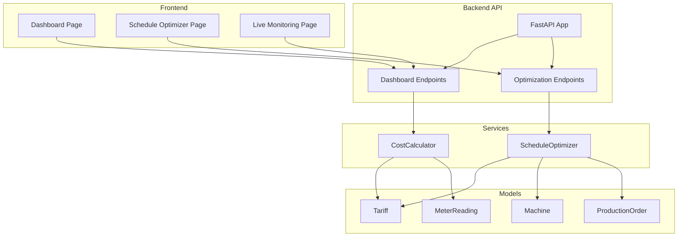
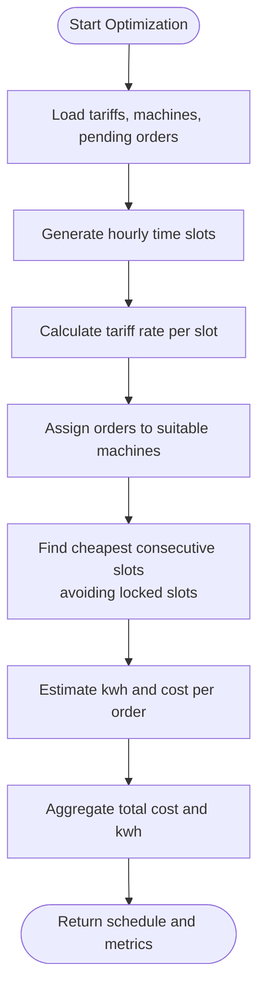
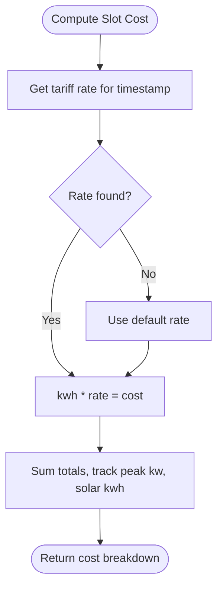
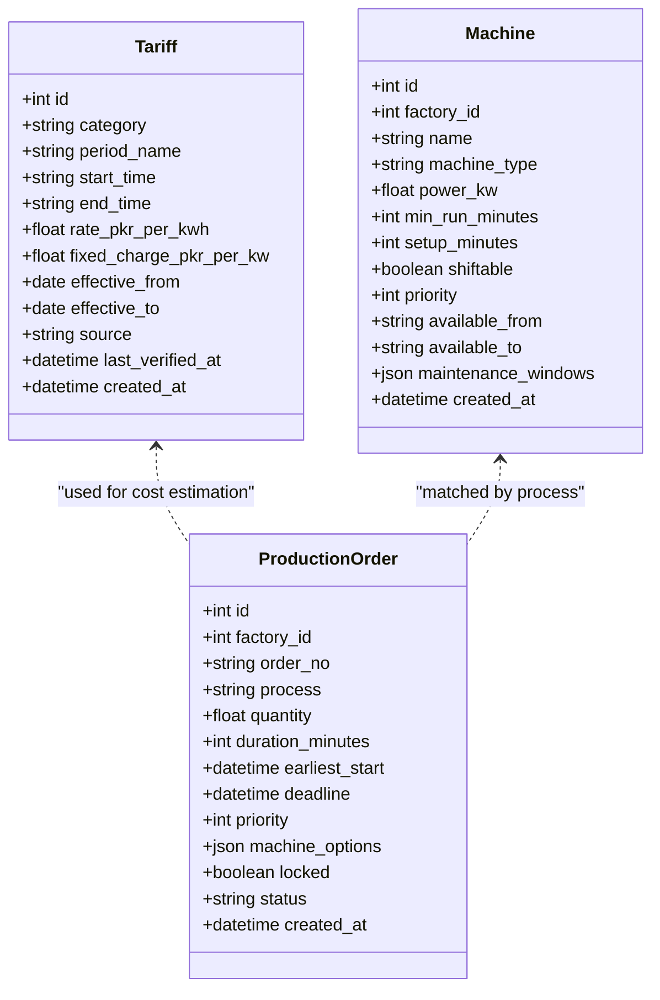
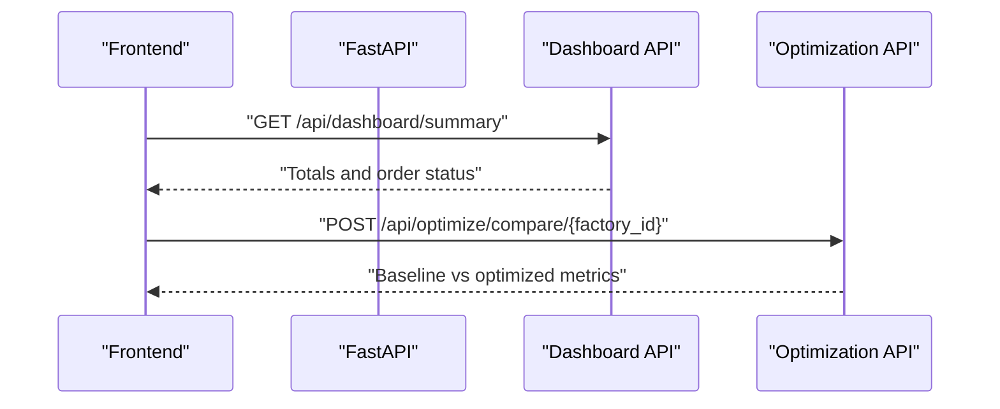
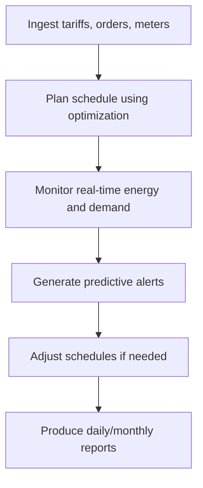
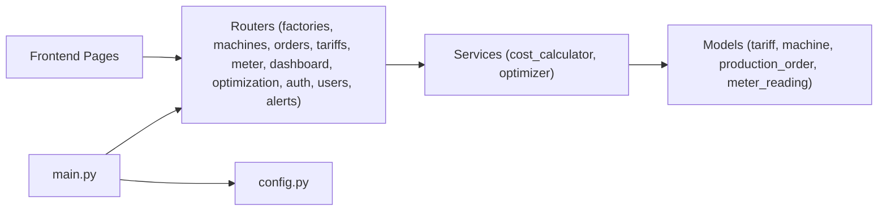

# Project Overview

<cite>
**Referenced Files in This Document**
- [README.md](file://README.md)
- [main.py](file://backend/main.py)
- [config.py](file://backend/app/core/config.py)
- [optimizer.py](file://backend/app/services/optimizer.py)
- [cost_calculator.py](file://backend/app/services/cost_calculator.py)
- [tariff.py](file://backend/app/models/tariff.py)
- [machine.py](file://backend/app/models/machine.py)
- [production_order.py](file://backend/app/models/production_order.py)
- [dashboard.py](file://backend/app/api/dashboard.py)
- [optimization.py](file://backend/app/api/optimization.py)
- [page.tsx (Dashboard)](file://frontend/app/dashboard/page.tsx)
- [page.tsx (Schedule Optimizer)](file://frontend/app/dashboard/schedule_optimizer/page.tsx)
- [page.tsx (Live Monitoring)](file://frontend/app/dashboard/live_monitoring/page.tsx)
- [energy_consumption_chart.tsx](file://frontend/components/charts/energy_consumption_chart.tsx)
</cite>

## Table of Contents
1. Introduction
2. Project Structure
3. Core Components
4. Architecture Overview
5. Detailed Component Analysis
6. Dependency Analysis
7. Performance Considerations
8. Troubleshooting Guide
9. Conclusion

## Introduction
TariffGuard is an AI-powered energy and production optimization platform designed for small to medium textile factories. It transforms electricity tariffs, production requirements, solar availability, and maximum-demand constraints into actionable production schedules that reduce electricity costs while maintaining delivery deadlines. The platform’s core value proposition is intelligent scheduling based on time-of-use tariffs: by shifting energy-intensive tasks to cheaper periods and leveraging solar generation windows, factories can lower their energy bills without sacrificing throughput.

Key benefits include:
- Cost reduction through tariff-aware scheduling and optimization
- Real-time monitoring of energy consumption, demand, and machine status
- Predictive alerts for peak demand risks and schedule deviations
- Production optimization that balances cost, capacity, and deadlines

The target audience includes plant managers, supervisors, and owners of small to medium manufacturing facilities who need practical tools to manage energy costs and production efficiency.

For beginners, TariffGuard simplifies complex energy management by providing a clear dashboard, visual schedules, and straightforward recommendations. For experienced developers, it exposes well-structured APIs, modular services, and extensible models for tariffs, machines, orders, and meter readings.

Practical example: A factory enters its pending production orders with durations and deadlines. TariffGuard reads the current tariffs, generates hourly time slots, calculates the applicable rate per slot, and proposes a schedule that runs high-power processes during off-peak or solar hours. The system then compares baseline costs (e.g., running everything at peak rates) versus optimized costs, showing estimated savings and a Gantt view of proposed changes.

**Section sources**
- [README.md:6-49](file://README.md#L6-L49)

## Project Structure
TariffGuard follows a layered architecture:
- Backend API (FastAPI) exposing endpoints for authentication, factories, machines, orders, tariffs, meter readings, dashboard summaries, optimization, and alerts
- Services layer implementing business logic such as cost calculation and schedule optimization
- Data models (SQLAlchemy) defining entities like Tariff, Machine, ProductionOrder, MeterReading
- Frontend (Next.js) with dashboards for overview, live monitoring, schedule optimization, reports, and settings



**Diagram sources**
- [main.py:18-58](file://backend/main.py#L18-L58)
- [dashboard.py:13-79](file://backend/app/api/dashboard.py#L13-L79)
- [optimization.py:9-48](file://backend/app/api/optimization.py#L9-L48)
- [cost_calculator.py:12-110](file://backend/app/services/cost_calculator.py#L12-L110)
- [optimizer.py:14-238](file://backend/app/services/optimizer.py#L14-L238)
- [tariff.py:5-19](file://backend/app/models/tariff.py#L5-L19)
- [machine.py:5-20](file://backend/app/models/machine.py#L5-L20)
- [production_order.py:5-20](file://backend/app/models/production_order.py#L5-L20)

**Section sources**
- [main.py:18-58](file://backend/main.py#L18-L58)
- [README.md:184-204](file://README.md#L184-L204)

## Core Components
- Tariff model: Defines time-based pricing periods (start/end times, rates, effective dates). Used to determine the applicable rate for any timestamp.
- Machine model: Captures factory equipment attributes including power consumption, availability windows, and maintenance windows.
- ProductionOrder model: Represents jobs with process type, quantity, duration, earliest start, deadline, priority, and locking flags.
- CostCalculator service: Computes energy costs per slot using tariffs and meter readings; estimates machine run costs; aggregates totals and peak demand.
- ScheduleOptimizer service: Generates hourly time slots, maps tariff rates, finds cheapest consecutive slots for each order, assigns suitable machines, and builds an optimized schedule with cost and kWh estimates.
- Dashboard API: Provides summary statistics across factories, machines, orders, tariffs, and meter readings; returns factory-specific energy stats.
- Optimization API: Exposes endpoints to generate optimized schedules and compare baseline vs optimized outcomes.
- Frontend dashboards: Visualize KPIs, energy profiles, live machine status, and schedule optimization results with interactive controls.

**Section sources**
- [tariff.py:5-19](file://backend/app/models/tariff.py#L5-L19)
- [machine.py:5-20](file://backend/app/models/machine.py#L5-L20)
- [production_order.py:5-20](file://backend/app/models/production_order.py#L5-L20)
- [cost_calculator.py:12-110](file://backend/app/services/cost_calculator.py#L12-L110)
- [optimizer.py:14-238](file://backend/app/services/optimizer.py#L14-L238)
- [dashboard.py:13-79](file://backend/app/api/dashboard.py#L13-L79)
- [optimization.py:9-48](file://backend/app/api/optimization.py#L9-L48)
- [page.tsx (Dashboard):12-172](file://frontend/app/dashboard/page.tsx#L12-L172)
- [page.tsx (Schedule Optimizer):72-379](file://frontend/app/dashboard/schedule_optimizer/page.tsx#L72-L379)
- [page.tsx (Live Monitoring):34-197](file://frontend/app/dashboard/live_monitoring/page.tsx#L34-L197)

## Architecture Overview
TariffGuard integrates frontend dashboards with backend services to deliver real-time insights and optimized schedules. The FastAPI application mounts routers for domain features, initializes the database, and serves static assets. Services encapsulate business logic, while models define persistent data structures.

```mermaid
sequenceDiagram
participant UI as "Frontend Pages"
participant API as "FastAPI App"
participant Opt as "Optimization Router"
participant Svc as "ScheduleOptimizer"
participant Calc as "CostCalculator"
participant DB as "Database Models"
UI->>API : "GET /api/dashboard/summary"
API->>DB : "Aggregate counts and stats"
DB-->>API : "Summary data"
API-->>UI : "Dashboard summary"
UI->>API : "POST /api/optimize/compare/{factory_id}"
API->>Opt : "Route to compare_schedules"
Opt->>Svc : "compare_baseline_vs_optimized(...)"
Svc->>DB : "Load tariffs, machines, orders"
Svc->>Calc : "get_tariff_rate(timestamp)"
Calc-->>Svc : "Applicable rate"
Svc-->>Opt : "Baseline vs optimized result"
Opt-->>UI : "Savings and schedule"
```

**Diagram sources**
- [main.py:18-58](file://backend/main.py#L18-L58)
- [dashboard.py:13-79](file://backend/app/api/dashboard.py#L13-L79)
- [optimization.py:9-48](file://backend/app/api/optimization.py#L9-L48)
- [optimizer.py:14-238](file://backend/app/services/optimizer.py#L14-L238)
- [cost_calculator.py:12-110](file://backend/app/services/cost_calculator.py#L12-L110)

## Detailed Component Analysis

### Schedule Optimization Service
The optimizer creates hourly time slots within a specified window, computes the tariff rate for each slot, and selects the cheapest consecutive slots for each pending order while respecting machine suitability and locked slots. It then estimates energy usage and cost per order and aggregates totals.



**Diagram sources**
- [optimizer.py:36-190](file://backend/app/services/optimizer.py#L36-L190)

**Section sources**
- [optimizer.py:14-238](file://backend/app/services/optimizer.py#L14-L238)

### Cost Calculation Service
The cost calculator determines the applicable tariff rate for a given timestamp, handles overnight tariff ranges, and computes slot-level and aggregate costs. It also supports estimating machine run costs and aggregating grid vs solar consumption.



**Diagram sources**
- [cost_calculator.py:15-110](file://backend/app/services/cost_calculator.py#L15-L110)

**Section sources**
- [cost_calculator.py:12-110](file://backend/app/services/cost_calculator.py#L12-L110)

### Data Models: Tariff, Machine, ProductionOrder
These models define the core entities used throughout the platform:
- Tariff: Time-based pricing with category, period name, start/end times, rate, fixed charge, effective dates, source, verification timestamps.
- Machine: Equipment profile with power rating, availability windows, maintenance windows, shiftable flag, and priority.
- ProductionOrder: Job definition with process type, quantity, duration, earliest start, deadline, priority, machine options, lock status, and lifecycle status.



**Diagram sources**
- [tariff.py:5-19](file://backend/app/models/tariff.py#L5-L19)
- [machine.py:5-20](file://backend/app/models/machine.py#L5-L20)
- [production_order.py:5-20](file://backend/app/models/production_order.py#L5-L20)

**Section sources**
- [tariff.py:5-19](file://backend/app/models/tariff.py#L5-L19)
- [machine.py:5-20](file://backend/app/models/machine.py#L5-L20)
- [production_order.py:5-20](file://backend/app/models/production_order.py#L5-L20)

### API Endpoints and Frontend Integration
- Dashboard endpoints provide overall and factory-specific summaries, including energy totals, peak demand, and solar generation.
- Optimization endpoints generate schedules and compare baseline vs optimized outcomes.
- Frontend pages consume these endpoints to render KPIs, charts, and interactive schedule views.



**Diagram sources**
- [dashboard.py:13-79](file://backend/app/api/dashboard.py#L13-L79)
- [optimization.py:9-48](file://backend/app/api/optimization.py#L9-L48)
- [page.tsx (Dashboard):16-62](file://frontend/app/dashboard/page.tsx#L16-L62)
- [page.tsx (Schedule Optimizer):123-152](file://frontend/app/dashboard/schedule_optimizer/page.tsx#L123-L152)

**Section sources**
- [dashboard.py:13-79](file://backend/app/api/dashboard.py#L13-L79)
- [optimization.py:9-48](file://backend/app/api/optimization.py#L9-L48)
- [page.tsx (Dashboard):16-62](file://frontend/app/dashboard/page.tsx#L16-L62)
- [page.tsx (Schedule Optimizer):123-152](file://frontend/app/dashboard/schedule_optimizer/page.tsx#L123-L152)

### Conceptual Overview
At a high level, TariffGuard ingests tariff schedules and production orders, then uses optimization algorithms to propose the lowest-cost production plan. The system continuously monitors energy consumption and alerts when demand approaches limits or when schedules deviate from plans. Users interact via dashboards that visualize energy profiles, machine statuses, and schedule changes.



[No sources needed since this diagram shows conceptual workflow, not actual code structure]

## Dependency Analysis
TariffGuard’s backend organizes dependencies by feature routers and services:
- main.py wires routers for factories, machines, orders, tariffs, meter readings, dashboard, optimization, auth, users, and alerts
- config.py centralizes environment settings including database URL and optional cloud/AI keys
- Services depend on models for data access and computation
- Frontend pages depend on backend APIs to fetch data and trigger optimization



**Diagram sources**
- [main.py:18-58](file://backend/main.py#L18-L58)
- [config.py:4-21](file://backend/app/core/config.py#L4-L21)

**Section sources**
- [main.py:18-58](file://backend/main.py#L18-L58)
- [config.py:4-21](file://backend/app/core/config.py#L4-L21)

## Performance Considerations
- Time-slot granularity: Using hourly slots balances accuracy and performance; consider finer intervals for high-resolution optimization if needed.
- Query efficiency: Dashboard aggregation uses SQL functions to minimize data transfer; ensure indexes on frequently filtered fields (e.g., factory_id, status).
- Locking and concurrency: Locked slots prevent reassignment; ensure robust handling of concurrent optimization runs to avoid race conditions.
- Solar integration: Accurate solar forecasts improve optimization quality; integrate reliable forecasting inputs where possible.
- Caching: Cache tariff rates and machine availability for repeated queries within short time windows to reduce database load.

[No sources needed since this section provides general guidance]

## Troubleshooting Guide
Common issues and resolutions:
- Database connection errors: Verify DATABASE_URL and environment configuration; check container networking and credentials.
- Missing tariffs: Ensure tariffs cover the entire day, including overnight ranges; validate start/end times and effective dates.
- No optimal slots found: Check machine availability windows, locked slots, and order durations; adjust constraints or unlock necessary slots.
- Frontend fetch failures: Confirm API endpoints are mounted and CORS allows requests; inspect network logs for error responses.
- Alerts not generated: Validate alert thresholds and unresolved filters; ensure meter readings and order statuses are up to date.

**Section sources**
- [config.py:4-21](file://backend/app/core/config.py#L4-L21)
- [main.py:25-38](file://backend/main.py#L25-L38)
- [dashboard.py:44-79](file://backend/app/api/dashboard.py#L44-L79)
- [page.tsx (Dashboard):16-62](file://frontend/app/dashboard/page.tsx#L16-L62)

## Conclusion
TariffGuard delivers measurable value to small to medium textile factories by converting electricity tariffs into actionable production schedules that reduce energy costs while maintaining operational goals. Its modular architecture enables easy extension and integration with additional data sources and optimization strategies. Through real-time monitoring, predictive alerts, and intuitive dashboards, TariffGuard empowers operators to make informed decisions that balance cost, capacity, and deadlines.

[No sources needed since this section summarizes without analyzing specific files]