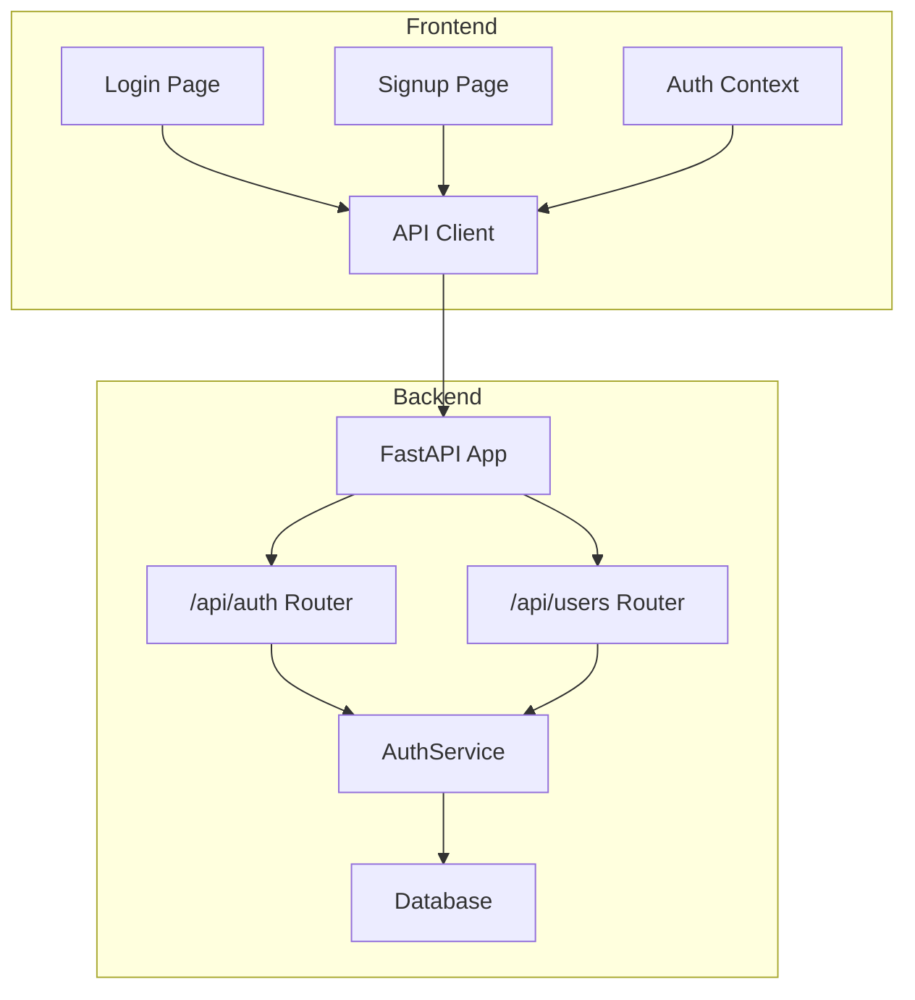
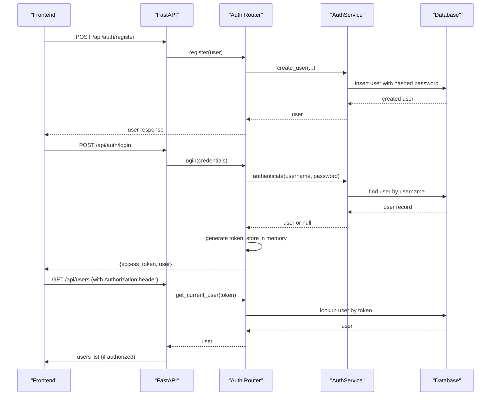
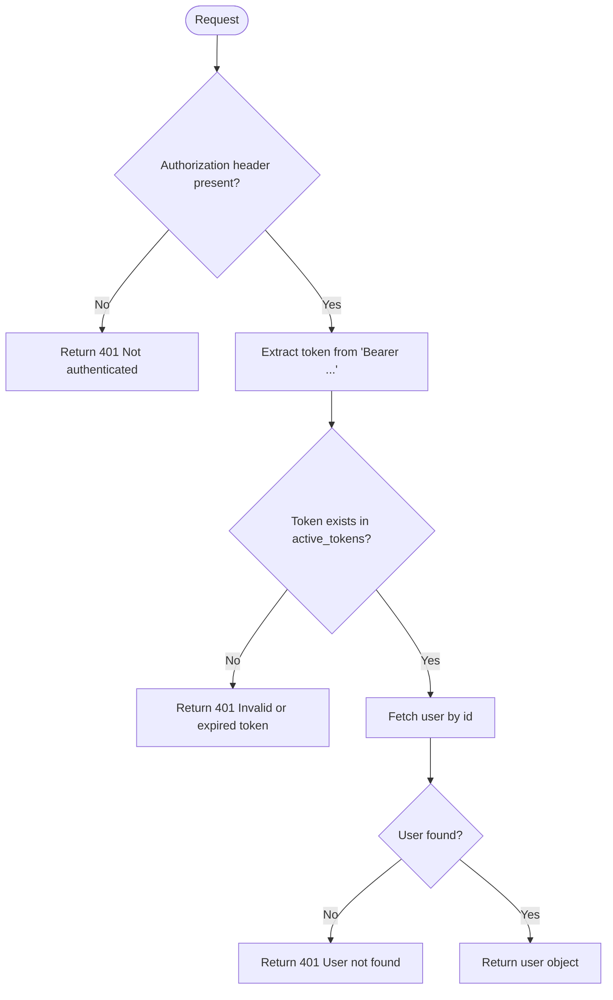
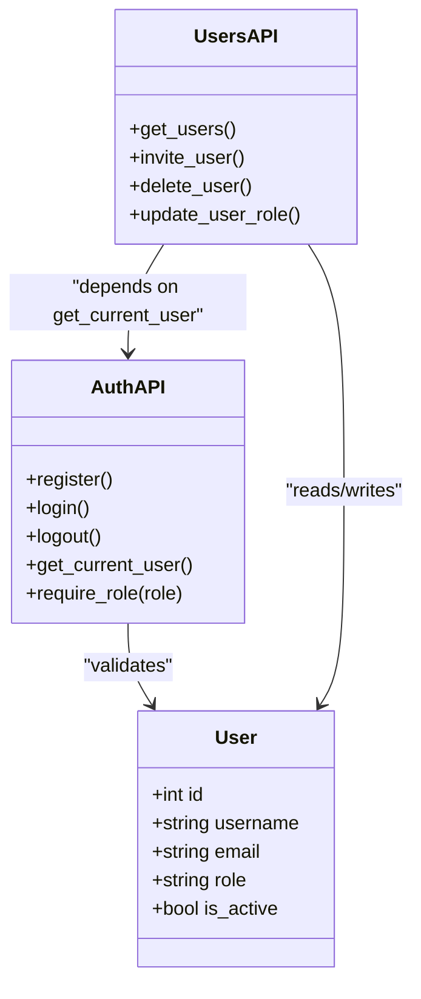
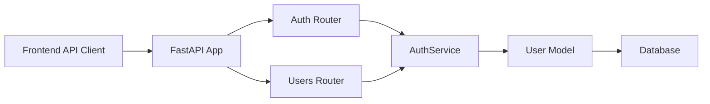

# Security & Authentication

<cite>
**Referenced Files in This Document**
- [main.py](file://backend/main.py)
- [auth.py](file://backend/app/api/auth.py)
- [auth_service.py](file://backend/app/services/auth.py)
- [user_model.py](file://backend/app/models/user.py)
- [user_schemas.py](file://backend/app/schemas/user.py)
- [users_api.py](file://backend/app/api/users.py)
- [error_handlers.py](file://backend/app/core/error_handlers.py)
- [config.py](file://backend/app/core/config.py)
- [frontend_auth_context.tsx](file://frontend/context/auth_context.tsx)
- [login_page.tsx](file://frontend/app/(auth)/login/page.tsx)
- [signup_page.tsx](file://frontend/app/(auth)/signup/page.tsx)
- [api_client.ts](file://frontend/lib/api.ts)
</cite>

## Table of Contents
1. [Introduction](#introduction)
2. [Project Structure](#project-structure)
3. [Core Components](#core-components)
4. [Architecture Overview](#architecture-overview)
5. [Detailed Component Analysis](#detailed-component-analysis)
6. [Dependency Analysis](#dependency-analysis)
7. [Performance Considerations](#performance-considerations)
8. [Troubleshooting Guide](#troubleshooting-guide)
9. [Conclusion](#conclusion)
10. [Appendices](#appendices)

## Introduction
This document provides comprehensive security and authentication guidance for TariffGuard. It covers the user registration, login/logout flows, token management, role-based access control (RBAC), input validation, SQL injection prevention, XSS protection, CSRF mitigation, API security practices, frontend security patterns, best practices, vulnerability assessment guidelines, incident response procedures, data protection, privacy considerations, and compliance requirements for sensitive manufacturing data.

## Project Structure
TariffGuard is a FastAPI backend with a Next.js frontend. Authentication endpoints are exposed under /api/auth, protected by Bearer tokens stored in-memory on the server and persisted in the browser’s localStorage by the frontend. RBAC is enforced via dependencies that check the current user’s role.

**Diagram sources**
- [main.py:48-58](file://backend/main.py#L48-L58)
- [auth.py:10-13](file://backend/app/api/auth.py#L10-L13)
- [users_api.py:12-16](file://backend/app/api/users.py#L12-L16)
- [auth_service.py:8-53](file://backend/app/services/auth.py#L8-L53)

**Section sources**
- [main.py:1-91](file://backend/main.py#L1-L91)
- [auth.py:1-89](file://backend/app/api/auth.py#L1-L89)
- [users_api.py:1-109](file://backend/app/api/users.py#L1-L109)

## Core Components
- Authentication endpoints: register, login, logout, and current user resolution.
- Role-based access control: Owner (full access), Manager (create/update), Supervisor (schedule management), Viewer (read-only).
- Password hashing with per-user salt and secure random token generation.
- In-memory active token store for session handling.
- Frontend context managing token lifecycle and role state.

Key implementation references:
- Registration and login flows: [auth.py:15-52](file://backend/app/api/auth.py#L15-L52)
- Token issuance and validation: [auth.py:12-13](file://backend/app/api/auth.py#L12-L13), [auth.py:63-81](file://backend/app/api/auth.py#L63-L81)
- Password hashing and verification: [auth_service.py:11-23](file://backend/app/services/auth.py#L11-L23)
- User model fields including role and factory association: [user_model.py:5-16](file://backend/app/models/user.py#L5-L16)
- Request/response schemas enforcing input types: [user_schemas.py:5-30](file://backend/app/schemas/user.py#L5-L30)
- Frontend token storage and auth context: [frontend_auth_context.tsx:23-44](file://frontend/context/auth_context.tsx#L23-L44)

**Section sources**
- [auth.py:15-81](file://backend/app/api/auth.py#L15-L81)
- [auth_service.py:11-53](file://backend/app/services/auth.py#L11-L53)
- [user_model.py:5-16](file://backend/app/models/user.py#L5-L16)
- [user_schemas.py:5-30](file://backend/app/schemas/user.py#L5-L30)
- [frontend_auth_context.tsx:23-44](file://frontend/context/auth_context.tsx#L23-L44)

## Architecture Overview
The authentication architecture uses Bearer tokens validated at the API layer. The frontend stores tokens in localStorage and attaches them to requests. Protected routes enforce roles via dependencies.

**Diagram sources**
- [auth.py:15-52](file://backend/app/api/auth.py#L15-L52)
- [auth.py:63-81](file://backend/app/api/auth.py#L63-L81)
- [auth_service.py:25-53](file://backend/app/services/auth.py#L25-L53)
- [users_api.py:17-31](file://backend/app/api/users.py#L17-L31)

## Detailed Component Analysis

### Authentication Endpoints and Session Handling
- Register: Validates input via Pydantic schema, checks uniqueness, creates user with hashed password.
- Login: Authenticates credentials, generates a secure random token, stores mapping in memory, returns token and user.
- Logout: Removes token from in-memory store if present.
- Current user dependency: Extracts Bearer token, validates presence, resolves user by token, raises 401 on invalid/expired tokens.

**Diagram sources**
- [auth.py:63-81](file://backend/app/api/auth.py#L63-L81)

**Section sources**
- [auth.py:15-61](file://backend/app/api/auth.py#L15-L61)
- [auth.py:63-81](file://backend/app/api/auth.py#L63-L81)

### Role-Based Access Control (RBAC)
Roles implemented:
- Owner: Full access across all features.
- Manager: Create/update operations; cannot create or delete owners.
- Supervisor: Schedule management capabilities.
- Viewer: Read-only access.

Enforcement points:
- Global role dependency: require_role enforces minimum role and allows owner override.
- Endpoint-level checks: users endpoints restrict actions based on role combinations.

**Diagram sources**
- [user_model.py:5-16](file://backend/app/models/user.py#L5-L16)
- [auth.py:83-89](file://backend/app/api/auth.py#L83-L89)
- [users_api.py:17-109](file://backend/app/api/users.py#L17-L109)

**Section sources**
- [auth.py:83-89](file://backend/app/api/auth.py#L83-L89)
- [users_api.py:17-109](file://backend/app/api/users.py#L17-L109)

### Password Storage and Verification
- Passwords are hashed with a unique per-user salt using SHA-256.
- Verification recomputes hash with stored salt and compares.
- Note: For production-grade security, consider upgrading to a dedicated password hashing library (e.g., bcrypt/argon2) with built-in timing-safe comparisons and configurable work factors.

References:
- Hashing and verification: [auth_service.py:11-23](file://backend/app/services/auth.py#L11-L23)
- User creation with hashed password: [auth_service.py:25-38](file://backend/app/services/auth.py#L25-L38)
- Authentication flow: [auth_service.py:40-53](file://backend/app/services/auth.py#L40-L53)

**Section sources**
- [auth_service.py:11-53](file://backend/app/services/auth.py#L11-L53)

### Input Validation and Error Handling
- Pydantic schemas enforce field types and constraints for user inputs.
- Global error handlers return structured JSON responses and suppress internal details in non-debug environments.

References:
- Schemas: [user_schemas.py:5-30](file://backend/app/schemas/user.py#L5-L30)
- Validation error handler: [error_handlers.py:11-20](file://backend/app/core/error_handlers.py#L11-L20)
- Database and generic error handlers: [error_handlers.py:22-44](file://backend/app/core/error_handlers.py#L22-L44)

**Section sources**
- [user_schemas.py:5-30](file://backend/app/schemas/user.py#L5-L30)
- [error_handlers.py:11-44](file://backend/app/core/error_handlers.py#L11-L44)

### CORS and Network Security
- CORS middleware currently allows all origins, methods, and headers with credentials enabled. This is overly permissive and should be restricted to trusted domains in production.

Reference:
- CORS configuration: [main.py:39-46](file://backend/main.py#L39-L46)

**Section sources**
- [main.py:39-46](file://backend/main.py#L39-L46)

### Frontend Security: Token Storage and Route Protection
- Tokens are stored in localStorage and attached to every request via the API client.
- Auth context persists user and role state across sessions.
- Demo mode sets a fake token for development convenience.

Recommendations:
- Prefer httpOnly cookies for token storage to mitigate XSS exposure.
- Implement route guards to protect dashboard pages based on role.
- Sanitize any user-supplied content rendered in the UI to prevent XSS.

References:
- Token persistence and role state: [frontend_auth_context.tsx:23-44](file://frontend/context/auth_context.tsx#L23-L44)
- Attaching Authorization header: [api_client.ts:8-20](file://frontend/lib/api.ts#L8-L20)
- Login page behavior: [login_page.tsx:34-51](file://frontend/app/(auth)/login/page.tsx#L34-L51)
- Signup page behavior: [signup_page.tsx:28-49](file://frontend/app/(auth)/signup/page.tsx#L28-L49)

**Section sources**
- [frontend_auth_context.tsx:23-44](file://frontend/context/auth_context.tsx#L23-L44)
- [api_client.ts:8-20](file://frontend/lib/api.ts#L8-L20)
- [login_page.tsx:34-51](file://frontend/app/(auth)/login/page.tsx#L34-L51)
- [signup_page.tsx:28-49](file://frontend/app/(auth)/signup/page.tsx#L28-L49)

## Dependency Analysis
Authentication and authorization span multiple layers:
- Frontend depends on API client to send tokens.
- Backend routers depend on auth dependencies to resolve current user and enforce roles.
- Services encapsulate password hashing and user creation logic.
- Models define persistent entities and relationships.

**Diagram sources**
- [api_client.ts:8-20](file://frontend/lib/api.ts#L8-L20)
- [main.py:48-58](file://backend/main.py#L48-L58)
- [auth.py:10-13](file://backend/app/api/auth.py#L10-L13)
- [users_api.py:12-16](file://backend/app/api/users.py#L12-L16)
- [auth_service.py:8-53](file://backend/app/services/auth.py#L8-L53)
- [user_model.py:5-16](file://backend/app/models/user.py#L5-L16)

**Section sources**
- [api_client.ts:8-20](file://frontend/lib/api.ts#L8-L20)
- [main.py:48-58](file://backend/main.py#L48-L58)
- [auth.py:10-13](file://backend/app/api/auth.py#L10-L13)
- [users_api.py:12-16](file://backend/app/api/users.py#L12-L16)
- [auth_service.py:8-53](file://backend/app/services/auth.py#L8-L53)
- [user_model.py:5-16](file://backend/app/models/user.py#L5-L16)

## Performance Considerations
- In-memory token store: Suitable for single-process development but does not scale across processes or survive restarts. Use a distributed cache (e.g., Redis) for production.
- Password hashing: SHA-256 is fast; consider slower algorithms (bcrypt/argon2) to resist brute-force attacks.
- Database queries: Ensure indexes on frequently queried fields like username and email to reduce latency.
- CORS: Restrict allowed origins to reduce unnecessary preflight overhead and improve security posture.

[No sources needed since this section provides general guidance]

## Troubleshooting Guide
Common issues and resolutions:
- 401 Unauthorized: Missing or invalid Authorization header; ensure token is present and valid.
- 403 Forbidden: Insufficient role; verify current user’s role and endpoint permissions.
- Validation errors: Check request payload against schemas; use structured error responses.
- Database errors: Review global error handlers; avoid leaking internals in production.

References:
- 401/403 handling in auth and users endpoints: [auth.py:63-89](file://backend/app/api/auth.py#L63-L89), [users_api.py:17-109](file://backend/app/api/users.py#L17-L109)
- Validation and database error handlers: [error_handlers.py:11-44](file://backend/app/core/error_handlers.py#L11-L44)

**Section sources**
- [auth.py:63-89](file://backend/app/api/auth.py#L63-L89)
- [users_api.py:17-109](file://backend/app/api/users.py#L17-L109)
- [error_handlers.py:11-44](file://backend/app/core/error_handlers.py#L11-L44)

## Conclusion
TariffGuard implements a functional authentication and RBAC system with clear separation between API, services, and models. While effective for development, production hardening is recommended: adopt secure token storage (httpOnly cookies), strengthen password hashing, restrict CORS, implement rate limiting, add CSRF protections, and introduce robust monitoring and incident response procedures. These steps will significantly improve resilience against common web vulnerabilities and align with compliance requirements for sensitive manufacturing data.

[No sources needed since this section summarizes without analyzing specific files]

## Appendices

### Security Best Practices Checklist
- Enforce HTTPS everywhere; configure TLS termination at the reverse proxy.
- Store tokens in httpOnly cookies; avoid localStorage for secrets.
- Use strong password hashing (bcrypt/argon2) with appropriate work factors.
- Restrict CORS to known origins; disable credentials unless necessary.
- Implement rate limiting on authentication endpoints to mitigate brute force.
- Add CSRF protection for state-changing endpoints when using cookies.
- Validate and sanitize all inputs; rely on Pydantic schemas and server-side checks.
- Parameterize queries to prevent SQL injection; prefer ORM usage.
- Apply secure response headers (HSTS, CSP, X-Frame-Options, Referrer-Policy).
- Log security events securely; avoid logging sensitive data.
- Rotate secrets regularly; manage environment variables securely.

[No sources needed since this section provides general guidance]

### Vulnerability Assessment Guidelines
- Conduct periodic penetration testing focusing on authentication and authorization bypasses.
- Scan dependencies for known vulnerabilities; maintain an updated dependency tree.
- Review code for insecure defaults (e.g., open CORS, debug flags).
- Test token expiration and revocation mechanisms.
- Validate role enforcement across all endpoints, including indirect calls.

[No sources needed since this section provides general guidance]

### Incident Response Procedures
- Detection: Monitor logs and alerts for suspicious activity (failed logins, privilege escalation attempts).
- Containment: Disable compromised accounts; revoke active tokens; isolate affected services if necessary.
- Eradication: Patch vulnerabilities; rotate secrets; remove malicious artifacts.
- Recovery: Restore from verified backups; re-enable services with hardened configurations.
- Postmortem: Document root cause; update controls; communicate lessons learned.

[No sources needed since this section provides general guidance]

### Data Protection and Privacy Considerations
- Minimize collection of personal data; collect only what is necessary.
- Encrypt sensitive data at rest and in transit.
- Implement access controls and audit logs for sensitive manufacturing data.
- Provide user rights to access, correct, and delete personal data where applicable.
- Comply with relevant regulations (e.g., local data protection laws) and industry standards.

[No sources needed since this section provides general guidance]