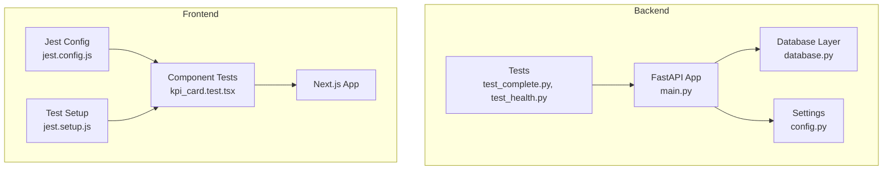
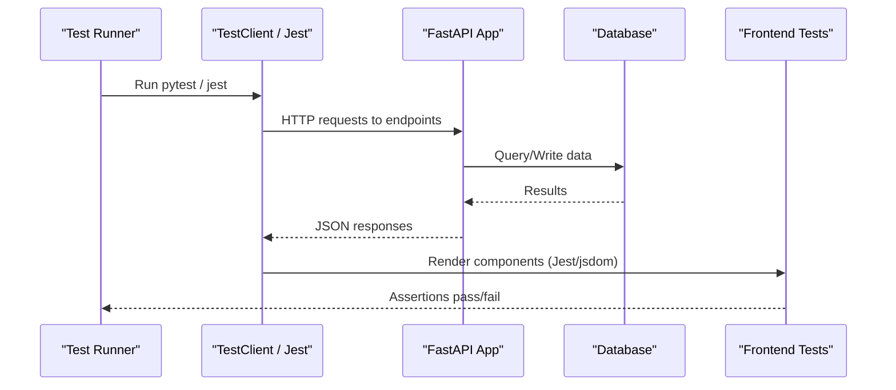
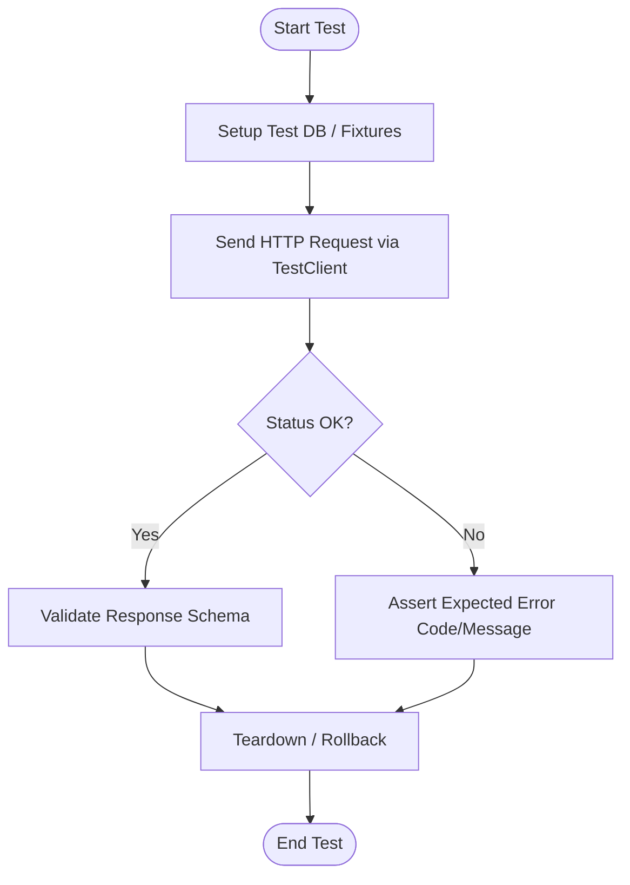
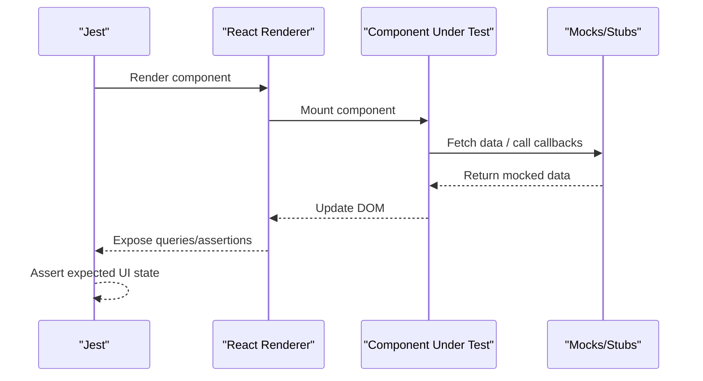
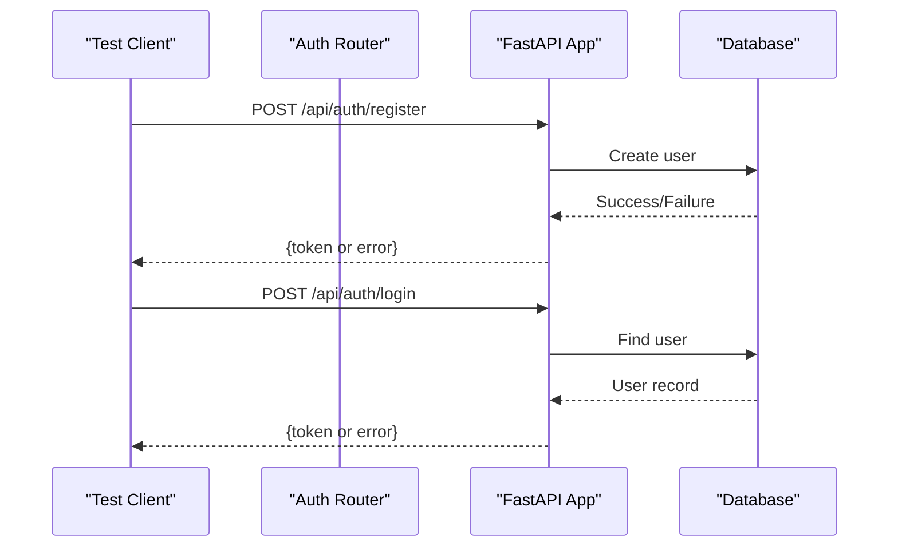
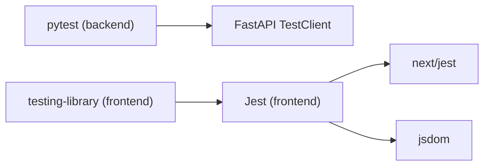

# Testing & Quality Assurance

<cite>
**Referenced Files in This Document**
- [main.py](file://backend/main.py)
- [database.py](file://backend/app/core/database.py)
- [config.py](file://backend/app/core/config.py)
- [requirements.txt](file://backend/requirements.txt)
- [test_complete.py](file://backend/tests/test_complete.py)
- [test_health.py](file://backend/tests/test_health.py)
- [test_auth.py](file://backend/test_auth.py)
- [package.json](file://frontend/package.json)
- [jest.config.js](file://frontend/jest.config.js)
- [jest.setup.js](file://frontend/jest.setup.js)
- [kpi_card.test.tsx](file://frontend/tests/components/kpi_card.test.tsx)
</cite>

## Table of Contents
1. Introduction
2. Project Structure
3. Core Components
4. Architecture Overview
5. Detailed Component Analysis
6. Dependency Analysis
7. Performance Considerations
8. Troubleshooting Guide
9. Conclusion
10. Appendices

## Introduction
This document defines the testing and quality assurance strategy for TariffGuard across backend and frontend. It covers unit, integration, and end-to-end testing approaches; framework setup (pytest for backend, Jest for frontend); coverage targets; mocking strategies; test data management; API testing practices; frontend component testing; continuous integration guidance; code quality tools; and performance, load, and security testing considerations.

## Project Structure
The repository includes:
- Backend (FastAPI): API endpoints, core services, database configuration, and tests under backend/tests.
- Frontend (Next.js + React): UI components and pages with a Jest-based test suite under frontend/tests.

**Diagram sources**
- [main.py:18-58](file://backend/main.py#L18-L58)
- [database.py:1-37](file://backend/app/core/database.py#L1-L37)
- [config.py:1-21](file://backend/app/core/config.py#L1-L21)
- [test_complete.py:1-199](file://backend/tests/test_complete.py#L1-L199)
- [test_health.py:1-25](file://backend/tests/test_health.py#L1-L25)
- [jest.config.js:1-16](file://frontend/jest.config.js#L1-L16)
- [jest.setup.js:1-2](file://frontend/jest.setup.js#L1-L2)
- [kpi_card.test.tsx:1-12](file://frontend/tests/components/kpi_card.test.tsx#L1-L12)

**Section sources**
- [main.py:18-58](file://backend/main.py#L18-L58)
- [package.json:1-38](file://frontend/package.json#L1-L38)

## Core Components
- Backend testing uses FastAPI TestClient to exercise routes without starting a server process. Tests cover health, root, and domain endpoints (factories, machines, orders, tariffs, dashboard, meter readings, optimization).
- Frontend testing uses Jest with Next.js integration and jsdom environment, plus testing-library matchers via jest.setup.js.

Key elements:
- Backend app assembly and routers are included in main.py, enabling direct client calls in tests.
- Database initialization is handled at startup, ensuring tables exist for integration tests.
- Settings and database URL are configurable via environment, supporting isolated test databases.

**Section sources**
- [main.py:18-58](file://backend/main.py#L18-L58)
- [database.py:27-37](file://backend/app/core/database.py#L27-L37)
- [config.py:4-21](file://backend/app/core/config.py#L4-L21)
- [test_complete.py:1-199](file://backend/tests/test_complete.py#L1-L199)
- [test_health.py:1-25](file://backend/tests/test_health.py#L1-L25)
- [jest.config.js:1-16](file://frontend/jest.config.js#L1-L16)
- [jest.setup.js:1-2](file://frontend/jest.setup.js#L1-L2)

## Architecture Overview
The testing architecture spans three layers:
- Unit tests: Validate individual functions and components in isolation using mocks where needed.
- Integration tests: Exercise API endpoints against an in-memory or test database to validate request/response contracts and business logic.
- End-to-end tests: Optionally run the full application stack to verify user flows across frontend and backend.

**Diagram sources**
- [main.py:18-58](file://backend/main.py#L18-L58)
- [database.py:27-37](file://backend/app/core/database.py#L27-L37)
- [test_complete.py:1-199](file://backend/tests/test_complete.py#L1-L199)
- [jest.config.js:1-16](file://frontend/jest.config.js#L1-L16)

## Detailed Component Analysis

### Backend API Testing Strategy
- Framework: pytest with FastAPI TestClient.
- Scope: Health, root, and all domain endpoints (factories, machines, orders, tariffs, dashboard, meter readings, optimization).
- Approach:
  - Use TestClient(app) to send requests directly to the in-process app.
  - Assert status codes and response shapes for success and error paths.
  - Leverage seed data or create fixtures to ensure deterministic state.
- Authentication:
  - A manual script demonstrates register/login flows; integrate into pytest by calling auth endpoints and asserting tokens or session behavior.
- Data Management:
  - Use a dedicated test database URL to isolate runs.
  - Create and drop tables per test or use transactional rollbacks to keep tests fast and independent.

**Diagram sources**
- [test_complete.py:1-199](file://backend/tests/test_complete.py#L1-L199)
- [test_health.py:1-25](file://backend/tests/test_health.py#L1-L25)
- [database.py:27-37](file://backend/app/core/database.py#L27-L37)

**Section sources**
- [test_complete.py:1-199](file://backend/tests/test_complete.py#L1-L199)
- [test_health.py:1-25](file://backend/tests/test_health.py#L1-L25)
- [test_auth.py:1-25](file://backend/test_auth.py#L1-L25)
- [database.py:27-37](file://backend/app/core/database.py#L27-L37)

### Frontend Component Testing Strategy
- Framework: Jest with next/jest and jsdom environment.
- Setup:
  - jest.config.js configures next/jest and sets up jsdom.
  - jest.setup.js imports testing-library matchers for assertions like toBeInTheDocument.
- Scope:
  - Begin with UI components (e.g., KPI card), then expand to forms, charts, and layout pieces.
- Approach:
  - Render components in isolation with minimal dependencies.
  - Mock external services or data fetches to focus on component behavior.
  - Assert rendered output, interactions, and state changes.

**Diagram sources**
- [jest.config.js:1-16](file://frontend/jest.config.js#L1-L16)
- [jest.setup.js:1-2](file://frontend/jest.setup.js#L1-L2)
- [kpi_card.test.tsx:1-12](file://frontend/tests/components/kpi_card.test.tsx#L1-L12)

**Section sources**
- [jest.config.js:1-16](file://frontend/jest.config.js#L1-L16)
- [jest.setup.js:1-2](file://frontend/jest.setup.js#L1-L2)
- [kpi_card.test.tsx:1-12](file://frontend/tests/components/kpi_card.test.tsx#L1-L12)
- [package.json:1-38](file://frontend/package.json#L1-L38)

### API Testing Approaches
- Endpoint validation:
  - Verify status codes, required fields, and response structure for each endpoint.
  - Include negative cases (invalid payloads, missing fields).
- Authentication testing:
  - Register users, login, and assert token/session handling.
  - Protect sensitive endpoints and assert unauthorized responses when credentials are missing or invalid.
- Error scenario testing:
  - Trigger validation errors and database errors; assert consistent error responses.
  - Ensure global exception handlers return structured errors.

**Diagram sources**
- [main.py:18-58](file://backend/main.py#L18-L58)
- [test_auth.py:1-25](file://backend/test_auth.py#L1-L25)

**Section sources**
- [test_auth.py:1-25](file://backend/test_auth.py#L1-L25)
- [main.py:18-58](file://backend/main.py#L18-L58)

### Test Coverage Requirements
- Backend:
  - Target high coverage for critical paths: authentication, CRUD operations, dashboard aggregation, meter reading stats, and optimization endpoints.
  - Use pytest-cov to generate reports and enforce minimum thresholds in CI.
- Frontend:
  - Cover key UI components and utilities; prioritize interactive elements and chart rendering logic.
  - Use Jest coverage reporting to track branch and line coverage.

[No sources needed since this section provides general guidance]

### Mocking Strategies
- Backend:
  - Mock external services (e.g., email, third-party APIs) using unittest.mock or httpx mock transport.
  - Use test database instances to avoid side effects.
- Frontend:
  - Mock network calls with jest.fn() or MSW if applicable.
  - Stub context providers and hooks to isolate component behavior.

[No sources needed since this section provides general guidance]

### Test Data Management
- Backend:
  - Seed initial data for deterministic tests (e.g., factories, machines).
  - Use unique identifiers per test run to prevent collisions.
- Frontend:
  - Provide fixture data for components that consume lists or charts.

**Section sources**
- [test_complete.py:39-199](file://backend/tests/test_complete.py#L39-L199)

### Continuous Integration Practices
- Backend:
  - Install dependencies from requirements.txt.
  - Run pytest with coverage; fail pipeline on threshold breach.
- Frontend:
  - Install dependencies from package.json.
  - Run jest; collect coverage; lint if configured.

[No sources needed since this section provides general guidance]

### Code Quality Tools
- Backend:
  - Linting and type checking can be added alongside pytest for stricter quality gates.
- Frontend:
  - ESLint is present in devDependencies; integrate lint checks into CI.

**Section sources**
- [requirements.txt:1-16](file://backend/requirements.txt#L1-L16)
- [package.json:1-38](file://frontend/package.json#L1-L38)

### Guidelines for Writing Effective Tests
- Keep tests small and focused on one behavior.
- Use descriptive names indicating scenario and expectation.
- Prefer explicit assertions over implicit ones.
- Isolate tests with fresh data or mocks to avoid flakiness.
- For API tests, validate both success and failure paths.

[No sources needed since this section provides general guidance]

### Debugging Failed Tests
- Backend:
  - Print or log request payloads and responses during failures.
  - Inspect database state post-test to identify data issues.
- Frontend:
  - Use console logs sparingly; prefer assertions and snapshot diffs.
  - Re-run with verbose output to pinpoint failing steps.

[No sources needed since this section provides general guidance]

### Maintaining Test Suites
- Regularly update tests when APIs or components change.
- Remove obsolete tests and consolidate overlapping cases.
- Enforce coverage thresholds to prevent regression.

[No sources needed since this section provides general guidance]

## Dependency Analysis
Testing dependencies are declared in backend and frontend configuration files.

**Diagram sources**
- [requirements.txt:1-16](file://backend/requirements.txt#L1-L16)
- [package.json:1-38](file://frontend/package.json#L1-L38)
- [jest.config.js:1-16](file://frontend/jest.config.js#L1-L16)

**Section sources**
- [requirements.txt:1-16](file://backend/requirements.txt#L1-L16)
- [package.json:1-38](file://frontend/package.json#L1-L38)

## Performance Considerations
- Use in-memory or lightweight databases for tests to reduce I/O overhead.
- Parallelize test execution where safe to speed up pipelines.
- Avoid heavy computations in unit tests; move to integration or dedicated benchmarks.

[No sources needed since this section provides general guidance]

## Troubleshooting Guide
Common issues and resolutions:
- Database not initialized:
  - Ensure startup event creates tables before running tests.
- Missing environment variables:
  - Provide DATABASE_URL and other settings in test environments.
- Frontend test environment mismatches:
  - Confirm jsdom environment and setup file are loaded.

**Section sources**
- [main.py:66-69](file://backend/main.py#L66-L69)
- [database.py:27-37](file://backend/app/core/database.py#L27-L37)
- [jest.config.js:1-16](file://frontend/jest.config.js#L1-L16)

## Conclusion
TariffGuard’s testing strategy combines robust backend integration tests with frontend component tests using modern tooling. By enforcing coverage, isolating test data, and integrating quality checks into CI, the project maintains reliability and accelerates development velocity. Expand coverage progressively, focusing on critical paths and complex logic such as optimization and dashboard aggregations.

[No sources needed since this section summarizes without analyzing specific files]

## Appendices

### Appendix A: Running Tests
- Backend:
  - Install dependencies from requirements.txt.
  - Run pytest to execute tests against the in-process FastAPI app.
- Frontend:
  - Install dependencies from package.json.
  - Run jest to execute component tests.

**Section sources**
- [requirements.txt:1-16](file://backend/requirements.txt#L1-L16)
- [package.json:1-38](file://frontend/package.json#L1-L38)

### Appendix B: Security Testing Considerations
- Validate authentication and authorization on protected endpoints.
- Test input sanitization and error handling to prevent leaks.
- Use secrets management in CI and never hardcode credentials.

[No sources needed since this section provides general guidance]

### Appendix C: Load and Performance Testing
- Use tools like k6 or Locust to simulate concurrent requests against API endpoints.
- Measure response times and resource usage under load.
- Establish baselines and alert on regressions.

[No sources needed since this section provides general guidance]